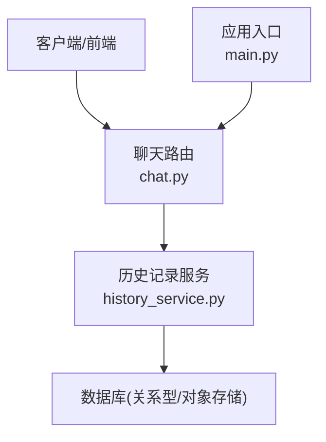
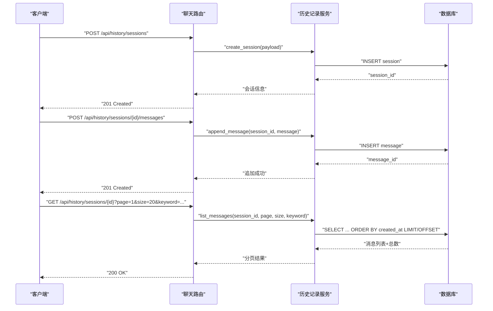
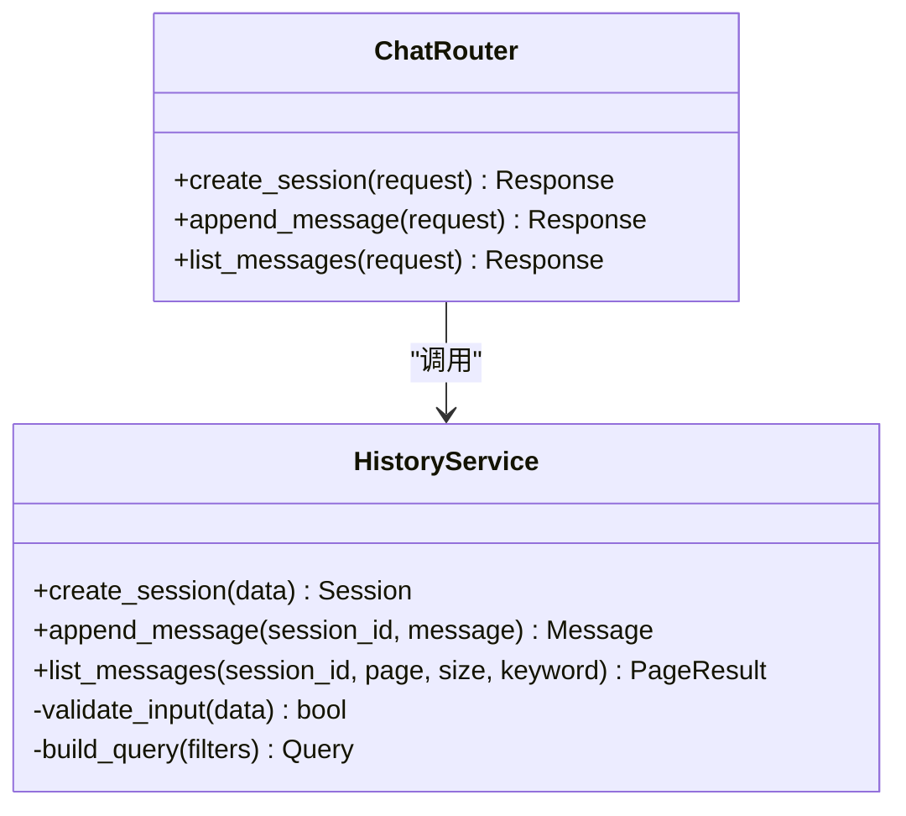
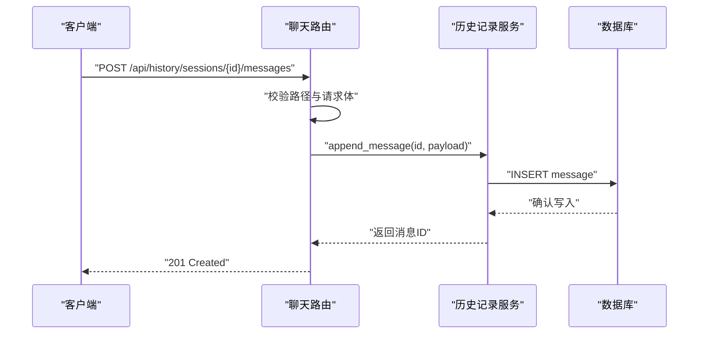

# 历史记录服务

<cite>
**本文引用的文件**   
- [history_service.py](file://backend/app/services/history_service.py)
- [chat.py](file://backend/app/routers/chat.py)
- [main.py](file://backend/app/main.py)
</cite>

## 目录
1. [简介](#简介)
2. [项目结构](#项目结构)
3. [核心组件](#核心组件)
4. [架构总览](#架构总览)
5. [详细组件分析](#详细组件分析)
6. [依赖分析](#依赖分析)
7. [性能考虑](#性能考虑)
8. [故障排查指南](#故障排查指南)
9. [结论](#结论)
10. [附录](#附录)

## 简介
本技术文档聚焦于“历史记录服务”，围绕消息存储架构、数据库表结构与索引优化、查询接口与分页机制、搜索实现、数据持久化与备份恢复、数据清理规则、版本管理与冲突解决、同步策略、数据迁移方案、性能调优与容量规划，以及API使用示例、查询优化技巧与故障排查方法进行全面说明。文档旨在帮助开发者快速理解并高效扩展该服务。

## 项目结构
后端采用分层设计：路由层负责HTTP接口定义，服务层封装业务逻辑（包括历史记录读写），应用入口统一注册路由与中间件。历史记录服务位于服务层，由聊天路由暴露REST API供前端或客户端调用。

图表来源
- [chat.py](file://backend/app/routers/chat.py)
- [history_service.py](file://backend/app/services/history_service.py)
- [main.py](file://backend/app/main.py)

章节来源
- [main.py](file://backend/app/main.py)
- [chat.py](file://backend/app/routers/chat.py)
- [history_service.py](file://backend/app/services/history_service.py)

## 核心组件
- 历史记录服务：提供历史会话的创建、追加消息、按会话查询、分页、全文检索等能力；负责将消息序列化为结构化记录并持久化。
- 聊天路由：对外暴露REST接口，接收请求参数，校验输入，调用服务层完成业务处理，返回标准化响应。
- 应用入口：初始化服务实例、注册路由、配置跨域与日志等。

章节来源
- [history_service.py](file://backend/app/services/history_service.py)
- [chat.py](file://backend/app/routers/chat.py)
- [main.py](file://backend/app/main.py)

## 架构总览
整体采用“路由-服务-存储”三层架构。路由层仅做协议适配与参数校验，服务层承载核心业务与数据访问抽象，存储层通过ORM或驱动访问数据库。历史记录以“会话-消息”模型组织，支持时间排序、分页与关键词检索。

图表来源
- [chat.py](file://backend/app/routers/chat.py)
- [history_service.py](file://backend/app/services/history_service.py)

## 详细组件分析

### 历史记录服务（history_service.py）
职责与边界
- 会话管理：创建、获取、删除会话元信息。
- 消息管理：追加消息、批量写入、按会话查询、分页、关键词检索。
- 数据一致性：保证同一会话内消息顺序与幂等性（如基于唯一键或版本号）。
- 可扩展点：存储抽象可替换为不同数据库或对象存储后端。

关键流程
- 创建会话：生成唯一会话ID，落盘会话元数据。
- 追加消息：校验消息体，插入消息记录，必要时更新会话统计字段（如最后更新时间）。
- 分页查询：基于时间戳或自增ID进行范围扫描，结合LIMIT/OFFSET或游标分页。
- 搜索功能：对消息文本建立倒排索引或启用数据库全文检索引擎，支持多词匹配与权重排序。

数据结构建议
- 会话表：会话ID、用户标识、标题、状态、创建时间、更新时间、消息计数等。
- 消息表：消息ID、会话ID、角色（用户/助手）、内容、附件引用、元数据、创建时间、版本号等。
- 索引策略：会话ID+创建时间复合索引、全文检索索引、常用过滤字段单列索引。

复杂度与性能
- 追加消息：O(1) 写入，配合缓冲与批量提交降低IO压力。
- 分页查询：O(log N) 索引查找 + O(K) 结果集扫描，K为页大小。
- 搜索：取决于全文检索实现，通常近似O(log N) + 相关性评分。

错误处理
- 参数校验失败：返回明确错误码与提示。
- 并发写入冲突：基于乐观锁或唯一约束重试。
- 存储异常：捕获并转换为统一错误响应，附带追踪ID便于定位。

章节来源
- [history_service.py](file://backend/app/services/history_service.py)

#### 类图（概念映射到实际代码）

图表来源
- [history_service.py](file://backend/app/services/history_service.py)
- [chat.py](file://backend/app/routers/chat.py)

### 聊天路由（chat.py）
职责与边界
- 定义REST端点：会话CRUD、消息追加、分页查询、搜索。
- 请求解析与校验：从路径/查询/JSON体提取参数，进行类型与必填校验。
- 响应格式化：统一包装分页结果与错误信息。

典型接口
- POST /api/history/sessions：创建新会话。
- POST /api/history/sessions/{id}/messages：向指定会话追加消息。
- GET /api/history/sessions/{id}：获取会话详情。
- GET /api/history/sessions/{id}/messages：分页查询消息，支持keyword过滤。

章节来源
- [chat.py](file://backend/app/routers/chat.py)

#### 时序图（消息追加）

图表来源
- [chat.py](file://backend/app/routers/chat.py)
- [history_service.py](file://backend/app/services/history_service.py)

### 应用入口（main.py）
职责与边界
- 初始化FastAPI应用、注册路由模块。
- 配置全局中间件（CORS、日志、限流等）。
- 启动事件钩子：连接池预热、健康检查端点。

章节来源
- [main.py](file://backend/app/main.py)

## 依赖分析
- 路由层依赖服务层，服务层依赖数据访问层（数据库驱动或ORM）。
- 可能的第三方库：HTTP框架、ORM/SQLAlchemy、全文检索插件、序列化库、日志与监控SDK。
- 耦合度：路由与服务解耦良好，服务内部可按需引入缓存、队列等扩展点。

图表来源
- [main.py](file://backend/app/main.py)
- [chat.py](file://backend/app/routers/chat.py)
- [history_service.py](file://backend/app/services/history_service.py)

章节来源
- [main.py](file://backend/app/main.py)
- [chat.py](file://backend/app/routers/chat.py)
- [history_service.py](file://backend/app/services/history_service.py)

## 性能考虑
- 索引优化
  - 会话ID+创建时间复合索引用于分页与时间范围查询。
  - 消息内容全文索引用于关键词搜索，避免全表扫描。
  - 高频过滤字段（如角色、标签）建立单列索引。
- 分页策略
  - 优先使用基于时间戳或主键的游标分页，减少OFFSET在大偏移时的性能退化。
  - 限制最大页大小，防止大结果集拖垮数据库。
- 写入优化
  - 批量插入与事务合并，降低频繁小写IO。
  - 异步写入队列（可选）提升吞吐。
- 缓存与热点
  - 会话元信息与最近N条消息可加入内存缓存，设置合理TTL。
- 资源规划
  - 根据QPS与平均消息大小估算磁盘与带宽需求，预留增长空间。
  - 分库分表策略：按会话ID哈希或时间分片，控制单表规模。

[本节为通用性能指导，不直接分析具体文件]

## 故障排查指南
常见问题与定位步骤
- 接口超时
  - 检查数据库慢查询与索引命中情况。
  - 查看服务日志中的耗时分布与外部依赖延迟。
- 分页结果不完整
  - 确认是否使用稳定排序键（如created_at+id），避免重复或缺失。
  - 校验最大页大小与客户端分页参数。
- 搜索不准确
  - 检查分词器与停用词配置，验证索引重建是否完成。
  - 核对查询条件与权重配置。
- 写入冲突
  - 观察唯一约束冲突日志，确认客户端幂等键是否正确传递。
  - 增加重试与退避策略。

章节来源
- [history_service.py](file://backend/app/services/history_service.py)
- [chat.py](file://backend/app/routers/chat.py)

## 结论
历史记录服务通过清晰的分层设计与合理的索引与分页策略，提供了高可用、可扩展的消息存储与查询能力。建议在后续迭代中完善全文检索、异步写入与缓存层，并结合监控指标持续优化性能与成本。

[本节为总结性内容，不直接分析具体文件]

## 附录

### API使用示例
- 创建会话
  - 方法：POST
  - 路径：/api/history/sessions
  - 请求体：包含用户标识、标题等元数据
  - 响应：返回会话ID与基本信息
- 追加消息
  - 方法：POST
  - 路径：/api/history/sessions/{id}/messages
  - 请求体：包含角色、内容、附件引用等
  - 响应：返回消息ID与写入状态
- 分页查询
  - 方法：GET
  - 路径：/api/history/sessions/{id}/messages?page=1&size=20&keyword=...
  - 响应：返回消息列表、总数与分页信息

章节来源
- [chat.py](file://backend/app/routers/chat.py)

### 查询优化技巧
- 使用稳定的排序键组合（时间+主键）确保分页稳定性。
- 在高频过滤字段上建立索引，避免回表。
- 对长文本字段按需加载，避免不必要的I/O。
- 合理使用只读副本分担查询压力。

[本节为通用优化建议，不直接分析具体文件]

### 数据持久化与备份恢复
- 持久化策略
  - 事务包裹写入，确保会话与消息的一致性。
  - 定期快照与增量日志，支持时间点恢复。
- 备份恢复
  - 冷备：定时导出数据库快照至对象存储。
  - 热备：开启主从复制与binlog，缩短RTO/RPO。
- 数据清理规则
  - 基于保留策略（如90天）归档或删除过期会话。
  - 清理任务异步执行，避免影响在线查询。

[本节为通用策略建议，不直接分析具体文件]

### 版本管理、冲突解决与同步策略
- 版本管理
  - 消息记录携带版本号或时间戳，服务端据此判断新旧。
- 冲突解决
  - 采用“最新时间戳胜出”或“客户端幂等键去重”。
- 同步策略
  - 离线场景下本地暂存，网络恢复后增量同步。
  - 冲突时触发人工审核或自动合并策略。

[本节为通用策略建议，不直接分析具体文件]

### 数据迁移方案
- 灰度发布
  - 双写旧表与新表，逐步切换读取源。
- 回滚策略
  - 保持旧表可读，快速切回。
- 校验与补偿
  - 对比行数与抽样内容一致性，补偿缺失数据。

[本节为通用迁移建议，不直接分析具体文件]