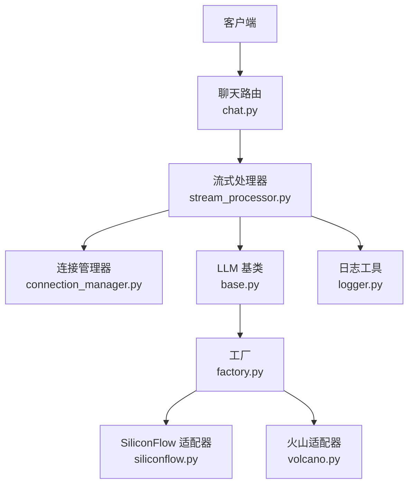
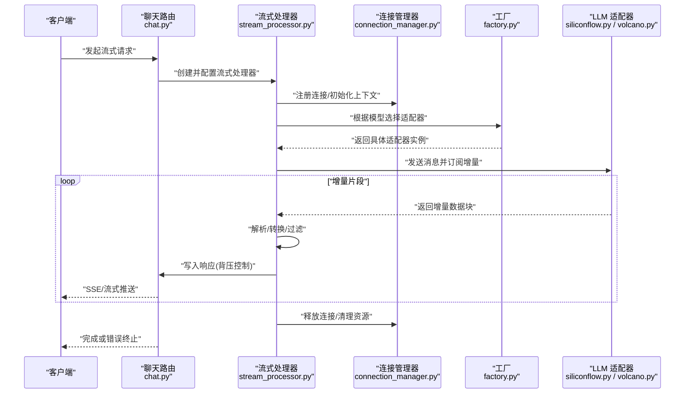
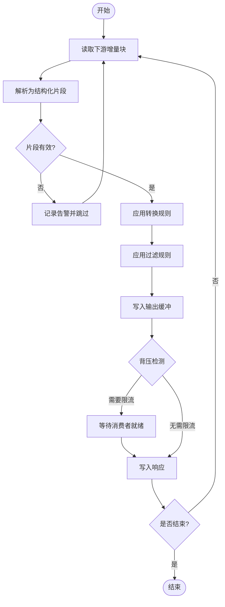
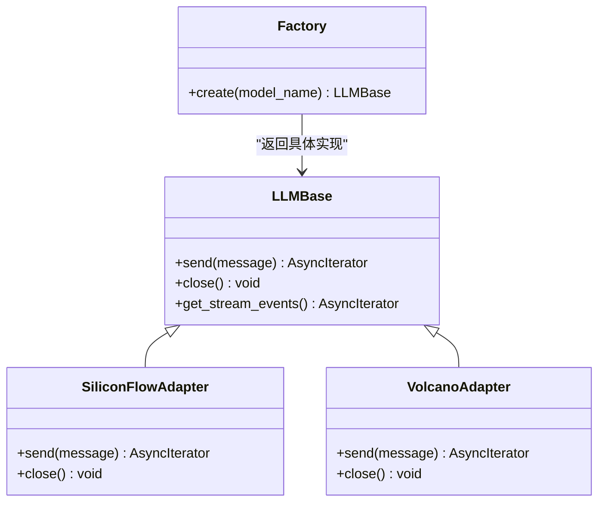
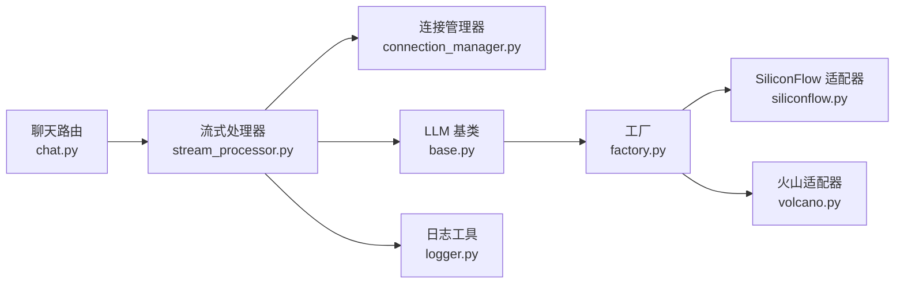

# 流式响应处理

<cite>
**本文引用的文件**   
- [backend/app/main.py](file://backend/app/main.py)
- [backend/app/routers/chat.py](file://backend/app/routers/chat.py)
- [backend/app/services/stream_processor.py](file://backend/app/services/stream_processor.py)
- [backend/app/services/connection_manager.py](file://backend/app/services/connection_manager.py)
- [backend/app/llm/base.py](file://backend/app/llm/base.py)
- [backend/app/llm/factory.py](file://backend/app/llm/factory.py)
- [backend/app/llm/siliconflow.py](file://backend/app/llm/siliconflow.py)
- [backend/app/llm/volcano.py](file://backend/app/llm/volcano.py)
- [backend/app/utils/logger.py](file://backend/app/utils/logger.py)
</cite>

## 目录
1. [简介](#简介)
2. [项目结构](#项目结构)
3. [核心组件](#核心组件)
4. [架构总览](#架构总览)
5. [详细组件分析](#详细组件分析)
6. [依赖关系分析](#依赖关系分析)
7. [性能考虑](#性能考虑)
8. [故障排查指南](#故障排查指南)
9. [结论](#结论)
10. [附录](#附录)

## 简介
本技术文档围绕后端服务中的“流式响应处理”能力展开，聚焦以下目标：
- 数据分块传输机制与增量渲染算法
- 缓冲区管理策略与背压控制
- 流式数据的解析、转换、过滤管道实现
- 错误处理与恢复（网络中断、数据损坏、超时）
- 性能优化（内存管理、并发处理）
- 最佳实践、监控指标与调试工具使用指南
- 常见问题与解决方案

## 项目结构
本项目采用分层与按功能域组织相结合的结构。与流式响应相关的核心代码位于 backend/app 下：
- 路由层：接收请求并驱动流式输出
- 服务层：封装流式处理器与连接管理器
- LLM 适配层：对接不同供应商的流式接口
- 工具层：日志等通用能力

图表来源
- [backend/app/routers/chat.py](file://backend/app/routers/chat.py)
- [backend/app/services/stream_processor.py](file://backend/app/services/stream_processor.py)
- [backend/app/services/connection_manager.py](file://backend/app/services/connection_manager.py)
- [backend/app/llm/base.py](file://backend/app/llm/base.py)
- [backend/app/llm/factory.py](file://backend/app/llm/factory.py)
- [backend/app/llm/siliconflow.py](file://backend/app/llm/siliconflow.py)
- [backend/app/llm/volcano.py](file://backend/app/llm/volcano.py)
- [backend/app/utils/logger.py](file://backend/app/utils/logger.py)

章节来源
- [backend/app/main.py](file://backend/app/main.py)
- [backend/app/routers/chat.py](file://backend/app/routers/chat.py)

## 核心组件
- 聊天路由：负责解析请求参数、选择模型、建立 SSE/流式通道，并将下游生成的增量片段写入响应。
- 流式处理器：维护解析、转换、过滤管道；协调缓冲与背压；统一错误与重试逻辑。
- 连接管理器：管理长连接生命周期、心跳保活、断线重连与资源清理。
- LLM 适配层：抽象统一的流式接口，屏蔽不同供应商差异。
- 日志工具：结构化记录关键事件与指标。

章节来源
- [backend/app/routers/chat.py](file://backend/app/routers/chat.py)
- [backend/app/services/stream_processor.py](file://backend/app/services/stream_processor.py)
- [backend/app/services/connection_manager.py](file://backend/app/services/connection_manager.py)
- [backend/app/llm/base.py](file://backend/app/llm/base.py)
- [backend/app/llm/factory.py](file://backend/app/llm/factory.py)
- [backend/app/llm/siliconflow.py](file://backend/app/llm/siliconflow.py)
- [backend/app/llm/volcano.py](file://backend/app/llm/volcano.py)
- [backend/app/utils/logger.py](file://backend/app/utils/logger.py)

## 架构总览
下图展示一次典型的流式对话请求从客户端到 LLM 供应商的端到端流程，以及增量数据如何经管道处理后返回给前端。

图表来源
- [backend/app/routers/chat.py](file://backend/app/routers/chat.py)
- [backend/app/services/stream_processor.py](file://backend/app/services/stream_processor.py)
- [backend/app/services/connection_manager.py](file://backend/app/services/connection_manager.py)
- [backend/app/llm/factory.py](file://backend/app/llm/factory.py)
- [backend/app/llm/siliconflow.py](file://backend/app/llm/siliconflow.py)
- [backend/app/llm/volcano.py](file://backend/app/llm/volcano.py)

## 详细组件分析

### 聊天路由（SSE/流式入口）
职责
- 解析请求体与查询参数
- 选择模型与构建会话上下文
- 调用流式处理器并绑定响应通道
- 处理异常并返回合适的状态码与提示

关键点
- 将下游增量数据以最小延迟推送到客户端
- 在路由层做轻量校验与鉴权，避免进入深层处理

章节来源
- [backend/app/routers/chat.py](file://backend/app/routers/chat.py)

### 流式处理器（解析/转换/过滤管道）
职责
- 维护“解析→转换→过滤”三段式管道
- 管理输入/输出缓冲区与背压
- 聚合增量片段为可渲染单元
- 统一错误捕获、重试与降级

数据结构与复杂度
- 输入缓冲：环形缓冲或队列，O(1) 入队出队
- 输出缓冲：固定容量，满时触发背压暂停上游读取
- 增量聚合器：按行/标记/语义边界切分，均摊 O(n)

背压与缓冲策略
- 基于令牌桶或滑动窗口限制写入速率
- 当客户端消费慢时，降低上游拉取频率或短暂休眠
- 设置最大缓冲水位，超过阈值丢弃低优先级片段或触发告警

错误与恢复
- 网络中断：指数退避重试，带最大重试次数与熔断
- 数据损坏：跳过不可解析片段并记录告警，继续后续数据
- 超时：对单次读取与整体会话分别设置超时，及时释放资源

图表来源
- [backend/app/services/stream_processor.py](file://backend/app/services/stream_processor.py)

章节来源
- [backend/app/services/stream_processor.py](file://backend/app/services/stream_processor.py)

### 连接管理器（长连接与心跳）
职责
- 管理连接池与会话上下文
- 心跳保活与空闲回收
- 断线检测与自动重连
- 资源清理与泄漏防护

要点
- 区分“读连接”和“写连接”，读写分离提升吞吐
- 心跳间隔与超时时间可配置，避免误判
- 提供优雅关闭钩子，确保在异常路径也能释放资源

章节来源
- [backend/app/services/connection_manager.py](file://backend/app/services/connection_manager.py)

### LLM 适配层（多供应商统一接口）
职责
- 定义统一的流式接口契约
- 屏蔽各供应商协议差异（如 SSE、Server-Sent Events、自定义协议）
- 提供工厂方法按模型名选择具体实现

类关系示意

图表来源
- [backend/app/llm/base.py](file://backend/app/llm/base.py)
- [backend/app/llm/factory.py](file://backend/app/llm/factory.py)
- [backend/app/llm/siliconflow.py](file://backend/app/llm/siliconflow.py)
- [backend/app/llm/volcano.py](file://backend/app/llm/volcano.py)

章节来源
- [backend/app/llm/base.py](file://backend/app/llm/base.py)
- [backend/app/llm/factory.py](file://backend/app/llm/factory.py)
- [backend/app/llm/siliconflow.py](file://backend/app/llm/siliconflow.py)
- [backend/app/llm/volcano.py](file://backend/app/llm/volcano.py)

### 日志工具（可观测性基础）
职责
- 结构化记录关键事件（请求ID、模型名、耗时、字节数）
- 支持分级日志与采样策略
- 暴露指标打点接口供监控系统采集

章节来源
- [backend/app/utils/logger.py](file://backend/app/utils/logger.py)

## 依赖关系分析
- 路由层仅依赖服务层与日志工具，保持薄控制器风格
- 流式处理器依赖连接管理器与 LLM 适配层，并通过工厂解耦供应商
- LLM 适配层之间相互独立，通过统一基类约束行为

图表来源
- [backend/app/routers/chat.py](file://backend/app/routers/chat.py)
- [backend/app/services/stream_processor.py](file://backend/app/services/stream_processor.py)
- [backend/app/services/connection_manager.py](file://backend/app/services/connection_manager.py)
- [backend/app/llm/base.py](file://backend/app/llm/base.py)
- [backend/app/llm/factory.py](file://backend/app/llm/factory.py)
- [backend/app/llm/siliconflow.py](file://backend/app/llm/siliconflow.py)
- [backend/app/llm/volcano.py](file://backend/app/llm/volcano.py)
- [backend/app/utils/logger.py](file://backend/app/utils/logger.py)

章节来源
- [backend/app/main.py](file://backend/app/main.py)
- [backend/app/routers/chat.py](file://backend/app/routers/chat.py)

## 性能考虑
- 背压控制
  - 基于令牌桶或滑动窗口限制每秒写入量
  - 当客户端消费慢时，主动降速或暂停上游拉取，避免内存膨胀
- 内存管理
  - 固定大小缓冲池复用对象，减少 GC 压力
  - 增量聚合器按语义边界切分，避免大对象累积
- 并发处理
  - 读写分离：读侧异步迭代，写侧批量合并后一次性写出
  - 任务隔离：每个会话独立协程，避免互相阻塞
- 网络优化
  - 合理设置超时与重试退避，避免雪崩
  - 启用连接复用与 Keep-Alive

[本节为通用指导，不直接分析具体文件]

## 故障排查指南
常见问题与定位步骤
- 客户端无增量显示
  - 检查路由层是否正确绑定流式响应
  - 确认流式处理器未过早关闭或抛出异常
  - 查看日志中是否有“背压/缓冲溢出”告警
- 频繁断线重连
  - 核对心跳间隔与超时配置
  - 观察连接管理器是否出现资源泄漏
- 数据乱序或缺失
  - 检查解析阶段的分片边界是否正确
  - 确认过滤规则是否误删必要片段
- 高 CPU/内存占用
  - 评估缓冲水位与批大小
  - 调整背压阈值与重试退避策略

建议的监控指标
- 请求级：首字节延迟、平均增量延迟、总时长、字节吞吐
- 系统级：缓冲水位、背压触发次数、重连次数、错误率
- 业务级：模型名称分布、失败原因分类

章节来源
- [backend/app/utils/logger.py](file://backend/app/utils/logger.py)
- [backend/app/services/stream_processor.py](file://backend/app/services/stream_processor.py)
- [backend/app/services/connection_manager.py](file://backend/app/services/connection_manager.py)

## 结论
该流式响应处理系统通过清晰的层次划分与可插拔的 LLM 适配层，实现了稳定高效的增量数据传输。结合背压控制、缓冲管理与完善的错误恢复策略，能够在复杂网络环境下保持良好用户体验。建议在上线前完善监控与告警，持续优化背压与缓冲参数，以获得更稳定的性能表现。

[本节为总结性内容，不直接分析具体文件]

## 附录
- 最佳实践清单
  - 始终为读/写操作设置超时
  - 使用结构化日志记录关键路径事件
  - 对下游供应商的错误进行可观测性打点
  - 在测试环境模拟弱网与高延迟场景
- 调试工具建议
  - 开启详细日志级别，按请求 ID 追踪
  - 使用抓包工具验证服务端增量推送顺序与大小
  - 通过指标面板观察背压与缓冲水位变化

[本节为通用指导，不直接分析具体文件]