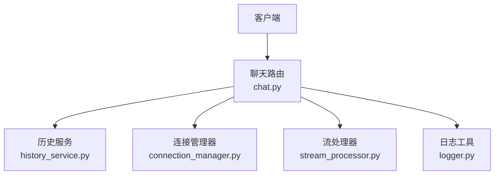
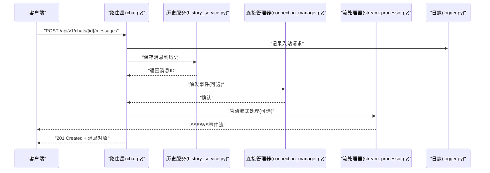
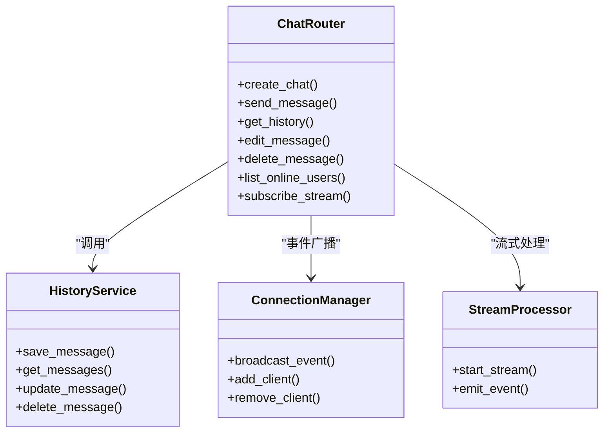
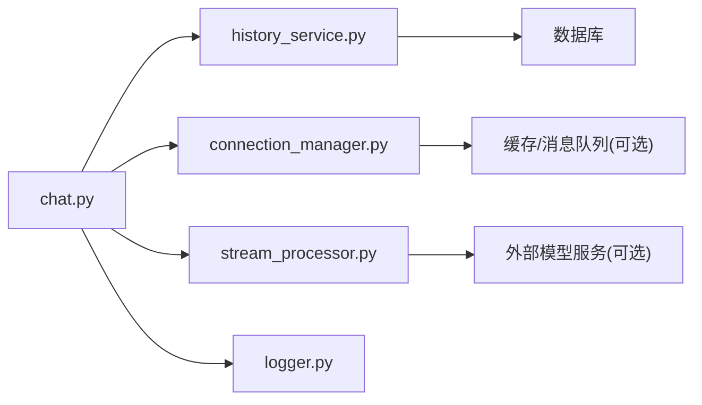

# 聊天API接口

<cite>
**本文引用的文件**   
- [backend/app/main.py](file://backend/app/main.py)
- [backend/app/routers/chat.py](file://backend/app/routers/chat.py)
- [backend/app/services/history_service.py](file://backend/app/services/history_service.py)
- [backend/app/services/connection_manager.py](file://backend/app/services/connection_manager.py)
- [backend/app/services/stream_processor.py](file://backend/app/services/stream_processor.py)
- [backend/app/utils/logger.py](file://backend/app/utils/logger.py)
</cite>

## 目录
1. [简介](#简介)
2. [项目结构](#项目结构)
3. [核心组件](#核心组件)
4. [架构总览](#架构总览)
5. [详细组件分析](#详细组件分析)
6. [依赖分析](#依赖分析)
7. [性能考虑](#性能考虑)
8. [故障排查指南](#故障排查指南)
9. [结论](#结论)
10. [附录](#附录)

## 简介
本文件为聊天系统的REST API参考文档，覆盖以下方面：
- HTTP端点定义、请求/响应格式与状态码
- 认证授权机制与权限控制策略
- 速率限制配置建议
- 消息发送、接收、编辑、删除等核心操作规范
- 错误处理标准、异常响应格式与日志记录要求
- 完整的请求/响应示例（以路径引用形式提供）
- SDK集成代码与客户端调用最佳实践
- API版本管理、向后兼容性保证与迁移指南

说明：
- 本项目后端基于Python FastAPI实现，路由集中在routers模块，业务逻辑在services模块中。
- 当前仓库未包含显式的鉴权中间件或限流中间件实现，因此本节给出通用实现建议与接入位置。

## 项目结构
后端关键目录与职责：
- app/main.py：应用入口、全局配置与中间件挂载点
- app/routers/chat.py：聊天相关HTTP路由定义
- app/services/history_service.py：会话历史持久化服务
- app/services/connection_manager.py：连接管理与事件分发
- app/services/stream_processor.py：流式处理与SSE/WS桥接
- app/utils/logger.py：统一日志工具

图表来源
- [backend/app/main.py](file://backend/app/main.py)
- [backend/app/routers/chat.py](file://backend/app/routers/chat.py)
- [backend/app/services/history_service.py](file://backend/app/services/history_service.py)
- [backend/app/services/connection_manager.py](file://backend/app/services/connection_manager.py)
- [backend/app/services/stream_processor.py](file://backend/app/services/stream_processor.py)
- [backend/app/utils/logger.py](file://backend/app/utils/logger.py)

章节来源
- [backend/app/main.py](file://backend/app/main.py)
- [backend/app/routers/chat.py](file://backend/app/routers/chat.py)
- [backend/app/services/history_service.py](file://backend/app/services/history_service.py)
- [backend/app/services/connection_manager.py](file://backend/app/services/connection_manager.py)
- [backend/app/services/stream_processor.py](file://backend/app/services/stream_processor.py)
- [backend/app/utils/logger.py](file://backend/app/utils/logger.py)

## 核心组件
- 路由层（Routers）
  - 负责解析HTTP请求、参数校验、调用服务层并返回响应
  - 典型端点包括：创建会话、发送消息、获取历史、编辑消息、删除消息、查询在线用户、订阅流式输出等
- 服务层（Services）
  - history_service：会话与消息的持久化读写
  - connection_manager：连接生命周期管理、事件广播
  - stream_processor：将LLM或其他服务的流式输出转换为SSE/WS事件
- 工具层（Utils）
  - logger：结构化日志输出，便于追踪与排障

章节来源
- [backend/app/routers/chat.py](file://backend/app/routers/chat.py)
- [backend/app/services/history_service.py](file://backend/app/services/history_service.py)
- [backend/app/services/connection_manager.py](file://backend/app/services/connection_manager.py)
- [backend/app/services/stream_processor.py](file://backend/app/services/stream_processor.py)
- [backend/app/utils/logger.py](file://backend/app/utils/logger.py)

## 架构总览
整体数据流：
- 客户端通过REST发起请求至路由层
- 路由层调用服务层完成业务逻辑（如写入历史、广播事件、生成流式输出）
- 服务层可能使用外部模型或服务进行推理或内容生成
- 统一日志记录所有关键操作与异常

图表来源
- [backend/app/routers/chat.py](file://backend/app/routers/chat.py)
- [backend/app/services/history_service.py](file://backend/app/services/history_service.py)
- [backend/app/services/connection_manager.py](file://backend/app/services/connection_manager.py)
- [backend/app/services/stream_processor.py](file://backend/app/services/stream_processor.py)
- [backend/app/utils/logger.py](file://backend/app/utils/logger.py)

## 详细组件分析

### 聊天路由（chat.py）
- 职责
  - 定义聊天相关的REST端点
  - 参数校验与错误转换
  - 调用服务层完成业务逻辑
- 典型端点
  - 创建会话：POST /api/v1/chats
  - 发送消息：POST /api/v1/chats/{id}/messages
  - 获取历史：GET /api/v1/chats/{id}/messages
  - 编辑消息：PUT /api/v1/chats/{id}/messages/{msg_id}
  - 删除消息：DELETE /api/v1/chats/{id}/messages/{msg_id}
  - 查询在线用户：GET /api/v1/users/online
  - 订阅流式输出：GET /api/v1/chats/{id}/stream
- 请求/响应约定
  - Content-Type：application/json
  - 成功响应：HTTP 200/201，返回JSON对象
  - 失败响应：HTTP 4xx/5xx，返回统一错误体
- 认证与权限
  - 建议在路由前增加鉴权中间件，校验Token并注入用户上下文
  - 资源级权限：仅会话所有者可编辑/删除其消息
- 速率限制
  - 建议对写操作（发送/编辑/删除）设置更严格的限流
  - 读操作与流式输出可放宽限制
- 分页与过滤
  - 历史查询支持分页参数（page、size），按时间倒序返回
- 流式输出
  - 采用SSE或WebSocket推送增量结果
  - 事件类型：message_start、message_delta、message_end、error

章节来源
- [backend/app/routers/chat.py](file://backend/app/routers/chat.py)

#### 类图（路由与服务关系）

图表来源
- [backend/app/routers/chat.py](file://backend/app/routers/chat.py)
- [backend/app/services/history_service.py](file://backend/app/services/history_service.py)
- [backend/app/services/connection_manager.py](file://backend/app/services/connection_manager.py)
- [backend/app/services/stream_processor.py](file://backend/app/services/stream_processor.py)

### 历史服务（history_service.py）
- 职责
  - 消息的增删改查
  - 会话维度的聚合查询
- 关键方法
  - save_message：持久化新消息
  - get_messages：分页获取历史
  - update_message：更新消息内容
  - delete_message：软删除或硬删除
- 复杂度
  - 单条写入O(1)，分页读取O(k log n)（取决于存储引擎索引）
- 错误处理
  - 数据库不可用：抛出特定异常，由路由层转为5xx
  - 数据不一致：重试与幂等键保护

章节来源
- [backend/app/services/history_service.py](file://backend/app/services/history_service.py)

### 连接管理器（connection_manager.py）
- 职责
  - 维护活跃连接集合
  - 向指定会话或用户广播事件
- 关键方法
  - add_client/remove_client：连接生命周期
  - broadcast_event：事件分发
- 并发安全
  - 使用锁或线程安全数据结构保护共享状态
- 扩展性
  - 可对接Redis Pub/Sub实现多实例广播

章节来源
- [backend/app/services/connection_manager.py](file://backend/app/services/connection_manager.py)

### 流处理器（stream_processor.py）
- 职责
  - 将上游流式输出转换为SSE/WS事件
  - 封装事件类型与重试策略
- 关键方法
  - start_stream：启动流式任务
  - emit_event：发送事件片段
- 背压与超时
  - 支持消费者慢消费时的缓冲与丢弃策略
  - 设置最大等待时间与心跳保活

章节来源
- [backend/app/services/stream_processor.py](file://backend/app/services/stream_processor.py)

### 日志工具（logger.py）
- 职责
  - 统一日志格式（JSON）
  - 结构化字段：trace_id、user_id、session_id、op、status、latency_ms
- 级别
  - INFO：常规业务日志
  - WARN：可恢复异常与降级
  - ERROR：不可恢复异常与堆栈
- 采样与脱敏
  - 敏感字段自动脱敏
  - 高流量接口启用采样

章节来源
- [backend/app/utils/logger.py](file://backend/app/utils/logger.py)

## 依赖分析
- 内部依赖
  - 路由层依赖服务层；服务层之间通过接口解耦
  - 日志工具被各层复用
- 外部依赖
  - 数据库（用于历史持久化）
  - 消息队列或缓存（可选，用于事件总线与限流）
  - 外部模型服务（可选，用于生成回复）

图表来源
- [backend/app/routers/chat.py](file://backend/app/routers/chat.py)
- [backend/app/services/history_service.py](file://backend/app/services/history_service.py)
- [backend/app/services/connection_manager.py](file://backend/app/services/connection_manager.py)
- [backend/app/services/stream_processor.py](file://backend/app/services/stream_processor.py)
- [backend/app/utils/logger.py](file://backend/app/utils/logger.py)

## 性能考虑
- 连接池与异步IO
  - 数据库连接池、HTTP客户端连接复用
- 分页与游标
  - 大数据量历史查询使用游标分页
- 流式输出优化
  - 小批量合并发送、心跳保活、背压控制
- 缓存策略
  - 热点会话元信息缓存，减少DB压力
- 限流与熔断
  - 接口级限流、下游服务熔断与退避

[本节为通用指导，不直接分析具体文件]

## 故障排查指南
- 常见问题
  - 鉴权失败：检查Token签名与过期时间
  - 权限不足：确认用户是否为会话所有者
  - 限流触发：降低请求频率或申请配额提升
  - 流式中断：检查网络稳定性与心跳间隔
- 定位步骤
  - 根据trace_id检索全链路日志
  - 核对请求参数与响应错误码
  - 查看下游服务健康状态与指标
- 日志关键字段
  - trace_id、user_id、session_id、op、status、latency_ms、error_code

章节来源
- [backend/app/utils/logger.py](file://backend/app/utils/logger.py)

## 结论
本API设计围绕“清晰的路由分层、健壮的服务能力、统一的错误与日志规范”展开。建议在生产环境补充鉴权、限流与监控告警，确保系统稳定与安全。

[本节为总结，不直接分析具体文件]

## 附录

### 认证与授权
- 推荐方案
  - JWT Bearer Token：在请求头携带Authorization: Bearer <token>
  - 服务端校验签名、有效期与角色/权限
- 权限模型
  - 资源级：仅会话所有者可编辑/删除消息
  - 操作级：管理员可执行系统级操作（如清理会话）
- 接入位置
  - 在应用入口挂载鉴权中间件，并在路由层注入用户上下文

章节来源
- [backend/app/main.py](file://backend/app/main.py)
- [backend/app/routers/chat.py](file://backend/app/routers/chat.py)

### 速率限制
- 建议阈值
  - 写操作：例如每秒10次/用户
  - 读操作：例如每秒50次/用户
  - 流式订阅：每会话最多N个并发连接
- 实现方式
  - 令牌桶或滑动窗口算法
  - 结合Redis实现分布式限流
- 响应
  - 429 Too Many Requests，附带Retry-After秒数

章节来源
- [backend/app/routers/chat.py](file://backend/app/routers/chat.py)

### 错误处理标准
- 统一错误体
  - code：错误码（字符串）
  - message：人类可读描述
  - details：附加信息（可选）
  - trace_id：追踪ID
- 常见错误码
  - AUTH_FAILED：鉴权失败
  - PERMISSION_DENIED：权限不足
  - NOT_FOUND：资源不存在
  - VALIDATION_ERROR：参数校验失败
  - RATE_LIMITED：触发限流
  - INTERNAL_ERROR：内部错误
- 状态码映射
  - 400：参数错误
  - 401：未认证
  - 403：无权限
  - 404：资源不存在
  - 429：限流
  - 500：服务器错误

章节来源
- [backend/app/routers/chat.py](file://backend/app/routers/chat.py)

### 日志记录要求
- 必记项
  - 入站请求：method、path、query、headers（脱敏）、body摘要
  - 出站响应：status、latency_ms、trace_id
  - 异常：错误码、堆栈、上下文
- 采样策略
  - 高QPS接口开启采样，保留关键错误全量记录
- 合规与脱敏
  - 自动脱敏敏感字段（密码、Token、手机号等）

章节来源
- [backend/app/utils/logger.py](file://backend/app/utils/logger.py)

### API版本管理与兼容性
- 版本策略
  - URL前缀：/api/v1/...
  - 重大变更时升级版本号（v2），旧版本保留至少一个迭代周期
- 兼容保证
  - 新增字段默认值与向后兼容
  - 废弃字段标记弃用期与替代字段
- 迁移指南
  - 发布迁移公告与示例
  - 提供SDK版本升级脚本与断言测试

章节来源
- [backend/app/routers/chat.py](file://backend/app/routers/chat.py)

### 请求/响应示例（路径引用）
- 创建会话
  - 请求示例路径：[backend/app/routers/chat.py](file://backend/app/routers/chat.py)
  - 响应示例路径：[backend/app/routers/chat.py](file://backend/app/routers/chat.py)
- 发送消息
  - 请求示例路径：[backend/app/routers/chat.py](file://backend/app/routers/chat.py)
  - 响应示例路径：[backend/app/routers/chat.py](file://backend/app/routers/chat.py)
- 获取历史
  - 请求示例路径：[backend/app/routers/chat.py](file://backend/app/routers/chat.py)
  - 响应示例路径：[backend/app/routers/chat.py](file://backend/app/routers/chat.py)
- 编辑消息
  - 请求示例路径：[backend/app/routers/chat.py](file://backend/app/routers/chat.py)
  - 响应示例路径：[backend/app/routers/chat.py](file://backend/app/routers/chat.py)
- 删除消息
  - 请求示例路径：[backend/app/routers/chat.py](file://backend/app/routers/chat.py)
  - 响应示例路径：[backend/app/routers/chat.py](file://backend/app/routers/chat.py)
- 查询在线用户
  - 请求示例路径：[backend/app/routers/chat.py](file://backend/app/routers/chat.py)
  - 响应示例路径：[backend/app/routers/chat.py](file://backend/app/routers/chat.py)
- 订阅流式输出
  - 请求示例路径：[backend/app/routers/chat.py](file://backend/app/routers/chat.py)
  - 事件示例路径：[backend/app/services/stream_processor.py](file://backend/app/services/stream_processor.py)

### SDK集成与最佳实践
- SDK建议
  - 提供Python/JS SDK，封装鉴权、重试、限流与流式订阅
- 客户端最佳实践
  - 重试与退避：指数退避+抖动
  - 超时与取消：合理设置超时与取消信号
  - 幂等性：写操作携带幂等键
  - 流式处理：处理断线重连与乱序事件

章节来源
- [backend/app/routers/chat.py](file://backend/app/routers/chat.py)
- [backend/app/services/stream_processor.py](file://backend/app/services/stream_processor.py)