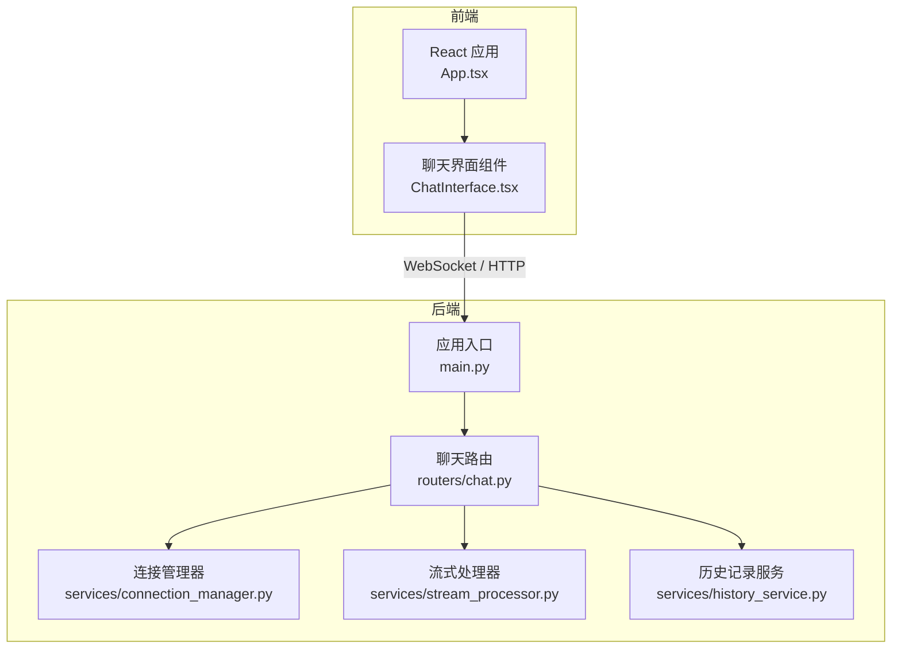
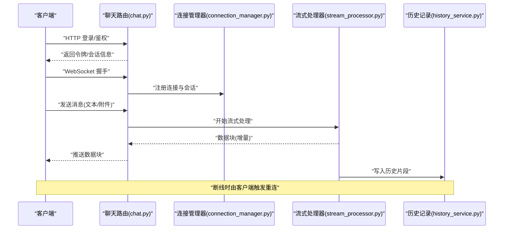
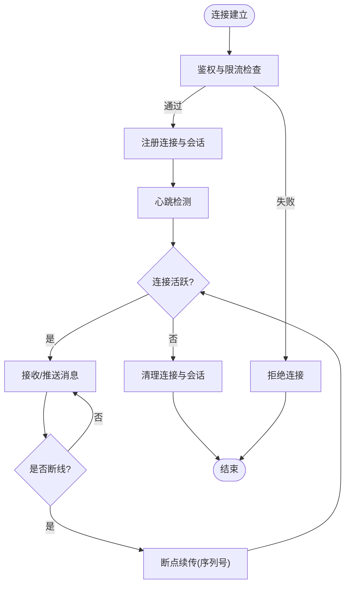
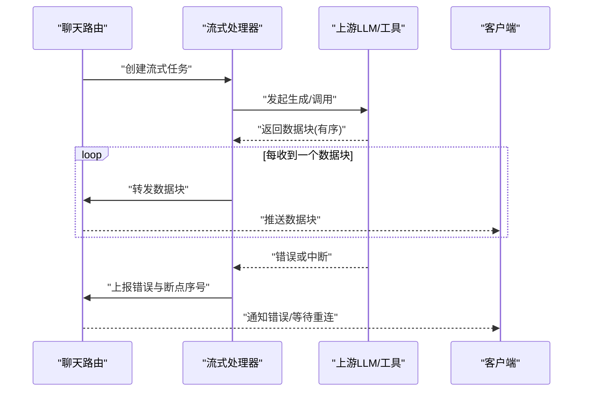
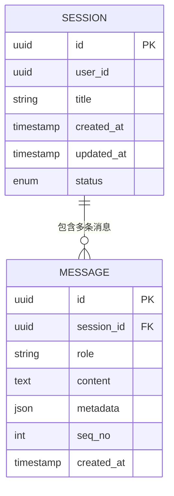
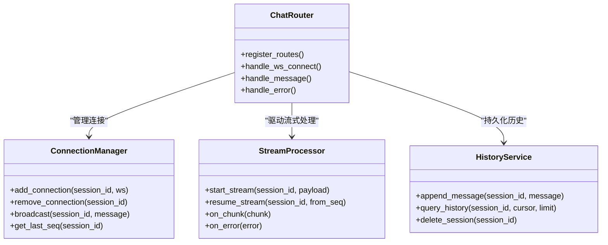
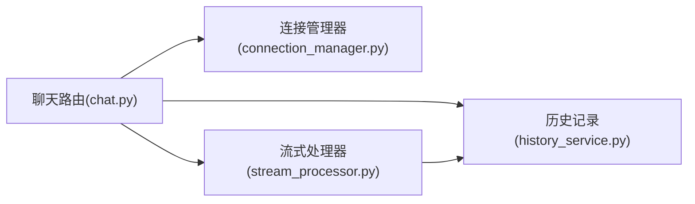

# 聊天系统

<cite>
**本文引用的文件**   
- [backend/app/main.py](file://backend/app/main.py)
- [backend/app/routers/chat.py](file://backend/app/routers/chat.py)
- [backend/app/services/connection_manager.py](file://backend/app/services/connection_manager.py)
- [backend/app/services/stream_processor.py](file://backend/app/services/stream_processor.py)
- [backend/app/services/history_service.py](file://backend/app/services/history_service.py)
- [frontend/src/components/ChatInterface.tsx](file://frontend/src/components/ChatInterface.tsx)
</cite>

## 目录
1. [简介](#简介)
2. [项目结构](#项目结构)
3. [核心组件](#核心组件)
4. [架构总览](#架构总览)
5. [详细组件分析](#详细组件分析)
6. [依赖关系分析](#依赖关系分析)
7. [性能考虑](#性能考虑)
8. [故障排查指南](#故障排查指南)
9. [结论](#结论)
10. [附录](#附录)

## 简介
本技术文档围绕聊天系统的后端与前端实现，系统性阐述以下关键主题：
- WebSocket 连接管理机制：连接建立、会话状态维护、断线重连策略
- 流式响应处理器：数据分块传输、增量渲染、错误恢复
- 历史记录服务：数据库设计、查询优化、存储策略
- 聊天路由器的 API 设计：消息格式、权限控制、速率限制
- 实时通信最佳实践、性能调优建议与故障排查指南
- 客户端集成示例与调试技巧

## 项目结构
本项目采用前后端分离架构。后端基于 Python（FastAPI）提供 REST 与 WebSocket 接口；前端使用 React + TypeScript 构建用户界面并通过 WebSocket 进行实时交互。

图表来源
- [backend/app/main.py](file://backend/app/main.py)
- [backend/app/routers/chat.py](file://backend/app/routers/chat.py)
- [backend/app/services/connection_manager.py](file://backend/app/services/connection_manager.py)
- [backend/app/services/stream_processor.py](file://backend/app/services/stream_processor.py)
- [backend/app/services/history_service.py](file://backend/app/services/history_service.py)
- [frontend/src/components/ChatInterface.tsx](file://frontend/src/components/ChatInterface.tsx)

章节来源
- [backend/app/main.py](file://backend/app/main.py)
- [backend/app/routers/chat.py](file://backend/app/routers/chat.py)
- [backend/app/services/connection_manager.py](file://backend/app/services/connection_manager.py)
- [backend/app/services/stream_processor.py](file://backend/app/services/stream_processor.py)
- [backend/app/services/history_service.py](file://backend/app/services/history_service.py)
- [frontend/src/components/ChatInterface.tsx](file://frontend/src/components/ChatInterface.tsx)

## 核心组件
- 应用入口 main.py：注册路由、挂载中间件、启动服务
- 聊天路由 chat.py：定义 REST 与 WebSocket 接口，处理鉴权、限流、消息路由
- 连接管理器 connection_manager.py：管理 WebSocket 连接生命周期、会话状态、广播与重连协调
- 流式处理器 stream_processor.py：解析上游 LLM 或工具输出，按块推送至客户端，支持错误恢复与重试
- 历史记录服务 history_service.py：持久化对话历史，提供分页与检索能力，负责索引与存储策略
- 前端 ChatInterface.tsx：建立 WebSocket 连接、发送消息、增量渲染、断线重连与错误提示

章节来源
- [backend/app/main.py](file://backend/app/main.py)
- [backend/app/routers/chat.py](file://backend/app/routers/chat.py)
- [backend/app/services/connection_manager.py](file://backend/app/services/connection_manager.py)
- [backend/app/services/stream_processor.py](file://backend/app/services/stream_processor.py)
- [backend/app/services/history_service.py](file://backend/app/services/history_service.py)
- [frontend/src/components/ChatInterface.tsx](file://frontend/src/components/ChatInterface.tsx)

## 架构总览
整体流程包括：客户端发起请求（REST 或 WebSocket），路由层进行鉴权与限流，随后调用连接管理器与流式处理器完成实时数据传输；同时通过历史记录服务持久化对话上下文。

图表来源
- [backend/app/routers/chat.py](file://backend/app/routers/chat.py)
- [backend/app/services/connection_manager.py](file://backend/app/services/connection_manager.py)
- [backend/app/services/stream_processor.py](file://backend/app/services/stream_processor.py)
- [backend/app/services/history_service.py](file://backend/app/services/history_service.py)

## 详细组件分析

### WebSocket 连接管理
- 连接建立
  - 路由层校验鉴权后，将连接注册到连接管理器，并绑定会话标识
  - 连接管理器维护连接集合、会话映射、心跳检测与超时清理
- 会话状态维护
  - 会话包含用户标识、角色、上下文指针、最近活跃时间等
  - 支持多连接共享同一会话（如跨设备同步）
- 断线重连策略
  - 服务端侧：记录最后成功推送的序列号，客户端重连后可从断点续传
  - 客户端侧：指数退避 + 抖动，最大重试次数与上限间隔
  - 心跳机制：双向 ping/pong，超时自动关闭并清理资源

图表来源
- [backend/app/routers/chat.py](file://backend/app/routers/chat.py)
- [backend/app/services/connection_manager.py](file://backend/app/services/connection_manager.py)

章节来源
- [backend/app/routers/chat.py](file://backend/app/routers/chat.py)
- [backend/app/services/connection_manager.py](file://backend/app/services/connection_manager.py)

### 流式响应处理器
- 数据分块传输
  - 将上游 LLM 或工具的长输出切分为小块，逐块推送，降低延迟
  - 每个数据块携带类型、序号、内容片段与可选元数据
- 增量渲染
  - 客户端根据类型与序号合并片段，避免重复渲染与乱序
  - 支持滚动定位与光标位置保持
- 错误恢复
  - 网络异常或上游中断时，记录已推送的最大序号
  - 客户端重连后请求从断点续传；服务端在可用范围内回放缺失片段
  - 对不可恢复错误返回明确错误码与可重试标志

图表来源
- [backend/app/routers/chat.py](file://backend/app/routers/chat.py)
- [backend/app/services/stream_processor.py](file://backend/app/services/stream_processor.py)

章节来源
- [backend/app/services/stream_processor.py](file://backend/app/services/stream_processor.py)
- [backend/app/routers/chat.py](file://backend/app/routers/chat.py)

### 历史记录服务
- 数据库设计
  - 会话表：会话 ID、用户 ID、标题、创建/更新时间、状态
  - 消息表：消息 ID、会话 ID、角色、内容、附件引用、时间戳、序号
  - 索引：会话 ID、时间戳、角色、关键词（全文检索扩展）
- 查询优化
  - 分页加载：按时间倒序分页，游标分页提升大会话体验
  - 预取策略：首屏加载最近 N 条，按需向上拉取更早历史
  - 缓存热点：近期会话摘要与高频消息缓存
- 存储策略
  - 冷热分层：热数据内存/近线存储，冷数据归档对象存储
  - 压缩与去重：相同片段去重，压缩存储以节省空间
  - 保留策略：按用户等级与合规要求设置保留期与清理任务

图表来源
- [backend/app/services/history_service.py](file://backend/app/services/history_service.py)

章节来源
- [backend/app/services/history_service.py](file://backend/app/services/history_service.py)

### 聊天路由器 API 设计
- 接口范围
  - REST：会话列表、会话详情、消息分页、设置更新
  - WebSocket：实时消息收发、事件通知（如系统提示、错误）
- 消息格式
  - 统一信封：类型、会话 ID、序号、时间戳、载荷
  - 载荷区分：文本、富文本、附件、工具调用结果
- 权限控制
  - 基于令牌的身份验证与会话隔离
  - 细粒度权限：读/写/管理，按会话或全局配置
- 速率限制
  - 基于用户与会话的双维度限流
  - 滑动窗口计数与突发保护，超限返回标准错误码

图表来源
- [backend/app/routers/chat.py](file://backend/app/routers/chat.py)
- [backend/app/services/connection_manager.py](file://backend/app/services/connection_manager.py)
- [backend/app/services/stream_processor.py](file://backend/app/services/stream_processor.py)
- [backend/app/services/history_service.py](file://backend/app/services/history_service.py)

章节来源
- [backend/app/routers/chat.py](file://backend/app/routers/chat.py)

### 客户端集成示例与调试技巧
- 连接建立
  - 先通过 REST 获取令牌，再建立 WebSocket 连接并携带会话上下文
  - 首次连接成功后订阅必要事件（消息、错误、系统通知）
- 增量渲染
  - 按序号合并数据块，避免重复渲染；遇到乱序则缓冲并重排
  - 长文本分段显示，保持滚动位置与输入框焦点
- 断线重连
  - 指数退避 + 随机抖动，最大重试次数与间隔上限
  - 重连后携带 last_seq 请求断点续传
- 调试技巧
  - 启用日志级别与追踪 ID，便于端到端问题定位
  - 本地代理捕获 WebSocket 帧，观察消息结构与时序
  - 模拟网络抖动与上游错误，验证重连与错误恢复路径

章节来源
- [frontend/src/components/ChatInterface.tsx](file://frontend/src/components/ChatInterface.tsx)

## 依赖关系分析
- 模块耦合
  - 路由层作为编排中心，依赖连接管理器、流式处理器与历史记录服务
  - 连接管理器与流式处理器之间通过事件与序列号协同
- 外部依赖
  - 上游 LLM/工具服务：可能引入超时与不稳定因素，需配合重试与熔断
  - 数据库与对象存储：影响历史读写性能与成本
- 潜在循环依赖
  - 确保路由不直接依赖流式处理器的内部实现细节，仅通过接口交互

图表来源
- [backend/app/routers/chat.py](file://backend/app/routers/chat.py)
- [backend/app/services/connection_manager.py](file://backend/app/services/connection_manager.py)
- [backend/app/services/stream_processor.py](file://backend/app/services/stream_processor.py)
- [backend/app/services/history_service.py](file://backend/app/services/history_service.py)

章节来源
- [backend/app/routers/chat.py](file://backend/app/routers/chat.py)
- [backend/app/services/connection_manager.py](file://backend/app/services/connection_manager.py)
- [backend/app/services/stream_processor.py](file://backend/app/services/stream_processor.py)
- [backend/app/services/history_service.py](file://backend/app/services/history_service.py)

## 性能考虑
- 连接管理
  - 使用高效数据结构维护连接集合与会话映射，避免 O(n) 查找
  - 批量清理空闲连接，减少内存占用
- 流式处理
  - 合理设置数据块大小，平衡延迟与开销
  - 对上游响应做背压控制，防止客户端过载
- 历史存储
  - 分页与游标结合，减少一次性加载量
  - 冷热分层与压缩，降低 I/O 与存储成本
- 限流与降级
  - 基于令牌桶或滑动窗口的限流算法
  - 上游不可用时快速失败与降级策略（返回缓存或提示）

[本节为通用指导，无需特定文件来源]

## 故障排查指南
- 常见问题
  - 连接频繁断开：检查心跳间隔与超时阈值，确认网络质量与代理配置
  - 消息乱序或缺失：核对序号字段与客户端合并逻辑，必要时启用断点续传
  - 历史加载缓慢：检查分页参数与索引命中情况，评估是否需要预热或缓存
- 诊断步骤
  - 查看服务端日志中的错误码与堆栈，定位具体模块
  - 使用追踪 ID 串联请求链路，对比客户端与服务端时间戳
  - 复现问题时抓取 WebSocket 帧与数据库慢查询
- 恢复策略
  - 自动重试与回退，人工介入开关
  - 会话级隔离，避免单用户问题扩散

章节来源
- [backend/app/routers/chat.py](file://backend/app/routers/chat.py)
- [backend/app/services/connection_manager.py](file://backend/app/services/connection_manager.py)
- [backend/app/services/stream_processor.py](file://backend/app/services/stream_processor.py)
- [backend/app/services/history_service.py](file://backend/app/services/history_service.py)
- [frontend/src/components/ChatInterface.tsx](file://frontend/src/components/ChatInterface.tsx)

## 结论
本聊天系统通过清晰的分层与模块化设计，实现了稳定的 WebSocket 连接管理、高效的流式响应处理与可靠的历史记录服务。结合合理的限流、缓存与降级策略，可在高并发场景下保持良好的用户体验。建议在部署中完善监控告警与自动化运维，持续优化性能与稳定性。

[本节为总结性内容，无需特定文件来源]

## 附录
- 术语
  - 会话：一次完整的对话上下文，包含多条消息
  - 数据块：流式传输的最小单位，携带序号与内容片段
  - 断点续传：从上次推送的序号继续传输缺失部分
- 参考实现路径
  - WebSocket 握手与消息路由：[backend/app/routers/chat.py](file://backend/app/routers/chat.py)
  - 连接管理与心跳：[backend/app/services/connection_manager.py](file://backend/app/services/connection_manager.py)
  - 流式处理与错误恢复：[backend/app/services/stream_processor.py](file://backend/app/services/stream_processor.py)
  - 历史持久化与查询：[backend/app/services/history_service.py](file://backend/app/services/history_service.py)
  - 客户端集成与重连：[frontend/src/components/ChatInterface.tsx](file://frontend/src/components/ChatInterface.tsx)