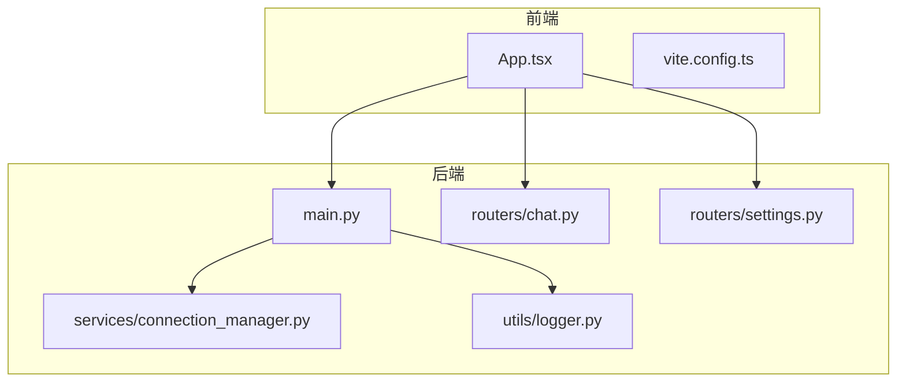
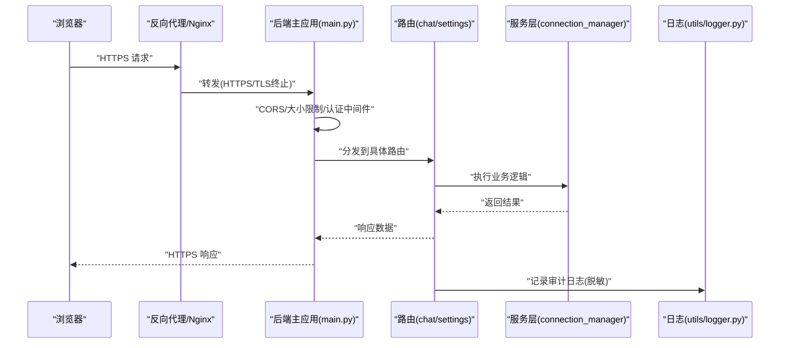
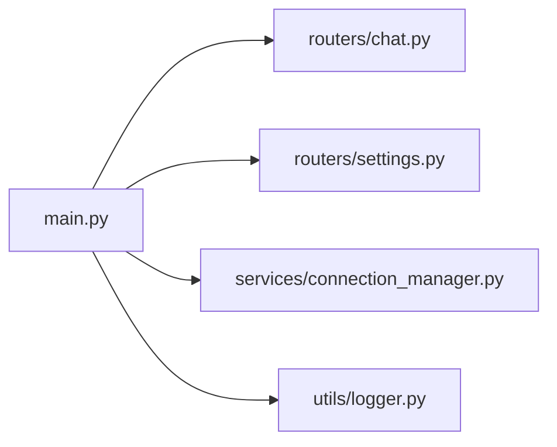

# 安全加固

<cite>
**本文引用的文件**   
- [backend/app/main.py](file://backend/app/main.py)
- [backend/app/routers/chat.py](file://backend/app/routers/chat.py)
- [backend/app/routers/settings.py](file://backend/app/routers/settings.py)
- [backend/app/services/connection_manager.py](file://backend/app/services/connection_manager.py)
- [backend/app/utils/logger.py](file://backend/app/utils/logger.py)
- [backend/env.example](file://backend/env.example)
- [frontend/src/App.tsx](file://frontend/src/App.tsx)
- [frontend/vite.config.ts](file://frontend/vite.config.ts)
</cite>

## 目录
1. [简介](#简介)
2. [项目结构](#项目结构)
3. [核心组件](#核心组件)
4. [架构总览](#架构总览)
5. [详细组件分析](#详细组件分析)
6. [依赖关系分析](#依赖关系分析)
7. [性能与安全权衡](#性能与安全权衡)
8. [故障排查指南](#故障排查指南)
9. [结论](#结论)
10. [附录](#附录)

## 简介
本指南面向后端与前端工程，提供一套可落地的安全加固方案。内容覆盖身份认证与授权（JWT、权限模型、会话安全）、API 安全防护（请求验证、输入过滤、SQL 注入与 XSS 防护）、网络安全配置（HTTPS、CORS、防火墙）、敏感信息管理（密钥加密存储、环境变量保护、日志脱敏），以及安全审计与漏洞扫描流程和安全事件应急响应预案。文档在给出通用最佳实践的同时，结合仓库中现有代码位置进行映射说明，便于快速落地。

## 项目结构
本项目采用前后端分离：
- 后端基于 Python/ASGI 框架，路由位于 routers，服务逻辑位于 services，工具与日志位于 utils。
- 前端使用 TypeScript + Vite，入口为 App.tsx，构建配置在 vite.config.ts。

图示来源
- [backend/app/main.py](file://backend/app/main.py)
- [backend/app/routers/chat.py](file://backend/app/routers/chat.py)
- [backend/app/routers/settings.py](file://backend/app/routers/settings.py)
- [backend/app/services/connection_manager.py](file://backend/app/services/connection_manager.py)
- [backend/app/utils/logger.py](file://backend/app/utils/logger.py)
- [frontend/src/App.tsx](file://frontend/src/App.tsx)
- [frontend/vite.config.ts](file://frontend/vite.config.ts)

章节来源
- [backend/app/main.py](file://backend/app/main.py)
- [backend/app/routers/chat.py](file://backend/app/routers/chat.py)
- [backend/app/routers/settings.py](file://backend/app/routers/settings.py)
- [backend/app/services/connection_manager.py](file://backend/app/services/connection_manager.py)
- [backend/app/utils/logger.py](file://backend/app/utils/logger.py)
- [frontend/src/App.tsx](file://frontend/src/App.tsx)
- [frontend/vite.config.ts](file://frontend/vite.config.ts)

## 核心组件
- 应用入口与中间件挂载点：用于统一接入认证、鉴权、CORS、限流、请求体大小限制等安全能力。
- 路由层：承载业务接口，需实现参数校验、访问控制、输出净化。
- 连接管理：对长连接或 WebSocket 场景的鉴权与会话生命周期管理。
- 日志系统：负责结构化日志、敏感信息脱敏、审计日志留存。
- 前端应用：负责令牌持久化、跨域策略、XSS 防护与资源加载安全。

章节来源
- [backend/app/main.py](file://backend/app/main.py)
- [backend/app/routers/chat.py](file://backend/app/routers/chat.py)
- [backend/app/routers/settings.py](file://backend/app/routers/settings.py)
- [backend/app/services/connection_manager.py](file://backend/app/services/connection_manager.py)
- [backend/app/utils/logger.py](file://backend/app/utils/logger.py)
- [frontend/src/App.tsx](file://frontend/src/App.tsx)

## 架构总览
下图展示从浏览器到后端的典型请求路径与安全控制点：浏览器发起 HTTPS 请求，经反向代理（建议 Nginx）完成 TLS 终止、速率限制与基础 WAF；进入后端主应用后，由中间件执行 CORS、请求体大小限制、认证与鉴权；路由处理业务并调用服务层；所有关键操作通过日志系统进行审计记录。

图示来源
- [backend/app/main.py](file://backend/app/main.py)
- [backend/app/routers/chat.py](file://backend/app/routers/chat.py)
- [backend/app/routers/settings.py](file://backend/app/routers/settings.py)
- [backend/app/services/connection_manager.py](file://backend/app/services/connection_manager.py)
- [backend/app/utils/logger.py](file://backend/app/utils/logger.py)

## 详细组件分析

### 身份认证与授权
- JWT 令牌管理
  - 签发与校验：在认证成功后签发短期有效、带签名的 JWT，并在受保护路由前校验签名、过期时间与必要声明。
  - 刷新机制：支持短时效访问令牌与较长时效刷新令牌，刷新接口需绑定设备指纹或 IP 白名单，失败次数限制。
  - 撤销与黑名单：登出或异常时加入黑名单，定期清理；支持按用户维度撤销。
  - 传输与存储：仅通过 HTTPS 传输；前端优先使用 httpOnly Cookie 或内存存储，避免 localStorage 长期保存高敏令牌。
- 权限控制模型
  - 推荐 RBAC：角色-资源-动作三元组，结合最小权限原则。
  - 细粒度控制：在路由级与资源级双重校验，避免越权访问。
  - 动态策略：将策略配置外置，支持热更新与灰度发布。
- 会话安全
  - 会话标识随机化、固定长度、不可预测。
  - 绑定 User-Agent/IP 片段，检测异常迁移。
  - 设置合理的超时与空闲超时，服务端主动回收。

章节来源
- [backend/app/main.py](file://backend/app/main.py)
- [backend/app/routers/chat.py](file://backend/app/routers/chat.py)
- [backend/app/routers/settings.py](file://backend/app/routers/settings.py)
- [backend/app/services/connection_manager.py](file://backend/app/services/connection_manager.py)

### API 安全防护
- 请求验证
  - 严格类型与范围校验，拒绝非法或缺失字段。
  - 限制请求体大小与嵌套深度，防止 DoS。
  - 对枚举、正则、白名单进行强校验。
- 输入过滤与输出净化
  - 对富文本输出进行 HTML 标签白名单过滤与属性清洗。
  - 对 JSON 输出进行二次序列化，避免原型链污染。
- SQL 注入防护
  - 强制使用参数化查询或 ORM，禁止拼接 SQL。
  - 数据库账号最小权限，禁用高危命令。
- XSS 攻击防护
  - 默认输出编码，谨慎使用 dangerouslySetInnerHTML 等同源渲染。
  - 设置 CSP 头，限制脚本来源与内联脚本。
  - 对上传内容进行类型与内容校验，重命名与隔离存储。

章节来源
- [backend/app/routers/chat.py](file://backend/app/routers/chat.py)
- [backend/app/routers/settings.py](file://backend/app/routers/settings.py)
- [backend/app/main.py](file://backend/app/main.py)

### 网络安全配置
- HTTPS 强制启用
  - 反向代理统一 TLS 终止，强制 HTTP→HTTPS 跳转。
  - 启用 HSTS、TLS 1.2+、禁用弱密码套件。
- CORS 策略
  - 明确允许的源、方法、头部与凭据策略。
  - 生产环境关闭通配符，按需白名单。
- 防火墙规则
  - 仅开放必要端口，限制来源 IP 段。
  - 对内部服务间通信启用网络隔离与双向认证。

章节来源
- [backend/app/main.py](file://backend/app/main.py)
- [frontend/vite.config.ts](file://frontend/vite.config.ts)

### 敏感信息管理
- 密钥加密存储
  - 使用平台 KMS 或硬件加密模块托管密钥，运行时解密。
  - 密钥轮换策略与版本兼容。
- 环境变量保护
  - 通过 .env 模板与 CI/CD 注入，禁止入库。
  - 容器运行时以只读文件系统挂载敏感卷。
- 日志脱敏处理
  - 自动识别并掩码令牌、密码、身份证号、手机号等。
  - 结构化日志，包含时间戳、请求 ID、用户标识（脱敏）。

章节来源
- [backend/env.example](file://backend/env.example)
- [backend/app/utils/logger.py](file://backend/app/utils/logger.py)

### 安全审计与漏洞扫描
- 审计日志
  - 记录登录、授权变更、敏感数据访问、导出与删除等操作。
  - 关联请求 ID，便于追踪与取证。
- 漏洞扫描
  - 依赖库扫描（SCA）、镜像扫描、SAST/DAST 流水线集成。
  - 定期渗透测试与基线核查。
- 告警与闭环
  - 严重级别实时告警，工单流转与修复时限。
  - 复测与回归验证。

章节来源
- [backend/app/utils/logger.py](file://backend/app/utils/logger.py)

### 安全事件应急响应预案
- 分级响应
  - P0/P1 立即处置，P2/P3 限时修复。
- 处置流程
  - 发现→抑制→根因分析→修复→复盘→加固。
- 演练与复盘
  - 定期红蓝对抗演练，完善预案与自动化脚本。

[本节为通用流程说明，不直接分析具体文件]

## 依赖关系分析
后端各模块职责清晰，安全相关依赖集中在入口中间件、路由校验与服务层鉴权。

图示来源
- [backend/app/main.py](file://backend/app/main.py)
- [backend/app/routers/chat.py](file://backend/app/routers/chat.py)
- [backend/app/routers/settings.py](file://backend/app/routers/settings.py)
- [backend/app/services/connection_manager.py](file://backend/app/services/connection_manager.py)
- [backend/app/utils/logger.py](file://backend/app/utils/logger.py)

章节来源
- [backend/app/main.py](file://backend/app/main.py)
- [backend/app/routers/chat.py](file://backend/app/routers/chat.py)
- [backend/app/routers/settings.py](file://backend/app/routers/settings.py)
- [backend/app/services/connection_manager.py](file://backend/app/services/connection_manager.py)
- [backend/app/utils/logger.py](file://backend/app/utils/logger.py)

## 性能与安全权衡
- 认证开销：JWT 验签与权限检查应缓存热点策略，减少重复计算。
- 日志量控制：仅记录必要审计字段，异步写入与采样降低 I/O 压力。
- 输入校验：在边界尽早失败，避免深层解析带来的 CPU 消耗。
- 连接管理：对长连接实施心跳与空闲回收，防止资源泄漏。

[本节为通用指导，不直接分析具体文件]

## 故障排查指南
- 认证失败
  - 检查 JWT 签名、过期时间与颁发者声明。
  - 核对 CORS 与凭据策略是否允许携带 Cookie。
- 跨域报错
  - 确认 Origin 白名单、方法与头部是否匹配。
  - 预检请求是否正确返回 2xx。
- 日志缺失
  - 检查日志开关、脱敏规则与写入权限。
  - 确认请求 ID 贯穿链路。

章节来源
- [backend/app/main.py](file://backend/app/main.py)
- [backend/app/utils/logger.py](file://backend/app/utils/logger.py)
- [frontend/src/App.tsx](file://frontend/src/App.tsx)

## 结论
通过统一的认证授权、严格的 API 防护、完善的网络安全配置、健壮的敏感信息管理以及常态化的审计与扫描，可显著提升系统整体安全性。建议将上述措施纳入开发规范与 CI/CD 流水线，持续演进与度量。

[本节为总结性内容，不直接分析具体文件]

## 附录
- 术语
  - JWT：JSON Web Token，一种紧凑的自包含令牌格式。
  - RBAC：基于角色的访问控制。
  - CSP：内容安全策略，用于缓解 XSS 等风险。
- 参考清单
  - 环境变量模板：参见 [backend/env.example](file://backend/env.example)
  - 日志模块：参见 [backend/app/utils/logger.py](file://backend/app/utils/logger.py)
  - 前端入口与构建配置：参见 [frontend/src/App.tsx](file://frontend/src/App.tsx)、[frontend/vite.config.ts](file://frontend/vite.config.ts)