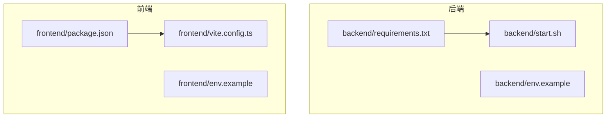
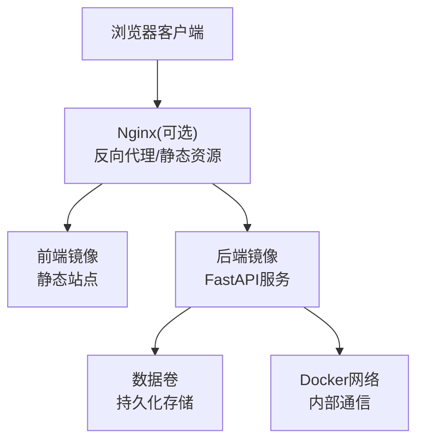
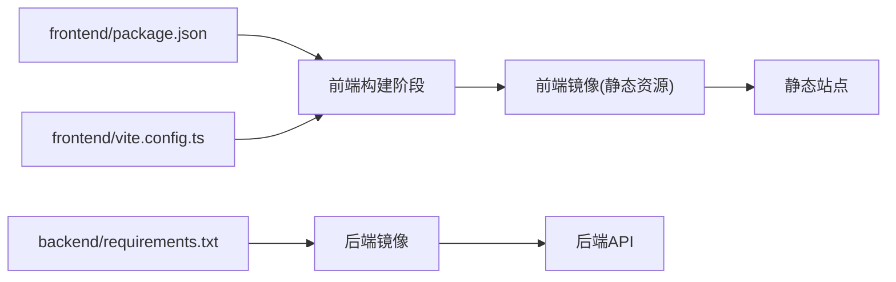
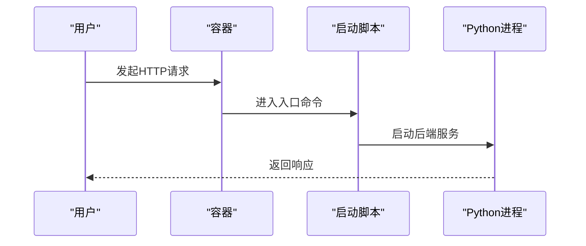
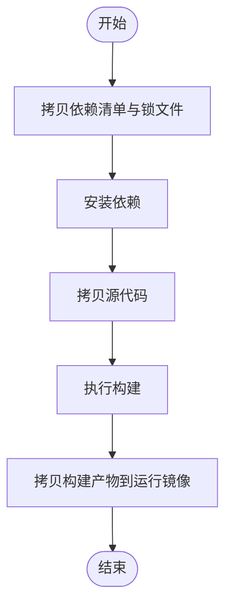

# Docker容器化配置

<cite>
**本文引用的文件**   
- [backend/requirements.txt](file://backend/requirements.txt)
- [backend/start.sh](file://backend/start.sh)
- [backend/env.example](file://backend/env.example)
- [frontend/package.json](file://frontend/package.json)
- [frontend/vite.config.ts](file://frontend/vite.config.ts)
- [frontend/env.example](file://frontend/env.example)
</cite>

## 目录
1. [简介](#简介)
2. [项目结构](#项目结构)
3. [核心组件](#核心组件)
4. [架构总览](#架构总览)
5. [详细组件分析](#详细组件分析)
6. [依赖关系分析](#依赖关系分析)
7. [性能与优化](#性能与优化)
8. [故障排查指南](#故障排查指南)
9. [结论](#结论)
10. [附录](#附录)

## 简介
本指南面向PolyStudio项目的Docker容器化落地，覆盖以下目标：
- 编写规范：多阶段构建、镜像分层最佳实践、安全加固措施
- 前后端服务镜像构建脚本：依赖安装、代码复制、端口暴露等完整配置
- 环境变量管理、数据卷挂载、网络配置
- Docker Compose编排：多服务协同部署
- 镜像优化技巧：缓存利用、体积压缩、安全扫描集成

## 项目结构
仓库包含后端（Python/FastAPI）与前端（Vite/React）两个独立服务。容器化需分别构建镜像并通过Compose编排对外提供服务。

图示来源
- [backend/requirements.txt](file://backend/requirements.txt)
- [backend/start.sh](file://backend/start.sh)
- [backend/env.example](file://backend/env.example)
- [frontend/package.json](file://frontend/package.json)
- [frontend/vite.config.ts](file://frontend/vite.config.ts)
- [frontend/env.example](file://frontend/env.example)

章节来源
- [backend/requirements.txt](file://backend/requirements.txt)
- [backend/start.sh](file://backend/start.sh)
- [backend/env.example](file://backend/env.example)
- [frontend/package.json](file://frontend/package.json)
- [frontend/vite.config.ts](file://frontend/vite.config.ts)
- [frontend/env.example](file://frontend/env.example)

## 核心组件
- 后端服务
  - 运行环境：Python + FastAPI（由入口脚本启动）
  - 依赖声明：requirements.txt
  - 启动脚本：start.sh
  - 环境变量示例：env.example
- 前端服务
  - 构建工具链：Vite + React（TypeScript）
  - 依赖声明：package.json
  - 构建配置：vite.config.ts
  - 环境变量示例：env.example

章节来源
- [backend/requirements.txt](file://backend/requirements.txt)
- [backend/start.sh](file://backend/start.sh)
- [backend/env.example](file://backend/env.example)
- [frontend/package.json](file://frontend/package.json)
- [frontend/vite.config.ts](file://frontend/vite.config.ts)
- [frontend/env.example](file://frontend/env.example)

## 架构总览
整体采用“前端静态资源 + 后端API”的双镜像模式，通过Nginx或反向代理统一对外暴露HTTP端口，并基于Compose进行编排。

图示来源
- [backend/start.sh](file://backend/start.sh)
- [frontend/vite.config.ts](file://frontend/vite.config.ts)

## 详细组件分析

### 后端镜像构建与运行
- 多阶段构建建议
  - 构建阶段：使用带编译/打包工具的Python基础镜像，安装依赖到虚拟环境或site-packages
  - 运行阶段：使用精简运行时镜像（如slim/alpine变体），仅拷贝必要产物与系统库
- 分层最佳实践
  - 先拷贝依赖清单再安装依赖，以最大化利用Docker层缓存
  - 将应用代码放在最后拷贝，避免依赖层频繁失效
- 安全加固
  - 非root用户运行
  - 最小化基础镜像，关闭不必要的包管理器
  - 定期更新基础镜像与安全补丁
- 端口与进程
  - 监听端口依据后端实现确定（常见为8000）
  - 使用健康检查探测后端就绪状态
- 环境变量
  - 从env.example读取默认值，在Compose中注入实际值
- 数据持久化
  - 将工作目录或上传目录映射至宿主卷，保证重启不丢失

章节来源
- [backend/requirements.txt](file://backend/requirements.txt)
- [backend/start.sh](file://backend/start.sh)
- [backend/env.example](file://backend/env.example)

### 前端镜像构建与运行
- 多阶段构建建议
  - 构建阶段：Node镜像执行依赖安装与构建，输出静态资源
  - 运行阶段：使用轻量Web服务器镜像（如Nginx）托管静态资源
- 分层最佳实践
  - 先拷贝package.json与lock文件，预安装依赖，再拷贝源码
  - 将构建产物复制到最终镜像的只读目录
- 环境变量
  - 构建期注入API地址等变量（参考vite.config.ts中的构建配置）
  - 运行期无需Node运行时
- 端口与代理
  - 对外暴露80端口，反向代理到后端API路径

章节来源
- [frontend/package.json](file://frontend/package.json)
- [frontend/vite.config.ts](file://frontend/vite.config.ts)
- [frontend/env.example](file://frontend/env.example)

### 环境变量管理
- 后端
  - 参考env.example定义键名与默认值
  - 在Compose中使用.env或secrets注入敏感信息
- 前端
  - 构建期注入常量，运行期仅承载静态资源
- 最佳实践
  - 区分开发/测试/生产环境
  - 禁止在镜像中硬编码密钥

章节来源
- [backend/env.example](file://backend/env.example)
- [frontend/env.example](file://frontend/env.example)

### 数据卷挂载
- 后端
  - 将工作空间、日志、上传目录映射到宿主卷
- 前端
  - 一般无需持久化；如需缓存可挂载构建缓存目录（仅限开发）

章节来源
- [backend/start.sh](file://backend/start.sh)

### 网络配置
- 使用Compose默认网络，服务间通过服务名访问
- 对外仅暴露必要端口（前端80、后端按需）
- 可通过反向代理统一域名与HTTPS终止

章节来源
- [backend/start.sh](file://backend/start.sh)
- [frontend/vite.config.ts](file://frontend/vite.config.ts)

### Docker Compose编排
- 服务定义
  - backend：构建后端镜像，注入环境变量，挂载数据卷，暴露后端端口
  - frontend：构建前端镜像，暴露80端口
  - nginx（可选）：反向代理，统一入口
- 网络与卷
  - 自定义网络隔离
  - 命名卷持久化后端数据
- 健康检查
  - 对后端添加健康检查，确保就绪后再转发流量

章节来源
- [backend/start.sh](file://backend/start.sh)
- [frontend/vite.config.ts](file://frontend/vite.config.ts)

## 依赖关系分析
- 后端依赖
  - Python第三方库由requirements.txt声明
- 前端依赖
  - Node模块由package.json与锁文件声明
- 构建顺序
  - 先构建前端静态资源，再由Nginx托管
  - 后端独立构建，提供API

图示来源
- [backend/requirements.txt](file://backend/requirements.txt)
- [frontend/package.json](file://frontend/package.json)
- [frontend/vite.config.ts](file://frontend/vite.config.ts)

章节来源
- [backend/requirements.txt](file://backend/requirements.txt)
- [frontend/package.json](file://frontend/package.json)
- [frontend/vite.config.ts](file://frontend/vite.config.ts)

## 性能与优化
- 缓存利用
  - 依赖层前置：先拷贝依赖清单再安装，减少重建
  - 使用Docker BuildKit缓存与远程缓存
- 镜像体积压缩
  - 多阶段构建，仅保留运行所需文件
  - 选择更小基础镜像（slim/alpine变体）
  - 清理包管理器缓存与临时文件
- 安全扫描集成
  - 在CI中集成Trivy/Grype等扫描器，阻断高危漏洞
  - 定期更新基础镜像与依赖版本
- 运行时优化
  - 限制CPU/内存资源
  - 启用只读根文件系统（除必要写入目录）

[本节为通用指导，不直接分析具体文件]

## 故障排查指南
- 启动失败
  - 检查环境变量是否缺失或格式错误
  - 查看容器日志定位异常堆栈
- 端口冲突
  - 确认宿主机端口未被占用
  - 调整Compose端口映射
- 权限问题
  - 确认非root用户具备写入权限
  - 校验数据卷挂载路径权限
- 网络不通
  - 验证服务是否在相同网络
  - 检查反向代理规则与健康检查

章节来源
- [backend/start.sh](file://backend/start.sh)

## 结论
通过多阶段构建、严格分层、最小化镜像与非root运行，结合Compose的环境变量、数据卷与网络编排，可实现前后端服务的稳定、安全与高效交付。建议在CI中集成依赖与镜像安全扫描，持续降低风险。

[本节为总结性内容，不直接分析具体文件]

## 附录

### 关键流程时序（后端启动）

图示来源
- [backend/start.sh](file://backend/start.sh)

### 前端构建流程图

图示来源
- [frontend/package.json](file://frontend/package.json)
- [frontend/vite.config.ts](file://frontend/vite.config.ts)