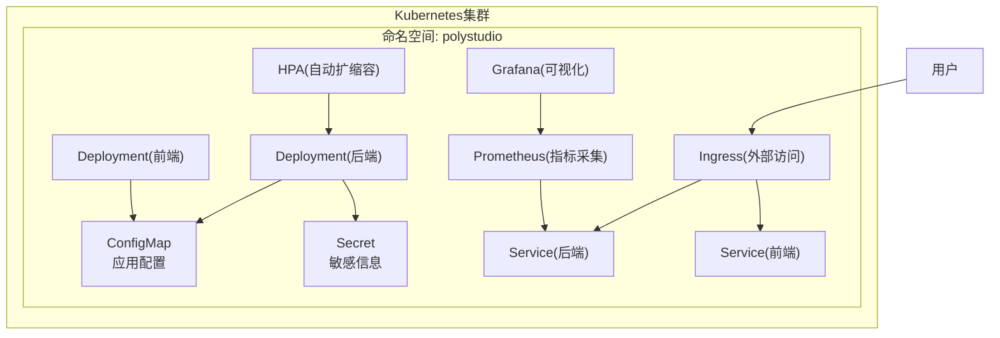
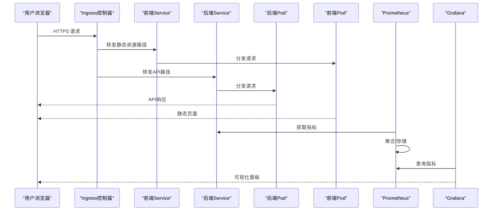
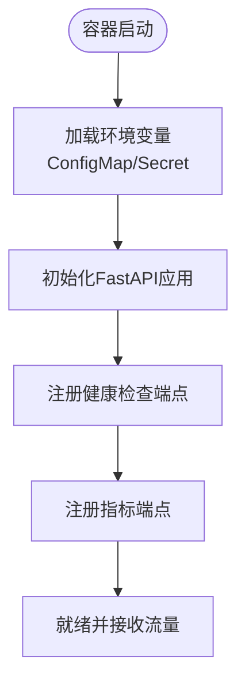
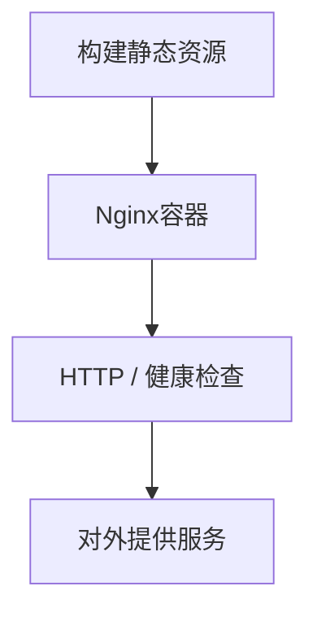
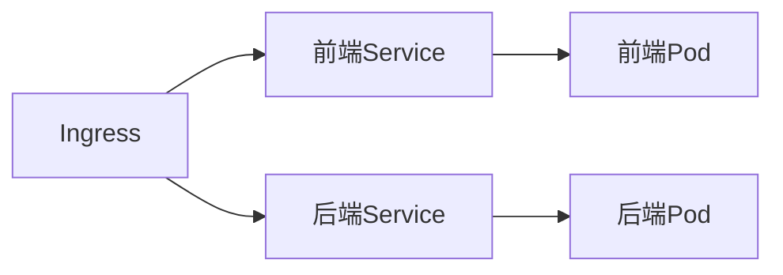
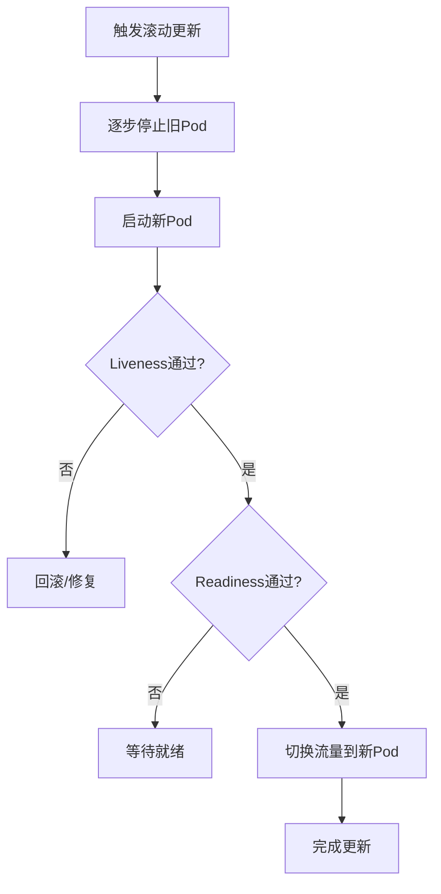
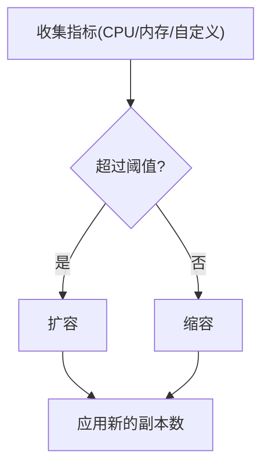
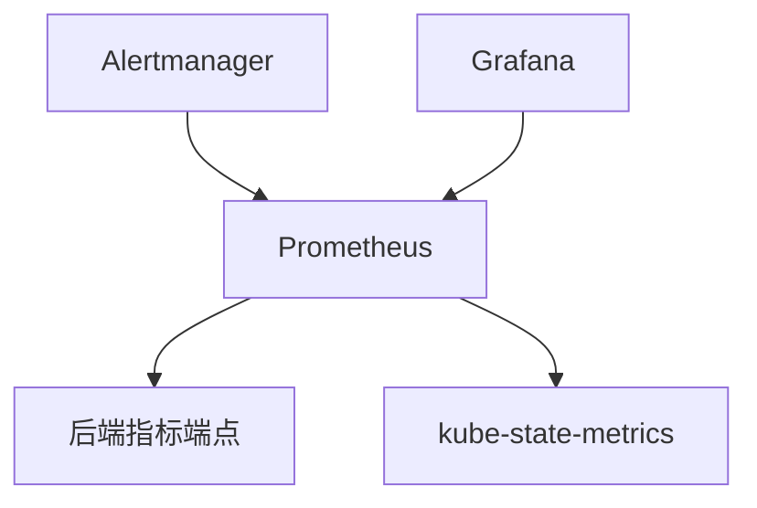
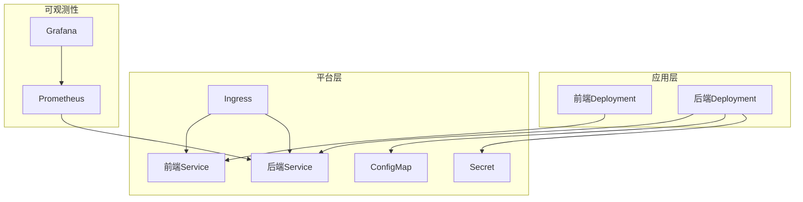

# Kubernetes集群部署

<cite>
**本文引用的文件**   
- [backend/app/main.py](file://backend/app/main.py)
- [backend/start.sh](file://backend/start.sh)
- [backend/env.example](file://backend/env.example)
- [frontend/package.json](file://frontend/package.json)
- [frontend/vite.config.ts](file://frontend/vite.config.ts)
</cite>

## 目录
1. [简介](#简介)
2. [项目结构](#项目结构)
3. [核心组件](#核心组件)
4. [架构总览](#架构总览)
5. [详细组件分析](#详细组件分析)
6. [依赖分析](#依赖分析)
7. [性能考虑](#性能考虑)
8. [故障排查指南](#故障排查指南)
9. [结论](#结论)
10. [附录](#附录)

## 简介
本指南面向在Kubernetes集群中部署PolyStudio项目的工程团队，提供从基础资源到高级特性的完整落地方案。内容涵盖：
- 完整的K8s清单（Deployment、Service、ConfigMap、Secret等）
- Pod资源配置与限制/请求设置
- Ingress控制器配置，实现外部访问与负载均衡
- Helm Chart模板与参数化部署、环境差异化配置
- 滚动更新策略与健康检查
- 自动扩缩容（HPA）
- 监控告警集成（Prometheus + Grafana）

## 项目结构
仓库包含前后端两套应用：
- 后端：Python FastAPI服务，入口为后端主程序，启动脚本用于容器内运行；环境变量示例位于env.example
- 前端：基于Vite的静态站点，构建产物由Nginx或类似Web服务器托管

图表来源
- [backend/app/main.py](file://backend/app/main.py)
- [backend/start.sh](file://backend/start.sh)
- [backend/env.example](file://backend/env.example)
- [frontend/package.json](file://frontend/package.json)
- [frontend/vite.config.ts](file://frontend/vite.config.ts)

章节来源
- [backend/app/main.py](file://backend/app/main.py)
- [backend/start.sh](file://backend/start.sh)
- [backend/env.example](file://backend/env.example)
- [frontend/package.json](file://frontend/package.json)
- [frontend/vite.config.ts](file://frontend/vite.config.ts)

## 核心组件
- 后端服务
  - 语言与框架：Python + FastAPI
  - 进程模型：多进程（gunicorn/uwsgi等），通过启动脚本拉起
  - 健康检查：HTTP探针（建议暴露/liveness与/readiness）
  - 配置注入：ConfigMap（非敏感）、Secret（敏感）
- 前端服务
  - 构建产物：静态HTML/CSS/JS
  - 运行时：Nginx镜像或同等静态服务器
  - 健康检查：HTTP探针（/）
- 网络与访问
  - Service：ClusterIP暴露内部服务
  - Ingress：统一入口、TLS终止、路径路由
- 可观测性
  - Prometheus抓取后端指标端点
  - Grafana展示仪表盘
- 弹性与稳定性
  - HPA基于CPU/内存或自定义指标扩缩容
  - 滚动更新策略与探针保障零停机发布

章节来源
- [backend/app/main.py](file://backend/app/main.py)
- [backend/start.sh](file://backend/start.sh)
- [backend/env.example](file://backend/env.example)
- [frontend/package.json](file://frontend/package.json)
- [frontend/vite.config.ts](file://frontend/vite.config.ts)

## 架构总览
下图展示了从外部流量到Pod的完整链路，以及监控数据流。

图表来源
- [backend/app/main.py](file://backend/app/main.py)
- [backend/start.sh](file://backend/start.sh)
- [backend/env.example](file://backend/env.example)
- [frontend/package.json](file://frontend/package.json)
- [frontend/vite.config.ts](file://frontend/vite.config.ts)

## 详细组件分析

### 后端服务（FastAPI）
- 进程与端口
  - 使用多进程WSGI/ASGI服务器承载FastAPI应用
  - 监听端口建议固定（如8000），便于健康检查与探针配置
- 配置与环境
  - 非敏感配置通过ConfigMap挂载为环境变量或配置文件
  - 敏感信息（密钥、令牌）通过Secret挂载
- 健康检查
  - /healthz：存活探针（Liveness）
  - /ready：就绪探针（Readiness）
- 日志与指标
  - 结构化日志输出至stdout/stderr
  - 暴露指标端点供Prometheus抓取（如/metrics）

图表来源
- [backend/app/main.py](file://backend/app/main.py)
- [backend/start.sh](file://backend/start.sh)
- [backend/env.example](file://backend/env.example)

章节来源
- [backend/app/main.py](file://backend/app/main.py)
- [backend/start.sh](file://backend/start.sh)
- [backend/env.example](file://backend/env.example)

### 前端服务（静态站点）
- 构建与产物
  - 使用Vite构建生成静态资源
  - 将构建产物放入Nginx镜像默认目录或通过Volume挂载
- 健康检查
  - HTTP根路径返回200即视为健康
- 反向代理
  - 可通过Ingress将静态资源与API分别路由到不同Service

图表来源
- [frontend/package.json](file://frontend/package.json)
- [frontend/vite.config.ts](file://frontend/vite.config.ts)

章节来源
- [frontend/package.json](file://frontend/package.json)
- [frontend/vite.config.ts](file://frontend/vite.config.ts)

### 网络与访问（Service与Ingress）
- Service
  - 后端Service：ClusterIP，端口映射到后端容器端口
  - 前端Service：ClusterIP，端口映射到Nginx容器端口
- Ingress
  - 域名与路径规则：/api 指向后端Service，其余指向前端Service
  - TLS：配置证书与主机名，强制HTTPS
  - 会话保持与超时：根据业务调整

图表来源
- [backend/app/main.py](file://backend/app/main.py)
- [backend/start.sh](file://backend/start.sh)
- [backend/env.example](file://backend/env.example)
- [frontend/package.json](file://frontend/package.json)
- [frontend/vite.config.ts](file://frontend/vite.config.ts)

### 配置与密钥（ConfigMap与Secret）
- ConfigMap
  - 存放非敏感配置（如后端服务地址、功能开关、日志级别）
  - 以环境变量或文件形式挂载到Pod
- Secret
  - 存放敏感信息（数据库密码、第三方API密钥）
  - 以环境变量或文件形式挂载到Pod
- 最佳实践
  - 按环境拆分ConfigMap/Secret（dev/staging/prod）
  - 使用Helm values区分环境差异

章节来源
- [backend/env.example](file://backend/env.example)

### 滚动更新与健康检查
- 滚动更新策略
  - maxUnavailable/maxSurge控制并发更新数量
  - 配合探针确保旧Pod在就绪后再替换
- 健康检查
  - Liveness：失败则重启Pod
  - Readiness：失败则从Service端点移除
- 回滚
  - 使用kubectl rollout undo快速回滚

### 自动扩缩容（HPA）
- 基于CPU/内存的HPA
  - 设置目标利用率阈值与最小/最大副本数
- 基于自定义指标的HPA
  - 结合Prometheus适配器，依据QPS、延迟等指标扩缩容
- 注意事项
  - 合理设置资源请求/限制，避免误判
  - 关注扩缩容抖动，必要时启用稳定窗口

### 监控与告警（Prometheus + Grafana）
- 指标采集
  - Prometheus抓取后端/metrics端点
  - 可选：Node Exporter、kube-state-metrics
- 可视化
  - Grafana连接Prometheus，导入内置或自定义仪表盘
- 告警
  - Alertmanager对接通知渠道（邮件、企业微信、钉钉等）

## 依赖分析
- 应用间依赖
  - 前端通过Ingress访问后端API
  - 后端读取ConfigMap/Secret中的配置
- 外部依赖
  - Ingress控制器（如Nginx Ingress）
  - 证书管理（如cert-manager）
  - 监控栈（Prometheus/Grafana/Alertmanager）

图表来源
- [backend/app/main.py](file://backend/app/main.py)
- [backend/start.sh](file://backend/start.sh)
- [backend/env.example](file://backend/env.example)
- [frontend/package.json](file://frontend/package.json)
- [frontend/vite.config.ts](file://frontend/vite.config.ts)

## 性能考虑
- 资源请求与限制
  - 为后端Pod设置合理的CPU/内存请求与限制，避免节点过载
  - 前端Pod通常资源占用较低，按需配置
- 水平扩展
  - 针对高并发场景启用HPA，结合缓存与CDN提升静态资源性能
- 连接与超时
  - 调整Ingress与Service的超时时间，匹配后端处理时长
- 存储与IO
  - 若涉及文件上传/下载，建议使用对象存储或持久卷，并开启压缩与缓存

## 故障排查指南
- 常见问题
  - Pod无法启动：查看事件与日志，确认镜像拉取、配置挂载、健康检查
  - 服务不可达：检查Service选择器、Ingress规则、DNS解析
  - 指标缺失：确认Prometheus抓取目标状态、指标端点可达
- 诊断步骤
  - kubectl describe pod/service/ingress
  - kubectl logs <pod> --previous
  - 验证探针端点是否返回期望状态码
  - 检查Secret/ConfigMap是否正确挂载

章节来源
- [backend/app/main.py](file://backend/app/main.py)
- [backend/start.sh](file://backend/start.sh)
- [backend/env.example](file://backend/env.example)
- [frontend/package.json](file://frontend/package.json)
- [frontend/vite.config.ts](file://frontend/vite.config.ts)

## 结论
通过上述清单与策略，可在Kubernetes上安全、稳定地部署PolyStudio前后端服务。建议在生产环境引入CI/CD流水线、GitOps流程与完善的监控告警体系，持续提升交付效率与系统可靠性。

## 附录

### 部署清单要点（字段说明）
- Deployment
  - replicas：初始副本数
  - strategy：滚动更新策略（maxUnavailable、maxSurge）
  - selector.matchLabels：与Pod模板一致
  - template.spec.containers：镜像、端口、环境变量、探针、资源限制
- Service
  - type：ClusterIP（内部）或LoadBalancer（云厂商）
  - ports：映射到容器端口
- Ingress
  - rules：host与paths映射到对应Service
  - tls：证书与主机名
- ConfigMap/Secret
  - data：键值对或文件内容
  - 挂载方式：环境变量或Volume
- HPA
  - scaleTargetRef：目标Deployment
  - metrics：CPU/内存或自定义指标
  - minReplicas/maxReplicas：副本范围

### Helm Chart模板要点
- values.yaml
  - 定义环境差异（镜像版本、副本数、资源限制、域名、证书等）
- templates/
  - 使用Go模板渲染K8s资源
  - 条件渲染（如仅生产环境启用HPA/Ingress）
- 多环境
  - 通过values-dev.yaml/values-prod.yaml覆盖默认值
  - CI/CD中传入对应values文件进行部署

### 健康检查与探针建议
- Liveness
  - 短耗时、幂等、失败即重启
- Readiness
  - 依赖外部资源可用（如数据库、缓存）
- Startup
  - 针对冷启动较慢的应用，设置启动探针避免误杀

### 监控与告警建议
- 关键指标
  - 后端：QPS、错误率、P99延迟、GC、线程/进程数
  - 集群：节点CPU/内存、Pod重启次数、Scheduling失败
- 告警规则
  - 错误率突增、延迟飙升、资源不足、证书即将过期
- 可视化
  - 预置仪表盘：应用概览、资源使用、错误分布、慢请求