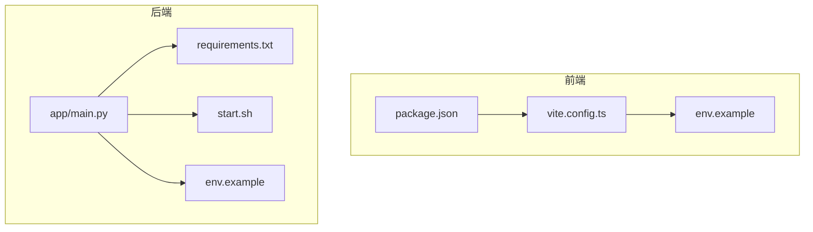
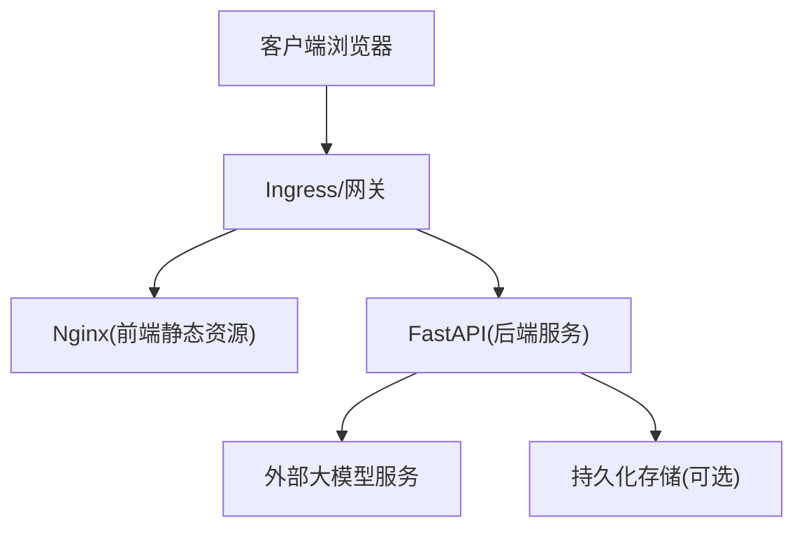
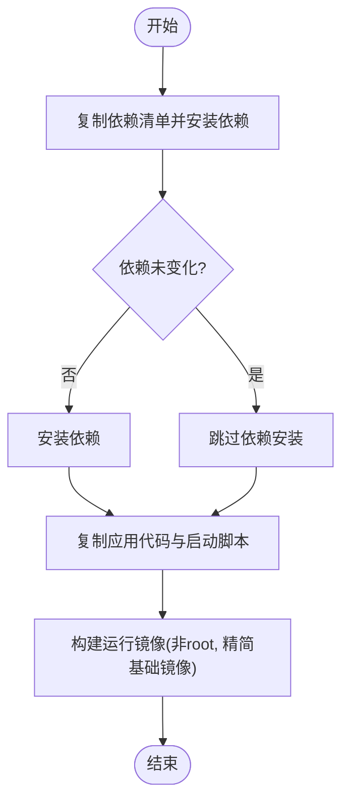
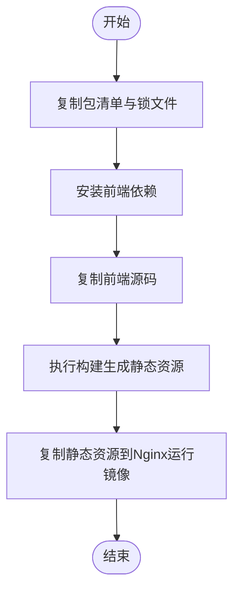
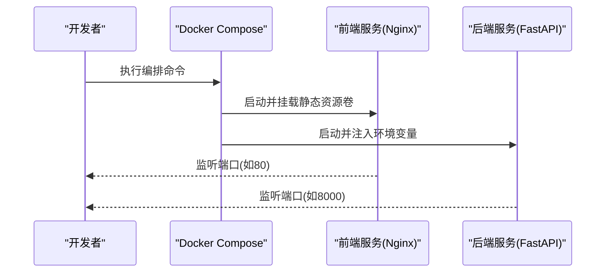
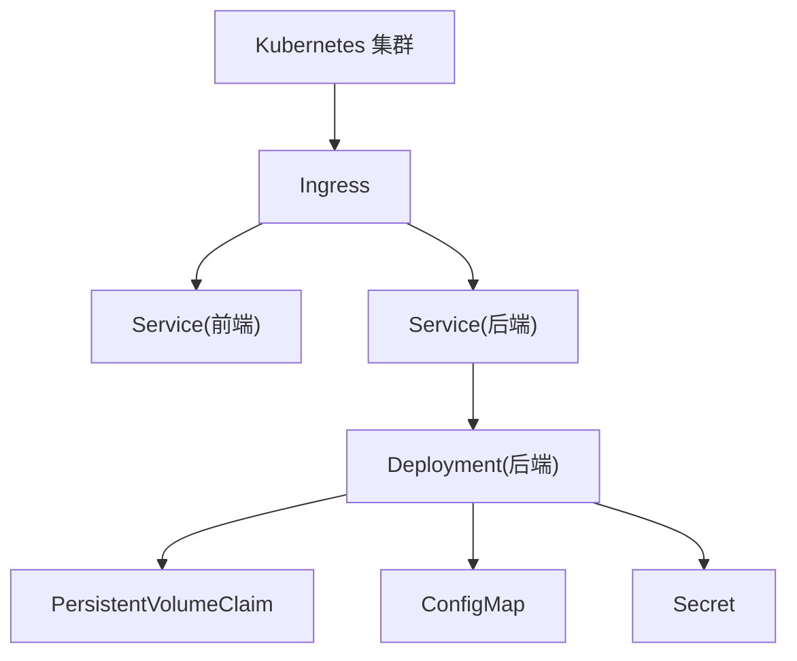
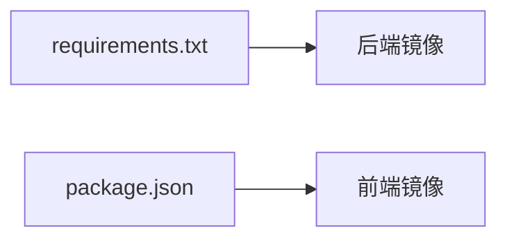

# 容器化部署

<cite>
**本文引用的文件**   
- [backend/app/main.py](file://backend/app/main.py)
- [backend/requirements.txt](file://backend/requirements.txt)
- [backend/start.sh](file://backend/start.sh)
- [backend/env.example](file://backend/env.example)
- [frontend/package.json](file://frontend/package.json)
- [frontend/vite.config.ts](file://frontend/vite.config.ts)
- [frontend/env.example](file://frontend/env.example)
</cite>

## 目录
1. [简介](#简介)
2. [项目结构](#项目结构)
3. [核心组件](#核心组件)
4. [架构总览](#架构总览)
5. [详细组件分析](#详细组件分析)
6. [依赖分析](#依赖分析)
7. [性能考虑](#性能考虑)
8. [故障排查指南](#故障排查指南)
9. [结论](#结论)
10. [附录](#附录)

## 简介
本指南面向将本项目进行容器化与集群化部署的工程团队，覆盖以下目标：
- Docker 镜像构建：多阶段构建、分层策略与安全加固
- Docker Compose 编排：前后端服务编排、网络、数据卷与环境变量注入
- Kubernetes 清单：Deployment、Service、ConfigMap/Secret、HPA 等
- 监控与日志：Prometheus 指标采集与 ELK 日志分析方案
- 安全与合规：最小权限镜像、漏洞扫描与基线检查流程

## 项目结构
仓库包含前端（Vite + React）与后端（Python FastAPI），以及各自的环境示例与依赖声明。容器化需分别构建前端静态资源与后端应用镜像，并通过反向代理或网关统一暴露。

图表来源
- [frontend/package.json](file://frontend/package.json)
- [frontend/vite.config.ts](file://frontend/vite.config.ts)
- [frontend/env.example](file://frontend/env.example)
- [backend/app/main.py](file://backend/app/main.py)
- [backend/requirements.txt](file://backend/requirements.txt)
- [backend/start.sh](file://backend/start.sh)
- [backend/env.example](file://backend/env.example)

章节来源
- [frontend/package.json](file://frontend/package.json)
- [frontend/vite.config.ts](file://frontend/vite.config.ts)
- [frontend/env.example](file://frontend/env.example)
- [backend/app/main.py](file://backend/app/main.py)
- [backend/requirements.txt](file://backend/requirements.txt)
- [backend/start.sh](file://backend/start.sh)
- [backend/env.example](file://backend/env.example)

## 核心组件
- 后端服务入口与启动脚本
  - 应用入口位于后端主模块，负责路由注册、中间件与服务生命周期管理
  - 启动脚本用于封装运行参数、环境变量与进程管理
- 前端构建产物
  - 通过包管理器安装依赖并执行构建，输出静态资源供 Nginx 等静态服务器托管
- 配置与环境
  - 前后端均提供环境示例，便于在容器内以环境变量注入敏感信息与运行时开关

章节来源
- [backend/app/main.py](file://backend/app/main.py)
- [backend/start.sh](file://backend/start.sh)
- [frontend/package.json](file://frontend/package.json)
- [frontend/vite.config.ts](file://frontend/vite.config.ts)
- [backend/env.example](file://backend/env.example)
- [frontend/env.example](file://frontend/env.example)

## 架构总览
整体采用“前端静态资源 + 后端 API”的分离式架构，容器化后通过反向代理统一对外暴露。

图表来源
- [backend/app/main.py](file://backend/app/main.py)
- [frontend/vite.config.ts](file://frontend/vite.config.ts)

## 详细组件分析

### 后端镜像构建（多阶段构建）
- 构建阶段
  - 使用轻量基础镜像安装 Python 依赖，生成只读依赖缓存层
  - 复制应用代码与启动脚本，避免引入无关文件
- 运行阶段
  - 基于更小的运行时镜像，仅包含必要系统库与 Python 解释器
  - 以非 root 用户运行，限制文件系统写入权限
- 分层优化建议
  - 将 requirements.txt 单独拷贝并预安装依赖，提升缓存命中率
  - 将应用代码置于独立层，减少变更带来的重建范围
- 安全最佳实践
  - 使用非 root 用户运行
  - 定期更新基础镜像与依赖
  - 启用只读根文件系统，必要时通过数据卷挂载可写路径

图表来源
- [backend/requirements.txt](file://backend/requirements.txt)
- [backend/start.sh](file://backend/start.sh)
- [backend/app/main.py](file://backend/app/main.py)

章节来源
- [backend/requirements.txt](file://backend/requirements.txt)
- [backend/start.sh](file://backend/start.sh)
- [backend/app/main.py](file://backend/app/main.py)

### 前端镜像构建（多阶段构建）
- 构建阶段
  - 使用 Node 镜像安装依赖并执行构建，产出静态资源目录
- 运行阶段
  - 使用 Nginx 镜像托管静态资源，关闭不必要的模块，禁用目录浏览
- 分层优化建议
  - 先复制 package.json 与锁文件，预安装依赖以提升缓存命中
  - 再复制源码与构建产物，减少变更影响范围
- 安全最佳实践
  - 仅暴露 80/443 端口
  - 使用只读根文件系统，必要时通过数据卷挂载日志

图表来源
- [frontend/package.json](file://frontend/package.json)
- [frontend/vite.config.ts](file://frontend/vite.config.ts)

章节来源
- [frontend/package.json](file://frontend/package.json)
- [frontend/vite.config.ts](file://frontend/vite.config.ts)

### Docker Compose 编排
- 服务定义
  - 前端服务：基于 Nginx 镜像，挂载构建后的静态资源目录
  - 后端服务：基于自定义镜像，暴露 API 端口
- 网络配置
  - 默认桥接网络，服务间通过服务名通信
- 数据卷挂载
  - 为后端持久化目录挂载宿主卷，保障数据不随容器销毁丢失
- 环境变量注入
  - 通过 .env 文件或 env_file 注入敏感信息，避免硬编码
- 健康检查与重启策略
  - 为关键服务添加健康检查，设置自动重启策略

图表来源
- [backend/start.sh](file://backend/start.sh)
- [backend/env.example](file://backend/env.example)
- [frontend/env.example](file://frontend/env.example)

章节来源
- [backend/start.sh](file://backend/start.sh)
- [backend/env.example](file://backend/env.example)
- [frontend/env.example](file://frontend/env.example)

### Kubernetes 部署清单要点
- Deployment
  - 定义前后端副本数、资源请求与限制、探针与健康检查
- Service
  - 为后端暴露 ClusterIP，前端可通过 Ingress 暴露公网访问
- ConfigMap/Secret
  - 将非敏感配置放入 ConfigMap，敏感信息放入 Secret，并以环境变量或卷形式注入
- HPA（水平扩缩容）
  - 基于 CPU/内存或自定义指标进行自动扩缩容
- 存储
  - 使用 PersistentVolumeClaim 挂载后端持久化目录

图表来源
- [backend/app/main.py](file://backend/app/main.py)
- [backend/start.sh](file://backend/start.sh)
- [backend/env.example](file://backend/env.example)

章节来源
- [backend/app/main.py](file://backend/app/main.py)
- [backend/start.sh](file://backend/start.sh)
- [backend/env.example](file://backend/env.example)

### 容器网络配置
- 容器间通信
  - 同一网络内的服务通过服务名解析与端口访问
- 对外暴露
  - 通过反向代理或 Ingress 统一入口，隐藏内部服务细节
- 网络安全
  - 限制入站端口，仅开放必要端口；对后端启用鉴权与限流

章节来源
- [backend/app/main.py](file://backend/app/main.py)
- [frontend/vite.config.ts](file://frontend/vite.config.ts)

### 数据卷挂载
- 后端持久化
  - 将上传文件、会话或缓存目录挂载至持久卷，确保数据跨重启保留
- 前端静态资源
  - 将构建产物挂载至 Nginx 工作目录，支持热更新（开发环境）

章节来源
- [backend/start.sh](file://backend/start.sh)

### 环境变量注入
- 前后端均提供环境示例，建议在容器中以环境变量注入
- 生产环境建议使用 Secret 管理敏感信息，并在编排文件中引用

章节来源
- [backend/env.example](file://backend/env.example)
- [frontend/env.example](file://frontend/env.example)

## 依赖分析
- 后端依赖
  - 通过依赖清单声明 Python 包，构建时预装以减少运行镜像体积
- 前端依赖
  - 通过包清单与锁文件管理前端依赖，构建阶段一次性安装

图表来源
- [backend/requirements.txt](file://backend/requirements.txt)
- [frontend/package.json](file://frontend/package.json)

章节来源
- [backend/requirements.txt](file://backend/requirements.txt)
- [frontend/package.json](file://frontend/package.json)

## 性能考虑
- 镜像体积
  - 使用多阶段构建与精简基础镜像，移除构建期工具链
- 缓存利用
  - 将依赖安装与应用代码分层，最大化构建缓存命中
- 资源配额
  - 为容器设置合理的 CPU/内存请求与限制，避免争用
- 连接复用
  - 合理配置反向代理与后端连接池，降低延迟

[本节为通用指导，无需列出具体文件来源]

## 故障排查指南
- 启动失败
  - 检查启动脚本与入口模块是否正确加载
  - 确认环境变量是否完整且格式正确
- 端口冲突
  - 核对容器端口映射与宿主机端口占用情况
- 权限问题
  - 确认非 root 用户对挂载目录具有读写权限
- 依赖缺失
  - 验证依赖清单与实际代码导入是否一致

章节来源
- [backend/start.sh](file://backend/start.sh)
- [backend/app/main.py](file://backend/app/main.py)

## 结论
通过多阶段构建、严格的安全基线与完善的编排清单，可将前后端服务稳定地部署到本地与集群环境。结合监控与日志体系，可实现可观测性与快速排障。持续进行镜像与依赖的安全扫描，有助于在生产环境中保持高安全水位。

[本节为总结性内容，无需列出具体文件来源]

## 附录

### 监控与日志方案
- Prometheus 指标
  - 在后端暴露标准指标端点，由 Prometheus 抓取
  - 使用 Grafana 可视化展示关键业务与系统指标
- ELK 日志收集
  - 容器输出结构化 JSON 日志至 stdout/stderr
  - 通过 Filebeat/Fluent Bit 采集并转发至 Elasticsearch
  - 使用 Kibana 进行检索与分析

[本节为概念性说明，无需列出具体文件来源]

### 安全加固与漏洞扫描
- 镜像加固
  - 使用非 root 用户运行
  - 仅安装必要依赖，禁用调试功能
  - 启用只读根文件系统
- 漏洞扫描
  - 在 CI 中集成 Trivy/Grype 等工具扫描镜像
  - 阻断高危漏洞合并与发布
- 运行时防护
  - 启用 Pod 安全策略/Pod 安全上下文
  - 限制特权模式与内核能力

[本节为概念性说明，无需列出具体文件来源]