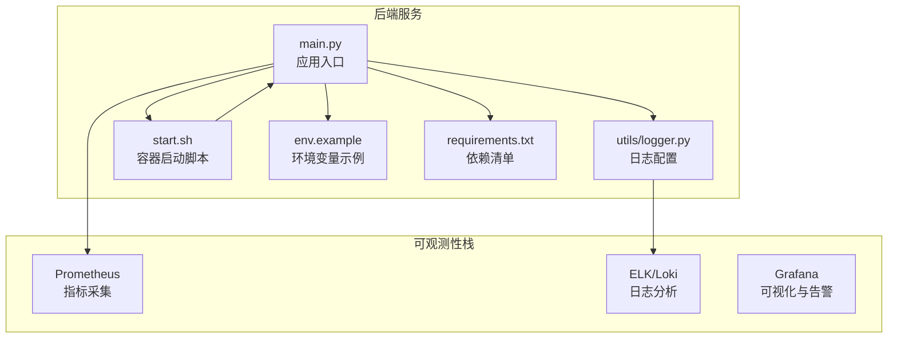
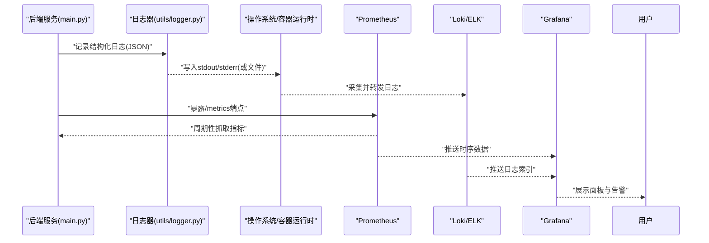
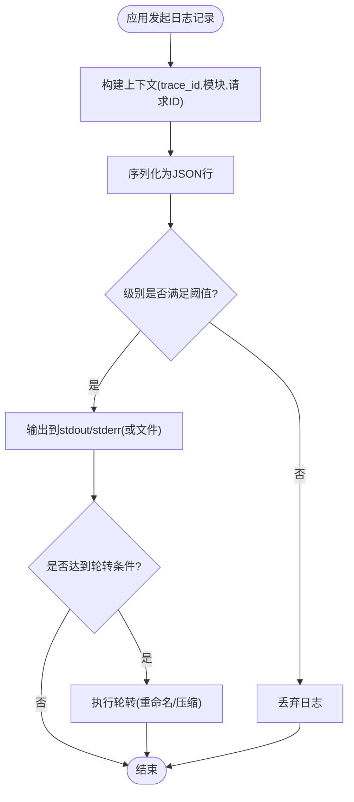
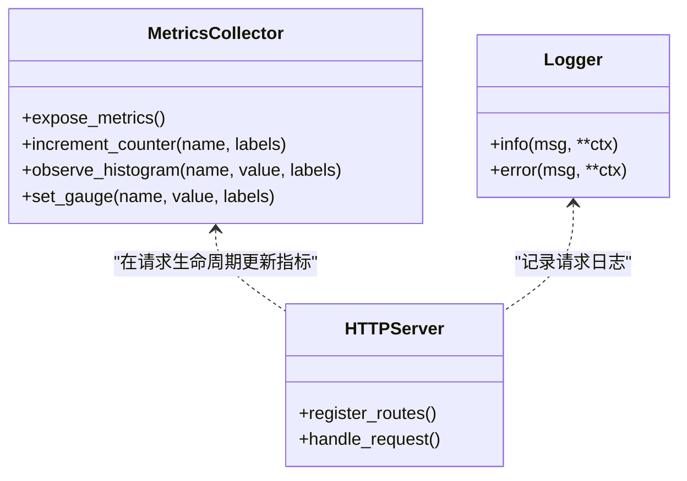
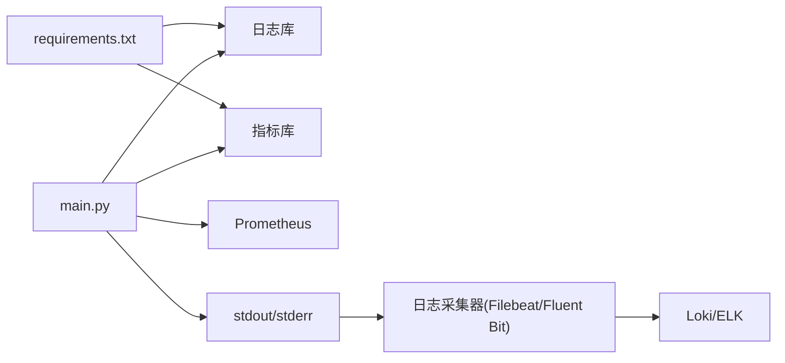

# 容器监控与日志

<cite>
**本文引用的文件**   
- [backend/app/utils/logger.py](file://backend/app/utils/logger.py)
- [backend/app/main.py](file://backend/app/main.py)
- [backend/requirements.txt](file://backend/requirements.txt)
- [backend/start.sh](file://backend/start.sh)
- [backend/env.example](file://backend/env.example)
</cite>

## 目录
1. [简介](#简介)
2. [项目结构](#项目结构)
3. [核心组件](#核心组件)
4. [架构总览](#架构总览)
5. [详细组件分析](#详细组件分析)
6. [依赖关系分析](#依赖关系分析)
7. [性能考虑](#性能考虑)
8. [故障排查指南](#故障排查指南)
9. [结论](#结论)
10. [附录](#附录)

## 简介
本方案面向容器化部署的后端服务，提供端到端的监控与日志收集实践：在应用层输出结构化日志、控制日志级别与轮转；通过指标采集接入 Prometheus；结合 ELK Stack 或 Loki 进行日志分析与检索；覆盖 CPU、内存、网络 I/O 等关键性能指标；配置基于阈值与异常检测的告警规则；并提供常用故障排查工具与调试技巧，帮助快速定位问题。

## 项目结构
本项目后端采用 Python Web 框架，日志模块位于 utils/logger.py，应用入口为 main.py，启动脚本 start.sh 与环境示例 env.example 用于容器化运行时的参数注入与进程管理。依赖清单见 requirements.txt。

图表来源
- [backend/app/main.py](file://backend/app/main.py)
- [backend/app/utils/logger.py](file://backend/app/utils/logger.py)
- [backend/start.sh](file://backend/start.sh)
- [backend/env.example](file://backend/env.example)
- [backend/requirements.txt](file://backend/requirements.txt)

章节来源
- [backend/app/main.py](file://backend/app/main.py)
- [backend/app/utils/logger.py](file://backend/app/utils/logger.py)
- [backend/start.sh](file://backend/start.sh)
- [backend/env.example](file://backend/env.example)
- [backend/requirements.txt](file://backend/requirements.txt)

## 核心组件
- 结构化日志与级别控制
  - 使用统一日志器输出 JSON 格式，包含时间戳、级别、模块、请求上下文（如 trace_id）、消息体等字段，便于下游解析与聚合。
  - 支持通过环境变量动态调整日志级别，避免在生产环境开启过高详细度。
- 指标采集
  - 暴露标准运行时指标（进程、线程、GC、HTTP 请求计数与时延）以及自定义业务指标（任务数、错误率、外部调用耗时）。
  - 提供 /metrics 端点供 Prometheus 抓取。
- 日志采集与存储
  - 将 stdout/stderr 作为主日志通道，由容器编排系统采集并转发至 ELK/Loki。
  - 可选本地文件落盘与轮转策略，配合 sidecar 或 DaemonSet 采集。
- 告警与可视化
  - 在 Grafana 中展示关键指标面板，并通过 Alertmanager 配置阈值与异常检测告警。

章节来源
- [backend/app/utils/logger.py](file://backend/app/utils/logger.py)
- [backend/app/main.py](file://backend/app/main.py)
- [backend/start.sh](file://backend/start.sh)
- [backend/env.example](file://backend/env.example)
- [backend/requirements.txt](file://backend/requirements.txt)

## 架构总览
下图展示了从应用到可观测性栈的整体数据流：应用输出结构化日志与指标，Prometheus 抓取指标，Loki/ELK 接收日志，Grafana 统一展示与告警。

图表来源
- [backend/app/main.py](file://backend/app/main.py)
- [backend/app/utils/logger.py](file://backend/app/utils/logger.py)

## 详细组件分析

### 日志子系统
- 目标
  - 统一日志格式（JSON），包含必要上下文字段，便于检索与关联。
  - 支持按级别过滤与采样，降低生产开销。
  - 支持日志轮转，避免磁盘增长。
- 设计要点
  - 使用标准库或第三方库初始化日志器，设置 JSON 编码器。
  - 通过环境变量注入日志级别、是否启用文件输出、轮转大小与保留份数。
  - 在请求处理链路中注入 trace_id，贯穿各模块以便追踪。
- 建议字段
  - timestamp、level、service、module、trace_id、span_id、msg、extra（业务键值对）。
- 轮转策略
  - 按大小或时间切分，保留 N 份，压缩归档。
  - 容器场景优先 stdout/stderr，由采集侧负责持久化与轮转。

图表来源
- [backend/app/utils/logger.py](file://backend/app/utils/logger.py)

章节来源
- [backend/app/utils/logger.py](file://backend/app/utils/logger.py)

### 指标采集与自定义指标
- 运行时指标
  - 进程 CPU/内存、线程数、GC 次数、打开文件句柄数。
  - HTTP 请求计数、时延分布、错误率。
- 业务指标
  - 任务队列长度、生成任务成功率、外部模型调用耗时与失败次数。
- 实现方式
  - 在应用入口注册 /metrics 端点，暴露当前状态。
  - 使用计数器、直方图、仪表盘等类型分别统计累计量、分布与瞬时值。
- 采集频率
  - Prometheus 默认 15s 抓取一次，可根据负载调整。

图表来源
- [backend/app/main.py](file://backend/app/main.py)

章节来源
- [backend/app/main.py](file://backend/app/main.py)

### 容器启动与环境变量
- 启动脚本
  - 负责加载环境变量、设置工作目录、启动进程、健康检查与优雅退出。
- 环境变量
  - 日志级别、是否启用文件输出、指标端口、外部服务地址等。
- 最佳实践
  - 所有可调参数通过环境变量注入，避免硬编码。
  - 在容器镜像中仅包含最小依赖，运行时通过挂载卷保存日志与缓存。

章节来源
- [backend/start.sh](file://backend/start.sh)
- [backend/env.example](file://backend/env.example)

## 依赖关系分析
- 运行时依赖
  - 日志与指标相关库需在 requirements.txt 中声明，确保镜像构建一致性与可复现性。
- 外部集成
  - Prometheus 抓取 /metrics。
  - Loki/ELK 通过 Filebeat/Fluent Bit/Tail 采集 stdout/stderr 或文件路径。
  - Grafana 连接 Prometheus 与 Loki 数据源。

图表来源
- [backend/requirements.txt](file://backend/requirements.txt)
- [backend/app/main.py](file://backend/app/main.py)

章节来源
- [backend/requirements.txt](file://backend/requirements.txt)
- [backend/app/main.py](file://backend/app/main.py)

## 性能考虑
- 日志
  - 生产环境关闭 DEBUG 级别；对高频日志进行采样或合并。
  - 优先输出到 stdout/stderr，减少磁盘 IO；必要时启用异步写入。
- 指标
  - 合理选择指标粒度与标签基数，避免高基数字典爆炸。
  - 直方图桶数量适中，避免过度细分导致内存占用上升。
- 资源配额
  - 为容器设置合理的 CPU/内存限制与请求，防止抖动影响采集与日志写入。
- 采集侧
  - 调整 Prometheus 抓取间隔与超时；日志采集器启用批处理与压缩。

## 故障排查指南
- 快速定位
  - 通过 trace_id 串联请求全链路日志与指标。
  - 在 Grafana 中查看错误率与时延突增，回溯对应时间段日志。
- 常见问题
  - 指标缺失：检查 /metrics 端点可达性与标签基数。
  - 日志丢失：确认 stdout/stderr 未被截断，采集器权限与路径正确。
  - 告警风暴：收敛相同根因告警，增加抑制与静默规则。
- 调试技巧
  - 临时提升日志级别观察热点路径。
  - 使用轻量探针注入额外上下文（如上游请求头）。
  - 对比不同版本指标差异，辅助回归定位。

## 结论
通过在应用层输出结构化日志与标准化指标，并结合 Prometheus、Loki/ELK 与 Grafana，可实现容器化服务的可观测性闭环。配合合理的轮转策略、告警规则与调试手段，能够显著提升问题定位效率与系统稳定性。

## 附录

### 结构化日志字段建议
- 基础字段
  - timestamp、level、service、module、trace_id、span_id、msg
- 业务字段
  - user_id、request_id、task_id、status、duration_ms、error_code
- 扩展字段
  - host、pod、container、namespace、region、version

### Prometheus 指标分类
- 运行时
  - 进程 CPU/内存、线程数、GC、文件句柄
- HTTP
  - 请求总数、时延分布、错误率
- 业务
  - 任务计数、成功率、外部调用耗时

### 告警规则建议
- 阈值类
  - 错误率超过阈值持续 N 分钟
  - P99 时延高于阈值
  - 内存使用率接近上限
- 异常检测
  - 指标突变（环比/同比）
  - 日志错误关键字激增

### 日志轮转策略
- 按大小：单文件最大 N MB，保留 M 份，压缩归档
- 按时间：按天/小时切分，保留周期内数据
- 容器推荐：stdout/stderr 为主，采集侧负责持久化与轮转