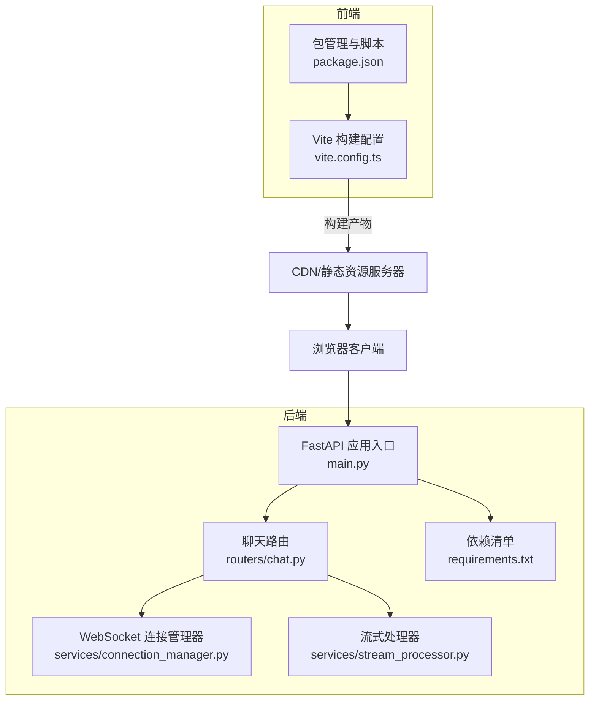
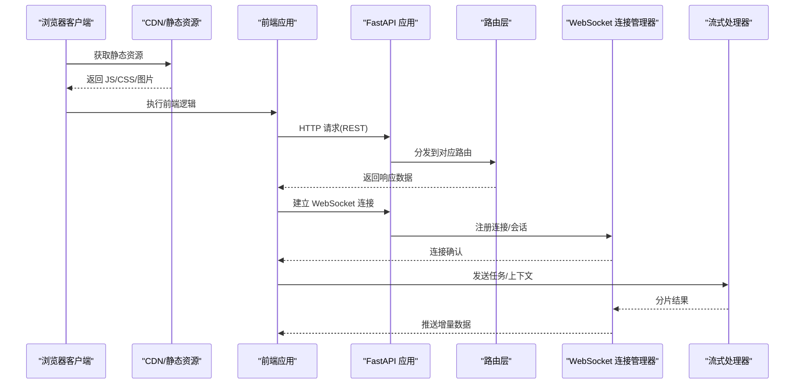
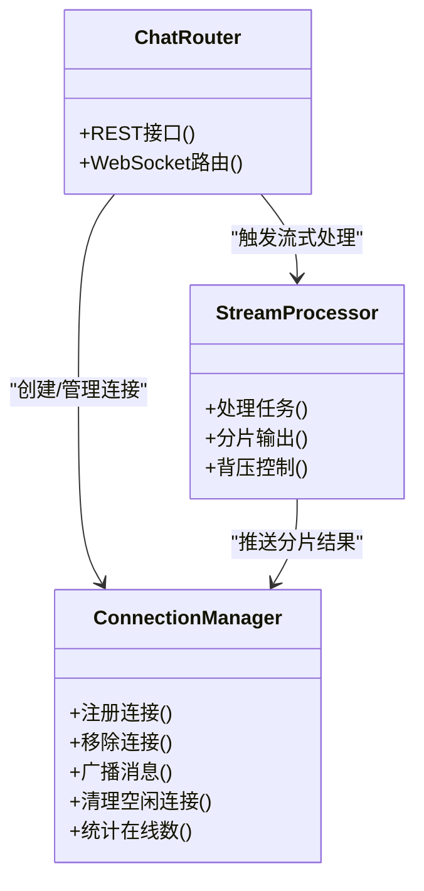
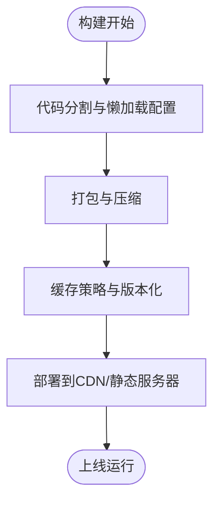
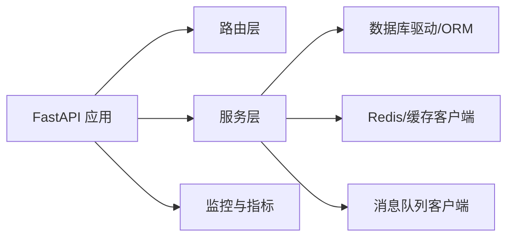

# 性能优化

<cite>
**本文引用的文件**   
- [backend/app/main.py](file://backend/app/main.py)
- [backend/app/services/connection_manager.py](file://backend/app/services/connection_manager.py)
- [backend/app/routers/chat.py](file://backend/app/routers/chat.py)
- [backend/app/services/stream_processor.py](file://backend/app/services/stream_processor.py)
- [backend/requirements.txt](file://backend/requirements.txt)
- [frontend/vite.config.ts](file://frontend/vite.config.ts)
- [frontend/package.json](file://frontend/package.json)
</cite>

## 目录
1. [简介](#简介)
2. [项目结构](#项目结构)
3. [核心组件](#核心组件)
4. [架构总览](#架构总览)
5. [详细组件分析](#详细组件分析)
6. [依赖分析](#依赖分析)
7. [性能考虑](#性能考虑)
8. [故障排查指南](#故障排查指南)
9. [结论](#结论)
10. [附录](#附录)

## 简介
本指南面向 PolyStudio 项目的后端与前端，聚焦于可落地的性能优化方案。内容覆盖：
- 后端服务性能调优：FastAPI 应用、异步处理、数据库查询、缓存策略
- WebSocket 连接管理优化：连接池配置、内存使用、并发能力
- 前端性能优化：代码分割、懒加载、静态资源优化
- 负载测试方法与工具：压力场景设计、基准测试、容量规划
- 具体实施方案：CDN 配置、数据库索引优化、Redis 缓存策略

## 项目结构
本项目采用前后端分离的架构：
- 后端基于 FastAPI（Python），提供 REST 与 WebSocket 接口，包含路由、服务层、流式处理等模块
- 前端基于 Vite + React（TypeScript），通过构建配置进行打包与优化

**图表来源**
- [backend/app/main.py](file://backend/app/main.py)
- [backend/app/routers/chat.py](file://backend/app/routers/chat.py)
- [backend/app/services/connection_manager.py](file://backend/app/services/connection_manager.py)
- [backend/app/services/stream_processor.py](file://backend/app/services/stream_processor.py)
- [backend/requirements.txt](file://backend/requirements.txt)
- [frontend/vite.config.ts](file://frontend/vite.config.ts)
- [frontend/package.json](file://frontend/package.json)

**章节来源**
- [backend/app/main.py](file://backend/app/main.py)
- [backend/app/routers/chat.py](file://backend/app/routers/chat.py)
- [backend/app/services/connection_manager.py](file://backend/app/services/connection_manager.py)
- [backend/app/services/stream_processor.py](file://backend/app/services/stream_processor.py)
- [backend/requirements.txt](file://backend/requirements.txt)
- [frontend/vite.config.ts](file://frontend/vite.config.ts)
- [frontend/package.json](file://frontend/package.json)

## 核心组件
- FastAPI 应用入口：负责中间件、生命周期钩子、全局配置与启动参数
- 路由层：REST API 与 WebSocket 路由定义，协调业务服务调用
- WebSocket 连接管理器：维护连接集合、广播消息、清理空闲连接
- 流式处理器：处理长时任务的分片输出与背压控制
- 前端构建配置：代码分割、懒加载、资源压缩与缓存策略

**章节来源**
- [backend/app/main.py](file://backend/app/main.py)
- [backend/app/routers/chat.py](file://backend/app/routers/chat.py)
- [backend/app/services/connection_manager.py](file://backend/app/services/connection_manager.py)
- [backend/app/services/stream_processor.py](file://backend/app/services/stream_processor.py)
- [frontend/vite.config.ts](file://frontend/vite.config.ts)

## 架构总览
下图展示从浏览器到后端的请求路径，以及 WebSocket 的连接建立与消息流转。

**图表来源**
- [backend/app/main.py](file://backend/app/main.py)
- [backend/app/routers/chat.py](file://backend/app/routers/chat.py)
- [backend/app/services/connection_manager.py](file://backend/app/services/connection_manager.py)
- [backend/app/services/stream_processor.py](file://backend/app/services/stream_processor.py)

## 详细组件分析

### 后端服务性能调优（FastAPI、异步、数据库、缓存）
- FastAPI 应用优化
  - 启用 Gunicorn/Uvicorn 多进程模型，合理设置 worker 数量与线程数
  - 使用中间件进行限流、日志、请求体大小限制与跨域配置
  - 避免在事件循环中执行阻塞 I/O；将 CPU 密集任务放入线程池或外部队列
- 异步处理优化
  - 路由与服务层尽量使用 async/await，减少同步阻塞
  - 对第三方库的阻塞调用使用 run_in_executor 包装
  - 为长时任务引入消息队列（如 Redis/RabbitMQ）与消费者模式
- 数据库查询优化
  - 使用连接池（如 SQLAlchemy Pool）并调整最大连接数与超时
  - 针对高频查询添加合适索引，避免 N+1 查询，使用批量操作
  - 对只读热点数据引入二级缓存（Redis/Memcached）
- 缓存策略配置
  - 分层缓存：本地 LRU + 分布式 Redis
  - 设置合理的 TTL、失效策略与回源保护（击穿/雪崩防护）
  - 对大对象进行序列化与压缩，注意内存占用

**章节来源**
- [backend/app/main.py](file://backend/app/main.py)
- [backend/app/routers/chat.py](file://backend/app/routers/chat.py)
- [backend/requirements.txt](file://backend/requirements.txt)

### WebSocket 连接管理优化（连接池、内存、并发）
- 连接池与会话管理
  - 按用户/会话维度组织连接集合，支持快速查找与广播
  - 实现心跳检测与空闲连接自动清理，防止僵尸连接
- 内存使用优化
  - 控制单连接缓冲大小，避免大消息堆积
  - 使用生成器与分块传输，降低峰值内存
- 并发处理能力
  - 结合 Uvicorn 多进程与连接管理器的事件循环，提升吞吐
  - 对高并发写入进行背压控制，必要时降级或排队

**图表来源**
- [backend/app/services/connection_manager.py](file://backend/app/services/connection_manager.py)
- [backend/app/services/stream_processor.py](file://backend/app/services/stream_processor.py)
- [backend/app/routers/chat.py](file://backend/app/routers/chat.py)

**章节来源**
- [backend/app/services/connection_manager.py](file://backend/app/services/connection_manager.py)
- [backend/app/services/stream_processor.py](file://backend/app/services/stream_processor.py)
- [backend/app/routers/chat.py](file://backend/app/routers/chat.py)

### 前端性能优化（代码分割、懒加载、静态资源）
- 代码分割与懒加载
  - 使用动态 import 与路由级懒加载，减少首屏体积
  - 对重型组件与第三方库按需加载
- 静态资源优化
  - 开启 gzip/brotli 压缩，启用 HTTP/2 与缓存头
  - 图片与字体使用现代格式与尺寸适配
- 构建与运行优化
  - 使用 Vite 的预构建与分包策略
  - 生产环境关闭调试信息，启用 Tree Shaking

**图表来源**
- [frontend/vite.config.ts](file://frontend/vite.config.ts)
- [frontend/package.json](file://frontend/package.json)

**章节来源**
- [frontend/vite.config.ts](file://frontend/vite.config.ts)
- [frontend/package.json](file://frontend/package.json)

## 依赖分析
后端依赖集中在 requirements.txt，建议关注以下类别：
- Web 框架与 ASGI 服务器（FastAPI、Uvicorn/Gunicorn）
- 异步 I/O 与网络库（aiohttp/httpx 等）
- 数据库驱动与 ORM（SQLAlchemy、psycopg2/pymysql 等）
- 缓存与消息队列（redis、celery/rq 等）
- 监控与指标（prometheus-client、sentry 等）

**图表来源**
- [backend/requirements.txt](file://backend/requirements.txt)

**章节来源**
- [backend/requirements.txt](file://backend/requirements.txt)

## 性能考虑
- 后端
  - 进程与线程：根据 CPU 核数与 I/O 特性调整 worker 数量；I/O 密集型可适当增加线程
  - 连接池：数据库连接池上限需匹配数据库最大连接数与并发需求
  - 缓存命中率：监控缓存命中与回源比例，优化键设计与 TTL
  - 背压与限流：在高并发下对慢下游进行限流与熔断
- WebSocket
  - 心跳与超时：合理设置心跳间隔与超时阈值，及时回收无效连接
  - 消息大小与频率：限制单条消息大小与推送频率，避免拥塞
  - 水平扩展：多实例部署时使用共享存储（Redis）进行跨节点广播
- 前端
  - 首屏时间：控制首屏资源体积，启用预加载关键资源
  - 渲染性能：减少重排重绘，使用虚拟列表与防抖节流
  - 网络优化：合并请求、使用缓存与断点续传（媒体资源）

[本节为通用指导，不直接分析具体文件]

## 故障排查指南
- 后端
  - 监控指标：QPS、延迟分布、错误率、CPU/内存/IO 使用率
  - 日志定位：结构化日志记录关键路径与异常堆栈
  - 慢查询分析：数据库慢查询日志与执行计划
- WebSocket
  - 连接泄漏：检查未正确移除的连接与广播失败
  - 内存增长：定位大消息或未及时释放的对象
  - 心跳失败：排查网络抖动与代理超时配置
- 前端
  - 构建产物过大：分析分包与依赖树
  - 运行时卡顿：使用性能面板定位主线程阻塞
  - 缓存问题：清除缓存与强制刷新验证

**章节来源**
- [backend/app/main.py](file://backend/app/main.py)
- [backend/app/services/connection_manager.py](file://backend/app/services/connection_manager.py)
- [backend/app/services/stream_processor.py](file://backend/app/services/stream_processor.py)
- [frontend/vite.config.ts](file://frontend/vite.config.ts)

## 结论
通过系统化的后端与前端优化、完善的 WebSocket 连接管理、科学的缓存与索引策略，以及持续的负载测试与容量规划，PolyStudio 可在高并发与大数据量场景下保持稳定与高性能。建议在生产环境持续采集指标与日志，结合 A/B 测试与灰度发布，逐步迭代优化效果。

[本节为总结性内容，不直接分析具体文件]

## 附录

### 负载测试方法与工具
- 工具选择
  - 命令行：wrk、hey、locust、k6
  - 可视化：Grafana + Prometheus 指标看板
- 场景设计
  - 基础吞吐：固定并发下的 QPS 与 P95/P99 延迟
  - 峰值冲击：短时突发流量，观察恢复时间与错误率
  - 长稳运行：长时间稳定负载，监控内存泄漏与连接泄漏
  - WebSocket 场景：连接建立速率、消息推送吞吐、掉线重连
- 基准与容量规划
  - 基线测试：在标准硬件与环境下的基准值
  - 容量曲线：不同并发与数据规模下的性能拐点
  - 扩容策略：水平扩展节点与垂直升级资源的平衡点

[本节为通用指导，不直接分析具体文件]

### CDN 配置要点
- 静态资源缓存：设置合适的 Cache-Control 与 ETag
- 压缩与协议：启用 gzip/brotli 与 HTTP/2
- 边缘缓存：按 URL 规则缓存热点资源
- 安全与回源：HTTPS、鉴权回源与回源限速

[本节为通用指导，不直接分析具体文件]

### 数据库索引优化
- 选择索引列：高频过滤、排序与连接条件
- 复合索引：遵循最左前缀原则
- 覆盖索引：减少回表查询
- 定期维护：重建与统计信息更新

[本节为通用指导，不直接分析具体文件]

### Redis 缓存策略
- 键设计：命名空间与层级清晰，避免冲突
- TTL 与过期：热点数据短 TTL，冷数据长 TTL
- 一致性：读写穿透保护与双写一致性策略
- 监控：命中率、内存使用与淘汰策略

[本节为通用指导，不直接分析具体文件]