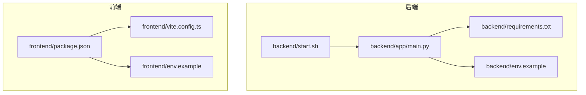
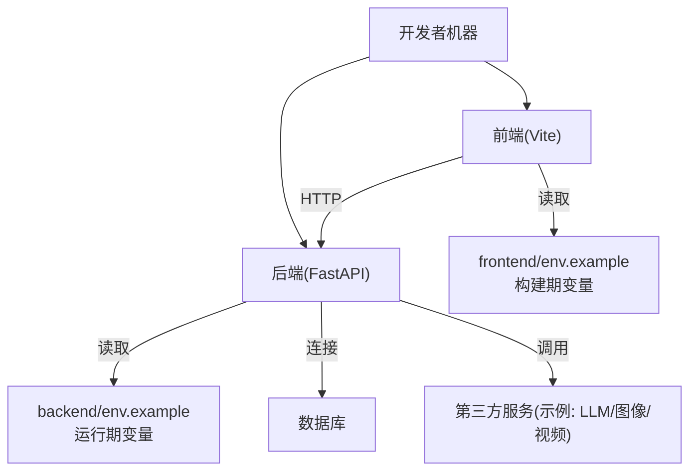
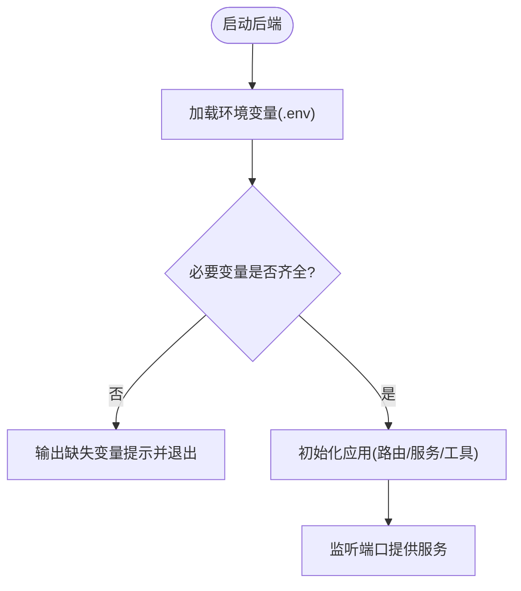
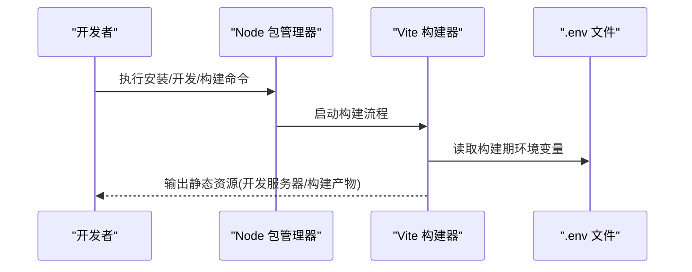
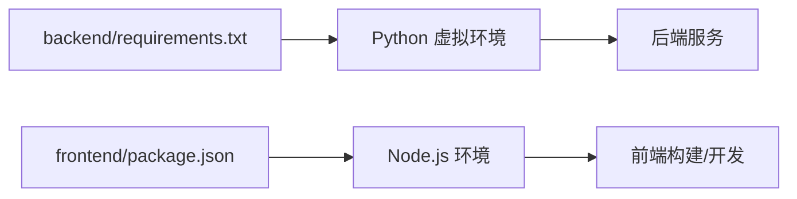

# 环境配置

<cite>
**本文引用的文件**   
- [backend/env.example](file://backend/env.example)
- [backend/requirements.txt](file://backend/requirements.txt)
- [backend/start.sh](file://backend/start.sh)
- [frontend/env.example](file://frontend/env.example)
- [frontend/package.json](file://frontend/package.json)
- [frontend/vite.config.ts](file://frontend/vite.config.ts)
- [backend/app/main.py](file://backend/app/main.py)
</cite>

## 更新摘要
**所做更改**   
- 更新了Python依赖管理部分，反映最新的包依赖要求
- 增强了虚拟环境创建和依赖安装的详细说明
- 优化了不同操作系统下的安装步骤，确保与新的依赖要求兼容
- 更新了故障排查指南，包含新依赖可能带来的问题解决方案

## 目录
1. [简介](#简介)
2. [项目结构](#项目结构)
3. [核心组件](#核心组件)
4. [架构总览](#架构总览)
5. [详细组件分析](#详细组件分析)
6. [依赖分析](#依赖分析)
7. [性能考虑](#性能考虑)
8. [故障排查指南](#故障排查指南)
9. [结论](#结论)
10. [附录](#附录)

## 简介
本指南聚焦于开发环境与生产环境的差异与统一配置方法，覆盖 Python 与 Node.js 版本要求、依赖包管理、环境变量配置（后端与前端）、API 密钥与第三方服务集成、数据库连接、以及 Windows/Linux/macOS 的安装步骤。同时提供虚拟环境创建、依赖安装、配置文件模板使用方法和常见问题排查方案。

## 项目结构
本项目采用前后端分离：
- 后端：Python + FastAPI（入口在 backend/app/main.py），通过环境变量加载配置，依赖由 requirements.txt 管理。
- 前端：TypeScript + Vite（构建与运行脚本在 frontend/package.json，Vite 配置在 frontend/vite.config.ts），通过环境变量注入到构建时。



**图示来源**
- [backend/app/main.py](file://backend/app/main.py)
- [backend/requirements.txt](file://backend/requirements.txt)
- [backend/env.example](file://backend/env.example)
- [backend/start.sh](file://backend/start.sh)
- [frontend/package.json](file://frontend/package.json)
- [frontend/vite.config.ts](file://frontend/vite.config.ts)
- [frontend/env.example](file://frontend/env.example)

**章节来源**
- [backend/app/main.py](file://backend/app/main.py)
- [backend/requirements.txt](file://backend/requirements.txt)
- [backend/env.example](file://backend/env.example)
- [backend/start.sh](file://backend/start.sh)
- [frontend/package.json](file://frontend/package.json)
- [frontend/vite.config.ts](file://frontend/vite.config.ts)
- [frontend/env.example](file://frontend/env.example)

## 核心组件
- 后端配置
  - 环境变量模板：参考 backend/env.example，用于定义 API 密钥、数据库连接、第三方服务等关键变量。
  - 依赖管理：backend/requirements.txt 列出 Python 依赖；建议使用 venv 或 conda 隔离环境。
  - 启动脚本：backend/start.sh 提供一键启动方式（Linux/macOS）。
- 前端配置
  - 环境变量模板：参考 frontend/env.example，用于定义构建期变量（如 API 基础地址等）。
  - 依赖管理：frontend/package.json 管理 Node.js 依赖与脚本命令。
  - 构建配置：frontend/vite.config.ts 控制构建行为与变量注入。

**章节来源**
- [backend/env.example](file://backend/env.example)
- [backend/requirements.txt](file://backend/requirements.txt)
- [backend/start.sh](file://backend/start.sh)
- [frontend/env.example](file://frontend/env.example)
- [frontend/package.json](file://frontend/package.json)
- [frontend/vite.config.ts](file://frontend/vite.config.ts)

## 架构总览
下图展示开发/生产环境下前后端与环境变量的交互关系。



[此图为概念性架构图，不直接映射具体源码文件]

## 详细组件分析

### 后端环境配置
- 环境变量
  - 使用 backend/env.example 作为模板，复制为 .env 后按需填写。
  - 常见类别：
    - API 密钥：例如各类大模型、图像生成、语音合成等服务的访问令牌。
    - 数据库连接：主机、端口、用户名、密码、库名等。
    - 第三方服务：存储、对象存储、消息队列等接入参数。
- 依赖管理
  - 使用 Python 虚拟环境（venv）隔离依赖，避免系统级污染。
  - 通过 backend/requirements.txt 安装依赖。
  - **更新** 建议检查 Python 版本兼容性，确保满足最新依赖包的版本要求。
- 启动方式
  - Linux/macOS：可直接执行 backend/start.sh。
  - Windows：建议通过命令行手动启动（见"不同操作系统下的安装步骤"）。



**图示来源**
- [backend/app/main.py](file://backend/app/main.py)
- [backend/env.example](file://backend/env.example)
- [backend/start.sh](file://backend/start.sh)

**章节来源**
- [backend/env.example](file://backend/env.example)
- [backend/requirements.txt](file://backend/requirements.txt)
- [backend/start.sh](file://backend/start.sh)
- [backend/app/main.py](file://backend/app/main.py)

### 前端环境配置
- 环境变量
  - 使用 frontend/env.example 作为模板，复制为 .env 后填写构建期变量（如 API 基础地址）。
  - 注意：Vite 仅在构建时将特定前缀的变量注入到客户端代码中，请遵循其约定。
- 依赖管理
  - 使用 Node.js 包管理器（npm/yarn/pnpm）安装依赖。
  - 脚本命令定义在 frontend/package.json。
- 构建与运行
  - 开发模式：使用 package.json 中的开发脚本。
  - 生产构建：使用 package.json 中的构建脚本，产物由 Vite 输出。



**图示来源**
- [frontend/package.json](file://frontend/package.json)
- [frontend/vite.config.ts](file://frontend/vite.config.ts)
- [frontend/env.example](file://frontend/env.example)

**章节来源**
- [frontend/env.example](file://frontend/env.example)
- [frontend/package.json](file://frontend/package.json)
- [frontend/vite.config.ts](file://frontend/vite.config.ts)

### 环境变量对比（开发 vs 生产）
- 开发环境
  - 后端：本地调试，日志级别可更详细；数据库指向本地或测试实例；第三方服务可使用沙箱/测试密钥。
  - 前端：启用热重载，便于快速迭代；API 地址指向本地后端。
- 生产环境
  - 后端：关闭调试日志，严格校验环境变量；数据库指向生产实例；第三方服务使用正式密钥与限流策略。
  - 前端：进行生产构建，最小化体积；API 地址指向生产域名；禁用调试信息。

[本节为通用指导，不直接分析具体文件]

## 依赖分析
- 后端依赖
  - 通过 backend/requirements.txt 管理 Python 依赖。
  - 建议在虚拟环境中安装，确保可复现。
  - **更新** 定期检查依赖更新，确保与最新安全补丁和功能保持同步。
- 前端依赖
  - 通过 frontend/package.json 管理 Node.js 依赖与脚本。
  - 锁定依赖版本（package-lock.json）以保证一致性。



**图示来源**
- [backend/requirements.txt](file://backend/requirements.txt)
- [frontend/package.json](file://frontend/package.json)

**章节来源**
- [backend/requirements.txt](file://backend/requirements.txt)
- [frontend/package.json](file://frontend/package.json)

## 性能考虑
- 后端
  - 合理设置并发与线程池大小，避免阻塞 I/O。
  - 对第三方服务调用增加超时与重试策略。
  - 生产环境开启压缩与缓存头。
- 前端
  - 生产构建启用代码分割与资源压缩。
  - 合理使用 CDN 与浏览器缓存策略。
  - 减少不必要的运行时变量注入。

[本节为通用指导，不直接分析具体文件]

## 故障排查指南
- 环境变量未生效
  - 确认已复制 env.example 为 .env 并正确填写。
  - 检查后端是否在启动时加载了 .env；检查前端构建是否读取了 .env。
- 端口占用
  - 修改后端监听端口或释放占用进程。
- 依赖安装失败
  - 检查 Python/Node.js 版本是否符合要求。
  - 清理缓存后重试安装。
  - **新增** 如果遇到特定包安装失败，尝试升级 pip 或 npm 到最新版本。
  - **新增** 对于网络问题导致的依赖下载失败，可配置国内镜像源加速下载。
- 第三方服务不可用
  - 核对 API 密钥与网络连通性。
  - 查看错误日志定位鉴权或服务端限制。
- **新增** Python 版本不兼容
  - 确认当前 Python 版本满足 requirements.txt 中的最低版本要求。
  - 如遇编译错误，检查系统是否安装了必要的编译工具和依赖库。

[本节为通用指导，不直接分析具体文件]

## 结论
通过统一的模板与环境变量管理，配合虚拟环境与依赖锁定，可在开发与生产环境间保持一致性与可复现性。建议在生产环境严格校验环境变量、最小化暴露面，并对第三方服务调用做好容错与监控。

[本节为总结性内容，不直接分析具体文件]

## 附录

### 版本要求
- Python
  - 建议使用较新的稳定版（例如 3.10+），以兼容现代依赖。
  - **更新** 根据最新的 requirements.txt 要求，确保 Python 版本满足所有依赖包的兼容性需求。
- Node.js
  - 建议使用 LTS 版本（例如 18.x/20.x），以确保 Vite 与生态兼容性。

[本节为通用指导，不直接分析具体文件]

### 虚拟环境与依赖安装
- Python 虚拟环境
  - 创建虚拟环境并激活。
  - 进入后端目录，使用 requirements.txt 安装依赖。
  - **更新** 推荐使用以下命令创建和管理虚拟环境：
    ```bash
    # 创建虚拟环境
    python -m venv venv
    
    # 激活虚拟环境
    # Windows:
    venv\Scripts\activate
    # Linux/macOS:
    source venv/bin/activate
    
    # 升级pip
    pip install --upgrade pip
    
    # 安装依赖
    pip install -r requirements.txt
    ```
- Node.js 环境
  - 进入前端目录，使用包管理器安装依赖。
  - 根据 package.json 中的脚本命令启动开发服务器或构建生产产物。
  - **更新** 推荐使用以下命令：
    ```bash
    # 进入前端目录
    cd frontend
    
    # 安装依赖
    npm install
    
    # 或使用yarn
    yarn install
    
    # 启动开发服务器
    npm run dev
    ```

[本节为通用指导，不直接分析具体文件]

### 配置文件模板使用方法
- 后端
  - 复制 backend/env.example 为 .env，按注释填写必要变量。
  - **更新** 确保所有必需的环境变量都已正确配置，特别是新的依赖包所需的配置项。
- 前端
  - 复制 frontend/env.example 为 .env，按注释填写构建期变量。

**章节来源**
- [backend/env.example](file://backend/env.example)
- [frontend/env.example](file://frontend/env.example)

### 不同操作系统下的安装步骤

- Windows
  - 安装 Python 与 Node.js（参考"版本要求"）。
  - 打开 PowerShell 或 CMD：
    - 创建并激活 Python 虚拟环境。
    - 进入 backend 目录，使用 requirements.txt 安装依赖。
    - 进入 frontend 目录，使用包管理器安装依赖。
    - 根据 package.json 中的脚本命令启动前端开发服务器。
    - 手动启动后端服务（若 start.sh 不可用）。
  - **更新** 如果遇到权限问题，尝试以管理员身份运行终端。
  - **更新** 对于某些需要编译的Python包，可能需要安装Visual Studio Build Tools。

- Linux
  - 安装 Python 与 Node.js（参考"版本要求"）。
  - 打开终端：
    - 创建并激活 Python 虚拟环境。
    - 进入 backend 目录，使用 requirements.txt 安装依赖。
    - 进入 frontend 目录，使用包管理器安装依赖。
    - 根据 package.json 中的脚本命令启动前端开发服务器。
    - 执行 backend/start.sh 启动后端服务。
  - **更新** 确保安装了系统级别的编译依赖：
    ```bash
    # Ubuntu/Debian
    sudo apt-get update
    sudo apt-get install build-essential python3-dev
    
    # CentOS/RHEL
    sudo yum groupinstall "Development Tools"
    sudo yum install python3-devel
    ```

- macOS
  - 安装 Python 与 Node.js（参考"版本要求"）。
  - 打开终端：
    - 创建并激活 Python 虚拟环境。
    - 进入 backend 目录，使用 requirements.txt 安装依赖。
    - 进入 frontend 目录，使用包管理器安装依赖。
    - 根据 package.json 中的脚本命令启动前端开发服务器。
    - 执行 backend/start.sh 启动后端服务。
  - **更新** 如需安装Xcode命令行工具：
    ```bash
    xcode-select --install
    ```

[本节为通用指导，不直接分析具体文件]

### 环境变量清单与说明（分类）
- 后端（运行期）
  - API 密钥：用于调用外部 AI/媒体生成等服务。
  - 数据库连接：主机、端口、用户名、密码、库名等。
  - 第三方服务：存储、对象存储、消息队列等接入参数。
- 前端（构建期）
  - API 基础地址：构建时注入到客户端代码。
  - 其他构建开关：如调试开关、功能特性开关等。

**章节来源**
- [backend/env.example](file://backend/env.example)
- [frontend/env.example](file://frontend/env.example)

### 依赖管理最佳实践
- **更新** Python 依赖管理
  - 定期更新 requirements.txt，记录依赖变更原因。
  - 使用 pip-tools 或 Poetry 进行更严格的依赖管理。
  - 在生产环境中使用冻结的依赖版本。
- **更新** Node.js 依赖管理
  - 使用 package-lock.json 锁定依赖版本。
  - 定期运行安全扫描检测已知漏洞。
  - 考虑使用 pnpm 以获得更好的性能和磁盘空间效率。

[本节为通用指导，不直接分析具体文件]

### 常见问题解决方案
- **新增** 依赖冲突解决
  - 使用 `pip list --outdated` 检查过期的依赖包。
  - 遇到版本冲突时，尝试分别安装有冲突的包。
  - 考虑使用 Docker 容器化环境避免系统级依赖问题。
- **新增** 网络问题处理
  - 配置国内镜像源加速依赖下载：
    ```bash
    # pip 镜像配置
    pip config set global.index-url https://pypi.tuna.tsinghua.edu.cn/simple
    
    # npm 镜像配置
    npm config set registry https://registry.npmmirror.com
    ```
- **新增** 内存不足问题
  - 调整 Node.js 最大内存限制：
    ```bash
    export NODE_OPTIONS="--max-old-space-size=4096"
    ```

[本节为通用指导，不直接分析具体文件]