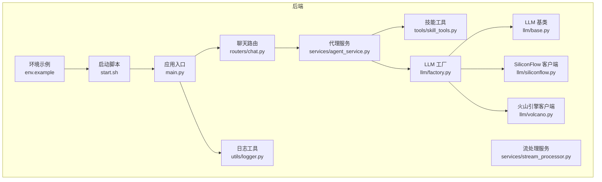
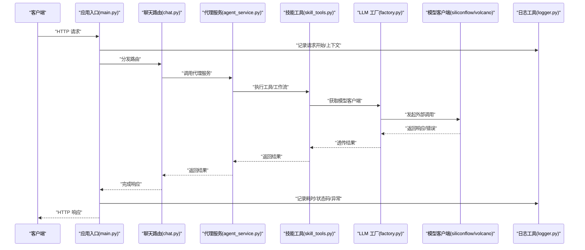
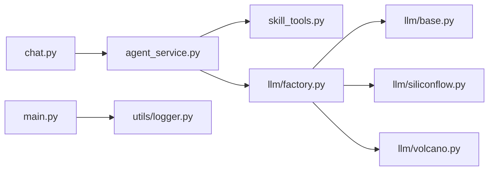

# 监控与日志

<cite>
**本文引用的文件**   
- [backend/app/main.py](file://backend/app/main.py)
- [backend/app/utils/logger.py](file://backend/app/utils/logger.py)
- [backend/app/routers/chat.py](file://backend/app/routers/chat.py)
- [backend/app/services/agent_service.py](file://backend/app/services/agent_service.py)
- [backend/app/services/stream_processor.py](file://backend/app/services/stream_processor.py)
- [backend/app/tools/skill_tools.py](file://backend/app/tools/skill_tools.py)
- [backend/app/llm/factory.py](file://backend/app/llm/factory.py)
- [backend/app/llm/base.py](file://backend/app/llm/base.py)
- [backend/app/llm/siliconflow.py](file://backend/app/llm/siliconflow.py)
- [backend/app/llm/volcano.py](file://backend/app/llm/volcano.py)
- [backend/start.sh](file://backend/start.sh)
- [backend/env.example](file://backend/env.example)
</cite>

## 目录
1. [简介](#简介)
2. [项目结构](#项目结构)
3. [核心组件](#核心组件)
4. [架构总览](#架构总览)
5. [详细组件分析](#详细组件分析)
6. [依赖关系分析](#依赖关系分析)
7. [性能考虑](#性能考虑)
8. [故障排查指南](#故障排查指南)
9. [结论](#结论)
10. [附录](#附录)

## 简介
本指南面向 PolyStudio 后端的监控与日志体系建设，目标是：
- 建立应用性能监控（APM）能力，覆盖请求响应时间、错误率、资源使用率等关键指标。
- 构建结构化日志收集方案，统一格式规范、分级策略与集中式存储。
- 配置告警规则，包括阈值、异常检测与通知渠道。
- 实现分布式追踪，支持链路追踪、调用链分析与性能瓶颈定位。
- 搭建监控仪表板与自定义报表，支撑日常运维与业务洞察。

## 项目结构
后端采用模块化分层组织，监控与日志相关的关键位置如下：
- 应用入口与中间件挂载点：用于接入 APM 与日志初始化。
- 路由层：承载 HTTP 请求生命周期，便于埋点与指标采集。
- 服务层与工具层：封装业务逻辑与外部调用，适合记录耗时与错误。
- LLM 工厂与各模型客户端：对外部大模型服务的调用点，是追踪与指标采集的重点。
- 启动脚本与环境示例：用于注入环境变量与运行参数，驱动监控与日志行为。

图表来源
- [backend/app/main.py](file://backend/app/main.py)
- [backend/app/routers/chat.py](file://backend/app/routers/chat.py)
- [backend/app/services/agent_service.py](file://backend/app/services/agent_service.py)
- [backend/app/services/stream_processor.py](file://backend/app/services/stream_processor.py)
- [backend/app/tools/skill_tools.py](file://backend/app/tools/skill_tools.py)
- [backend/app/llm/factory.py](file://backend/app/llm/factory.py)
- [backend/app/llm/base.py](file://backend/app/llm/base.py)
- [backend/app/llm/siliconflow.py](file://backend/app/llm/siliconflow.py)
- [backend/app/llm/volcano.py](file://backend/app/llm/volcano.py)
- [backend/app/utils/logger.py](file://backend/app/utils/logger.py)
- [backend/start.sh](file://backend/start.sh)
- [backend/env.example](file://backend/env.example)

章节来源
- [backend/app/main.py](file://backend/app/main.py)
- [backend/app/utils/logger.py](file://backend/app/utils/logger.py)
- [backend/app/routers/chat.py](file://backend/app/routers/chat.py)
- [backend/app/services/agent_service.py](file://backend/app/services/agent_service.py)
- [backend/app/services/stream_processor.py](file://backend/app/services/stream_processor.py)
- [backend/app/tools/skill_tools.py](file://backend/app/tools/skill_tools.py)
- [backend/app/llm/factory.py](file://backend/app/llm/factory.py)
- [backend/app/llm/base.py](file://backend/app/llm/base.py)
- [backend/app/llm/siliconflow.py](file://backend/app/llm/siliconflow.py)
- [backend/app/llm/volcano.py](file://backend/app/llm/volcano.py)
- [backend/start.sh](file://backend/start.sh)
- [backend/env.example](file://backend/env.example)

## 核心组件
- 应用入口与中间件
  - 在应用入口中注册全局中间件，用于统一捕获请求开始/结束、计算耗时、记录状态码与异常，并输出结构化日志。
  - 建议将链路追踪上下文（如 trace_id/span_id）注入到请求头与日志字段中，贯穿后续所有服务与工具调用。
- 日志工具
  - 提供统一的日志接口，支持 JSON 结构化输出、日志级别控制、采样与过滤。
  - 建议为每个模块定义独立 logger，并在关键路径写入必要上下文（用户标识、会话 ID、模型名称、工具名等）。
- 路由层
  - 在路由处理器前后进行埋点，记录入参摘要、出参摘要、耗时与错误类型，避免记录敏感信息。
- 服务层与工具层
  - 在服务方法边界记录进入/退出日志，对异常进行结构化捕获并附带堆栈摘要。
  - 对耗时较长的操作（如生成任务、流式处理）增加分段计时与进度事件。
- LLM 工厂与客户端
  - 在工厂创建具体客户端时注入追踪上下文；在客户端发送请求与接收响应时记录延迟、重试次数与错误码。
  - 对第三方 API 的限流、超时与熔断情况进行统计与告警。

章节来源
- [backend/app/main.py](file://backend/app/main.py)
- [backend/app/utils/logger.py](file://backend/app/utils/logger.py)
- [backend/app/routers/chat.py](file://backend/app/routers/chat.py)
- [backend/app/services/agent_service.py](file://backend/app/services/agent_service.py)
- [backend/app/tools/skill_tools.py](file://backend/app/tools/skill_tools.py)
- [backend/app/llm/factory.py](file://backend/app/llm/factory.py)
- [backend/app/llm/siliconflow.py](file://backend/app/llm/siliconflow.py)
- [backend/app/llm/volcano.py](file://backend/app/llm/volcano.py)

## 架构总览
下图展示了从请求进入到外部 LLM 调用的完整链路，以及监控与日志在各层的落点。

图表来源
- [backend/app/main.py](file://backend/app/main.py)
- [backend/app/routers/chat.py](file://backend/app/routers/chat.py)
- [backend/app/services/agent_service.py](file://backend/app/services/agent_service.py)
- [backend/app/tools/skill_tools.py](file://backend/app/tools/skill_tools.py)
- [backend/app/llm/factory.py](file://backend/app/llm/factory.py)
- [backend/app/llm/siliconflow.py](file://backend/app/llm/siliconflow.py)
- [backend/app/llm/volcano.py](file://backend/app/llm/volcano.py)
- [backend/app/utils/logger.py](file://backend/app/utils/logger.py)

## 详细组件分析

### 应用入口与中间件（APM 与日志接入点）
- 职责
  - 注册全局中间件，统一采集请求维度指标（开始时间、结束时间、状态码、异常类型）。
  - 初始化日志系统（JSON 输出、级别、采样率），注入链路追踪上下文。
- 关键埋点
  - 请求进入：记录 trace_id、span_id、用户标识、会话 ID、请求路径与方法。
  - 请求结束：记录耗时、状态码、是否异常、异常摘要。
  - 资源使用率：可在中间件中读取进程级指标（CPU、内存、GC 等）并上报。
- 建议
  - 将指标以 Prometheus 兼容格式暴露或推送到时序数据库。
  - 将结构化日志输出到集中式日志平台（如 ELK/Loki）。

章节来源
- [backend/app/main.py](file://backend/app/main.py)
- [backend/app/utils/logger.py](file://backend/app/utils/logger.py)

### 路由层（请求生命周期与指标采集）
- 职责
  - 在路由处理器前后记录进入/退出日志，聚合业务维度标签（模型名、工具名、任务类型）。
  - 对异常进行捕获并记录结构化错误信息，避免泄露敏感数据。
- 关键埋点
  - 入参摘要（脱敏）、出参摘要（长度/大小）、耗时、错误分类。
  - 将 trace_id 传递到下游服务与工具。

章节来源
- [backend/app/routers/chat.py](file://backend/app/routers/chat.py)

### 服务层（业务编排与可观测性）
- 代理服务
  - 负责编排工具与 LLM 调用，记录阶段耗时与失败原因。
  - 对长耗时任务进行分段计时，便于定位瓶颈。
- 流式处理服务
  - 对 SSE/流式响应进行分块记录，统计吞吐与延迟分布。
  - 记录断流、重试与恢复事件。

章节来源
- [backend/app/services/agent_service.py](file://backend/app/services/agent_service.py)
- [backend/app/services/stream_processor.py](file://backend/app/services/stream_processor.py)

### 工具层（外部调用与错误处理）
- 技能工具
  - 在执行工具前记录输入摘要，完成后记录输出摘要与耗时。
  - 对第三方依赖的错误进行分类（网络、鉴权、限流、超时）。
- LLM 工厂与客户端
  - 工厂根据配置选择具体模型客户端，注入追踪上下文。
  - 客户端记录请求/响应延迟、重试次数、错误码与速率限制信息。

章节来源
- [backend/app/tools/skill_tools.py](file://backend/app/tools/skill_tools.py)
- [backend/app/llm/factory.py](file://backend/app/llm/factory.py)
- [backend/app/llm/base.py](file://backend/app/llm/base.py)
- [backend/app/llm/siliconflow.py](file://backend/app/llm/siliconflow.py)
- [backend/app/llm/volcano.py](file://backend/app/llm/volcano.py)

### 启动脚本与环境变量（运行时开关）
- 启动脚本
  - 设置 Python 运行参数（如并发、线程池、调试开关），影响性能与日志输出。
- 环境变量
  - 通过 env.example 提供监控与日志相关的环境变量模板（如日志级别、采样率、追踪端点、指标推送地址）。

章节来源
- [backend/start.sh](file://backend/start.sh)
- [backend/env.example](file://backend/env.example)

## 依赖关系分析
- 耦合与内聚
  - 路由层与服务层解耦良好，服务层通过工厂模式选择 LLM 客户端，降低对外部实现的直接依赖。
  - 日志工具被多处复用，具备较高内聚性。
- 外部依赖
  - 外部 LLM 服务（SiliconFlow、火山引擎）作为关键外部依赖，需重点监控其可用性、延迟与错误率。
- 潜在循环依赖
  - 当前结构未见明显循环依赖，但需注意在工具或服务间引入新的共享模块时避免环状引用。

图表来源
- [backend/app/routers/chat.py](file://backend/app/routers/chat.py)
- [backend/app/services/agent_service.py](file://backend/app/services/agent_service.py)
- [backend/app/tools/skill_tools.py](file://backend/app/tools/skill_tools.py)
- [backend/app/llm/factory.py](file://backend/app/llm/factory.py)
- [backend/app/llm/base.py](file://backend/app/llm/base.py)
- [backend/app/llm/siliconflow.py](file://backend/app/llm/siliconflow.py)
- [backend/app/llm/volcano.py](file://backend/app/llm/volcano.py)
- [backend/app/main.py](file://backend/app/main.py)
- [backend/app/utils/logger.py](file://backend/app/utils/logger.py)

## 性能考虑
- 指标采集开销
  - 在高 QPS 场景下，避免在热路径中进行昂贵的序列化或 I/O 操作；优先使用轻量级计数器与直方图。
- 日志采样与过滤
  - 对高频 INFO 日志启用采样，保留 ERROR/WARN 全量；对敏感字段进行脱敏。
- 外部调用优化
  - 对 LLM 客户端增加连接池、超时与重试策略，记录重试与熔断事件，防止雪崩。
- 流式处理
  - 对 SSE/流式响应进行背压控制，记录吞吐与延迟分布，避免内存膨胀。

[本节为通用指导，不直接分析具体文件]

## 故障排查指南
- 快速定位
  - 通过 trace_id 串联请求全链路日志与指标，定位异常发生的具体环节。
  - 关注错误分类（网络、鉴权、限流、超时）与错误摘要，结合堆栈信息快速复现。
- 常见问题
  - 外部 LLM 服务不可用或限流：检查客户端重试与熔断配置，查看错误码与速率限制提示。
  - 流式响应中断：检查网络稳定性与服务器端超时设置，确认流式处理服务的断流恢复逻辑。
  - 日志缺失或重复：检查中间件是否正确注入 trace_id，确认日志采样与去重策略。
- 建议步骤
  - 开启 DEBUG 级别临时提升日志粒度，定位问题后恢复至生产级别。
  - 导出相关时间段内的指标与日志，对比变更历史与发布版本。

章节来源
- [backend/app/utils/logger.py](file://backend/app/utils/logger.py)
- [backend/app/routers/chat.py](file://backend/app/routers/chat.py)
- [backend/app/services/agent_service.py](file://backend/app/services/agent_service.py)
- [backend/app/services/stream_processor.py](file://backend/app/services/stream_processor.py)
- [backend/app/llm/siliconflow.py](file://backend/app/llm/siliconflow.py)
- [backend/app/llm/volcano.py](file://backend/app/llm/volcano.py)

## 结论
通过在应用入口、路由、服务与外部调用层系统化地接入 APM 与结构化日志，并结合分布式追踪与告警规则，PolyStudio 后端可实现端到端的全链路可观测性。建议在上线前完成指标面板与告警规则的联调演练，确保在生产环境中能够快速发现与定位问题。

[本节为总结性内容，不直接分析具体文件]

## 附录

### APM 指标清单与采集建议
- 请求维度
  - 请求总量、成功率、错误率、P50/P95/P99 响应时间、QPS。
- 业务维度
  - 按模型名称、工具名、任务类型分组的指标。
- 资源维度
  - CPU、内存、GC、文件句柄、网络连接数。
- 外部依赖
  - LLM 客户端的延迟、重试次数、错误码分布、限流与熔断事件。

章节来源
- [backend/app/main.py](file://backend/app/main.py)
- [backend/app/routers/chat.py](file://backend/app/routers/chat.py)
- [backend/app/llm/factory.py](file://backend/app/llm/factory.py)
- [backend/app/llm/siliconflow.py](file://backend/app/llm/siliconflow.py)
- [backend/app/llm/volcano.py](file://backend/app/llm/volcano.py)

### 结构化日志规范
- 字段要求
  - 基础字段：时间戳、级别、模块、trace_id、span_id、用户标识、会话 ID。
  - 业务字段：模型名称、工具名、任务类型、入参摘要、出参摘要。
  - 错误字段：错误类型、错误摘要、堆栈摘要（脱敏）。
- 分级策略
  - ERROR：影响功能可用性与数据一致性的错误。
  - WARN：潜在风险与降级情况。
  - INFO：关键业务流程节点。
  - DEBUG：开发调试信息，生产默认关闭或采样。
- 集中式存储
  - 推荐 ELK/Loki + 索引策略（按日期/模块拆分），保留周期与冷热分层。

章节来源
- [backend/app/utils/logger.py](file://backend/app/utils/logger.py)

### 告警规则与通知
- 阈值建议
  - 错误率超过阈值（如 5% 持续 5 分钟）。
  - P95 响应时间超过阈值（如 2s）。
  - 外部 LLM 错误率或延迟异常。
- 异常检测
  - 基于滑动窗口与同比/环比比较，识别突增与突降。
- 通知渠道
  - 邮件、企业微信/钉钉机器人、短信与电话升级。

章节来源
- [backend/app/main.py](file://backend/app/main.py)
- [backend/app/routers/chat.py](file://backend/app/routers/chat.py)
- [backend/app/llm/factory.py](file://backend/app/llm/factory.py)

### 分布式追踪实现要点
- 上下文传播
  - 在 HTTP 头中携带 trace_id/span_id，跨服务与工具调用保持一致。
- 链路可视化
  - 将 span 数据发送到追踪后端（如 Jaeger/OpenTelemetry Collector），形成调用链视图。
- 瓶颈定位
  - 通过 span 耗时与错误标记，快速定位慢调用与失败点。

章节来源
- [backend/app/main.py](file://backend/app/main.py)
- [backend/app/routers/chat.py](file://backend/app/routers/chat.py)
- [backend/app/services/agent_service.py](file://backend/app/services/agent_service.py)
- [backend/app/tools/skill_tools.py](file://backend/app/tools/skill_tools.py)
- [backend/app/llm/factory.py](file://backend/app/llm/factory.py)

### 监控仪表板与报表
- 仪表板建议
  - 概览页：QPS、错误率、P95、外部依赖健康度。
  - 业务页：按模型/工具/任务的指标对比与趋势。
  - 资源页：CPU/内存/GC 与连接池使用情况。
- 自定义报表
  - 按日/周/月导出关键指标，结合业务事件（发布、扩容）进行分析。

章节来源
- [backend/app/main.py](file://backend/app/main.py)
- [backend/app/routers/chat.py](file://backend/app/routers/chat.py)
- [backend/app/services/agent_service.py](file://backend/app/services/agent_service.py)