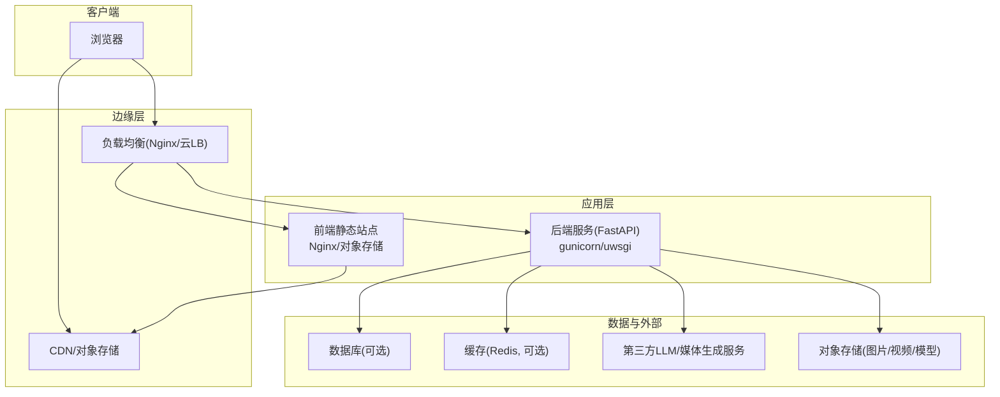
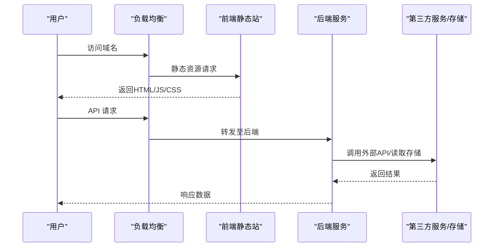
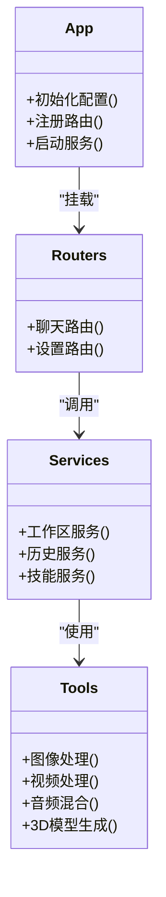
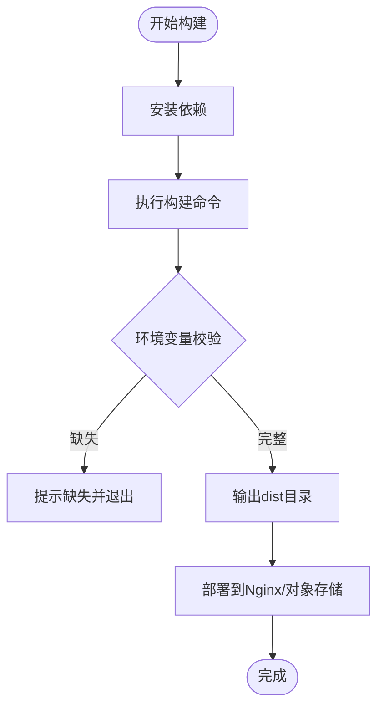
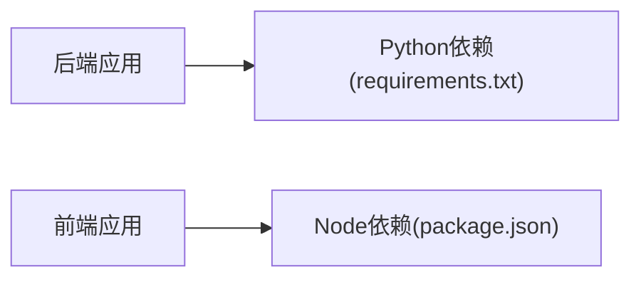

# 部署与运维

<cite>
**本文引用的文件**   
- [backend/app/main.py](file://backend/app/main.py)
- [backend/requirements.txt](file://backend/requirements.txt)
- [backend/env.example](file://backend/env.example)
- [backend/start.sh](file://backend/start.sh)
- [frontend/package.json](file://frontend/package.json)
- [frontend/vite.config.ts](file://frontend/vite.config.ts)
- [frontend/env.example](file://frontend/env.example)
</cite>

## 目录
1. [简介](#简介)
2. [项目结构](#项目结构)
3. [核心组件](#核心组件)
4. [架构总览](#架构总览)
5. [详细组件分析](#详细组件分析)
6. [依赖分析](#依赖分析)
7. [性能考虑](#性能考虑)
8. [故障排查指南](#故障排查指南)
9. [结论](#结论)
10. [附录](#附录)

## 简介
本指南面向生产环境的部署与运维，覆盖容器化（Docker）、云服务部署、负载均衡配置、环境与密钥管理、日志收集、监控告警、性能调优、备份恢复、灾难恢复、安全加固、自动化脚本与 CI/CD、容量规划与成本优化等主题。文档基于仓库中的后端 FastAPI 应用与前端 Vite 构建产物进行说明，并提供可落地的架构图与流程图。

## 项目结构
仓库采用前后端分离：
- 后端：Python + FastAPI，提供 REST/SSE 接口，包含工具链与服务模块。
- 前端：Vite + TypeScript，构建静态资源供 Nginx 或对象存储分发。

图表来源
- [backend/app/main.py:1-200](file://backend/app/main.py#L1-L200)
- [frontend/vite.config.ts:1-200](file://frontend/vite.config.ts#L1-L200)

章节来源
- [backend/app/main.py:1-200](file://backend/app/main.py#L1-L200)
- [frontend/vite.config.ts:1-200](file://frontend/vite.config.ts#L1-L200)

## 核心组件
- 后端入口与路由：FastAPI 应用启动、路由注册、中间件与生命周期钩子。
- 工具与服务：音视频处理、图像/3D 生成、工作区管理等。
- 前端构建与运行：Vite 开发服务器与生产构建产物。
- 环境配置：环境变量模板与启动脚本。

章节来源
- [backend/app/main.py:1-200](file://backend/app/main.py#L1-L200)
- [backend/requirements.txt:1-200](file://backend/requirements.txt#L1-L200)
- [backend/env.example:1-200](file://backend/env.example#L1-200)
- [backend/start.sh:1-200](file://backend/start.sh#L1-200)
- [frontend/package.json:1-200](file://frontend/package.json#L1-200)
- [frontend/vite.config.ts:1-200](file://frontend/vite.config.ts#L1-200)
- [frontend/env.example:1-200](file://frontend/env.example#L1-200)

## 架构总览
生产推荐架构：
- 前端静态资源通过 Nginx 或对象存储+CDN 分发。
- 后端以多进程方式运行（如 gunicorn），置于反向代理之后，启用 HTTPS 与限流。
- 使用外部数据库与缓存；大文件走对象存储；AI/媒体能力通过第三方 API 或自建推理集群。
- 统一日志采集（stdout/stderr）到集中式日志系统；指标暴露给监控系统。

图表来源
- [backend/app/main.py:1-200](file://backend/app/main.py#L1-L200)
- [frontend/vite.config.ts:1-200](file://frontend/vite.config.ts#L1-200)

## 详细组件分析

### 后端服务（FastAPI）
- 职责：接收 HTTP 请求，执行业务逻辑，调用工具与服务，返回 JSON/SSE 流。
- 关键路径：应用初始化、路由挂载、异常处理、健康检查。
- 进程模型：建议以多进程模式运行，配合反向代理的 keepalive 与超时设置。

图表来源
- [backend/app/main.py:1-200](file://backend/app/main.py#L1-L200)
- [backend/app/routers/chat.py:1-200](file://backend/app/routers/chat.py#L1-200)
- [backend/app/routers/settings.py:1-200](file://backend/app/routers/settings.py#L1-200)
- [backend/app/services/workspace_service.py:1-200](file://backend/app/services/workspace_service.py#L1-200)
- [backend/app/tools/image_generation.py:1-200](file://backend/app/tools/image_generation.py#L1-200)
- [backend/app/tools/video_concatenation.py:1-200](file://backend/app/tools/video_concatenation.py#L1-200)
- [backend/app/tools/audio_mixing.py:1-200](file://backend/app/tools/audio_mixing.py#L1-200)
- [backend/app/tools/model_3d_generation.py:1-200](file://backend/app/tools/model_3d_generation.py#L1-200)

章节来源
- [backend/app/main.py:1-200](file://backend/app/main.py#L1-L200)
- [backend/app/routers/chat.py:1-200](file://backend/app/routers/chat.py#L1-200)
- [backend/app/routers/settings.py:1-200](file://backend/app/routers/settings.py#L1-200)
- [backend/app/services/workspace_service.py:1-200](file://backend/app/services/workspace_service.py#L1-200)
- [backend/app/tools/image_generation.py:1-200](file://backend/app/tools/image_generation.py#L1-200)
- [backend/app/tools/video_concatenation.py:1-200](file://backend/app/tools/video_concatenation.py#L1-200)
- [backend/app/tools/audio_mixing.py:1-200](file://backend/app/tools/audio_mixing.py#L1-200)
- [backend/app/tools/model_3d_generation.py:1-200](file://backend/app/tools/model_3d_generation.py#L1-200)

### 前端静态站点（Vite）
- 职责：构建静态资源，支持环境变量注入，输出可被 Nginx/对象存储分发的产物。
- 关键路径：构建命令、环境变量、代理配置（开发期）。

图表来源
- [frontend/package.json:1-200](file://frontend/package.json#L1-200)
- [frontend/vite.config.ts:1-200](file://frontend/vite.config.ts#L1-200)
- [frontend/env.example:1-200](file://frontend/env.example#L1-200)

章节来源
- [frontend/package.json:1-200](file://frontend/package.json#L1-200)
- [frontend/vite.config.ts:1-200](file://frontend/vite.config.ts#L1-200)
- [frontend/env.example:1-200](file://frontend/env.example#L1-200)

### 环境与密钥管理
- 环境变量：后端与前端分别维护 env.example 模板，用于定义运行时参数与密钥占位。
- 密钥管理：生产环境建议使用云平台密钥管理服务（KMS/Secrets Manager），在容器启动时注入为环境变量或只读卷。
- 配置分层：基础配置（默认值）+ 环境配置（按环境覆盖）+ 运行时配置（动态开关）。

章节来源
- [backend/env.example:1-200](file://backend/env.example#L1-200)
- [frontend/env.example:1-200](file://frontend/env.example#L1-200)

### 日志收集与监控告警
- 日志：应用统一输出结构化日志到 stdout/stderr，由容器编排平台采集并转发至集中式日志系统。
- 指标：暴露健康检查与基础指标（QPS、延迟、错误率、资源使用），接入监控系统。
- 告警：对关键指标设定阈值与静默策略，结合通知渠道（邮件/IM/电话）。

章节来源
- [backend/app/utils/logger.py:1-200](file://backend/app/utils/logger.py#L1-200)
- [backend/app/main.py:1-200](file://backend/app/main.py#L1-L200)

### 负载均衡与反向代理
- 反向代理：HTTPS 终止、静态资源缓存、Gzip/Brotli 压缩、请求限流与黑白名单。
- 负载均衡：多实例横向扩展，会话保持（如需），健康检查与自动摘除。
- 超时与重试：合理设置连接、读写与上游超时，避免雪崩。

章节来源
- [backend/app/main.py:1-200](file://backend/app/main.py#L1-L200)
- [frontend/vite.config.ts:1-200](file://frontend/vite.config.ts#L1-200)

### 容器化部署（Docker）
- 镜像分层：基础镜像选择精简版，仅安装必要依赖，减少攻击面。
- 构建阶段：多阶段构建，将构建产物与运行环境分离。
- 运行参数：以非 root 用户运行，最小权限原则，只读根文件系统（可选）。
- 健康检查：容器编排平台定期探测健康端点。

章节来源
- [backend/start.sh:1-200](file://backend/start.sh#L1-200)
- [backend/requirements.txt:1-200](file://backend/requirements.txt#L1-200)

### 云服务部署
- 计算：托管容器服务或虚拟机实例，开启弹性伸缩。
- 网络：内网互通，外网通过网关/负载均衡暴露。
- 存储：对象存储承载静态与大文件，数据库使用托管服务。
- 密钥：使用平台提供的密钥管理服务，避免硬编码。

章节来源
- [backend/app/main.py:1-200](file://backend/app/main.py#L1-L200)
- [frontend/vite.config.ts:1-200](file://frontend/vite.config.ts#L1-200)

### 备份恢复与灾难恢复
- 数据备份：数据库定时快照与增量备份，对象存储版本控制与跨区域复制。
- 恢复演练：定期演练恢复流程，验证 RTO/RPO 目标。
- 容灾：多可用区或多地域部署，流量切换与回滚策略。

章节来源
- [backend/app/main.py:1-200](file://backend/app/main.py#L1-L200)

### 安全加固
- 传输安全：全站 HTTPS，强制 HSTS，禁用不安全协议。
- 访问控制：最小权限、IP 白名单、身份认证与鉴权。
- 依赖安全：定期扫描依赖漏洞，锁定版本，灰度发布。
- 审计：操作审计日志与敏感操作二次确认。

章节来源
- [backend/app/main.py:1-200](file://backend/app/main.py#L1-L200)

### 运维自动化与 CI/CD
- 构建流水线：拉取代码 -> 安装依赖 -> 构建前端 -> 构建后端镜像 -> 推送镜像 -> 部署。
- 质量门禁：单元测试、集成测试、安全扫描、镜像签名。
- 发布策略：蓝绿/金丝雀发布，自动回滚。

章节来源
- [frontend/package.json:1-200](file://frontend/package.json#L1-200)
- [backend/start.sh:1-200](file://backend/start.sh#L1-200)

### 容量规划与成本优化
- 容量规划：基于峰值 QPS、并发连接数、CPU/内存占用估算实例数量与规格。
- 弹性伸缩：根据 CPU/内存/自定义指标自动扩缩容。
- 成本优化：预留实例/抢占实例、冷热数据分层、CDN 命中率优化、按需释放资源。

章节来源
- [backend/app/main.py:1-200](file://backend/app/main.py#L1-L200)

## 依赖分析
- 后端依赖：Python 包清单定义于 requirements.txt，确保生产环境一致性与可复现性。
- 前端依赖：package.json 定义构建与运行依赖，锁定版本避免漂移。

图表来源
- [backend/requirements.txt:1-200](file://backend/requirements.txt#L1-200)
- [frontend/package.json:1-200](file://frontend/package.json#L1-200)

章节来源
- [backend/requirements.txt:1-200](file://backend/requirements.txt#L1-200)
- [frontend/package.json:1-200](file://frontend/package.json#L1-200)

## 性能考虑
- 数据库优化：索引设计、连接池大小、慢查询分析与分页策略。
- 缓存策略：热点数据缓存、分布式缓存、缓存失效与一致性保障。
- CDN 配置：静态资源缓存、压缩、预取与回源策略。
- 后端优化：异步 I/O、批量处理、限流与熔断、连接复用。

[本节为通用指导，不直接分析具体文件]

## 故障排查指南
- 常见问题：端口冲突、依赖缺失、环境变量未注入、证书过期、磁盘空间不足。
- 定位方法：查看应用日志与健康检查状态，核对反向代理与负载均衡配置。
- 快速恢复：滚动重启、回滚到上一稳定版本、扩容临时实例承接流量。

章节来源
- [backend/app/main.py:1-200](file://backend/app/main.py#L1-L200)
- [backend/app/utils/logger.py:1-200](file://backend/app/utils/logger.py#L1-200)

## 结论
通过容器化与标准化部署流程，结合完善的监控告警与安全加固，可在保证高可用的同时实现弹性与成本优化。建议在生产环境持续演练备份恢复与故障切换，确保业务连续性。

## 附录
- 参考文件路径：
  - 后端入口与配置：[backend/app/main.py](file://backend/app/main.py)、[backend/env.example](file://backend/env.example)、[backend/start.sh](file://backend/start.sh)、[backend/requirements.txt](file://backend/requirements.txt)
  - 前端构建与配置：[frontend/package.json](file://frontend/package.json)、[frontend/vite.config.ts](file://frontend/vite.config.ts)、[frontend/env.example](file://frontend/env.example)