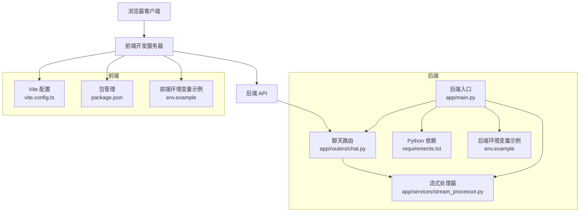
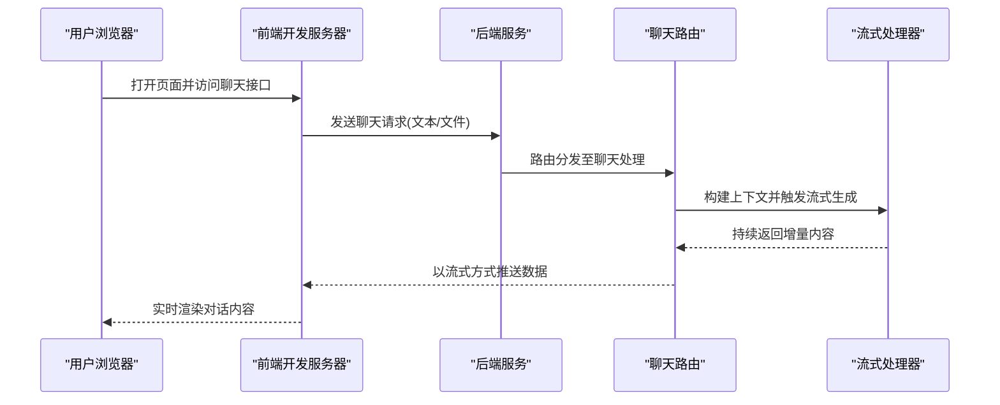
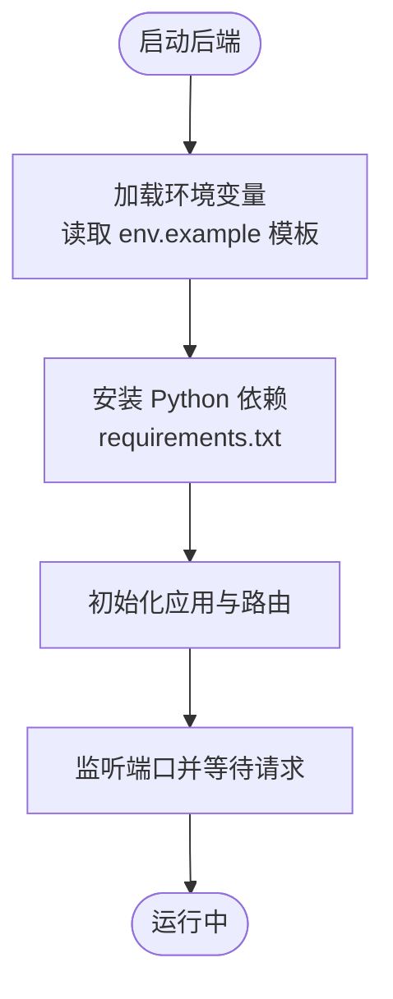
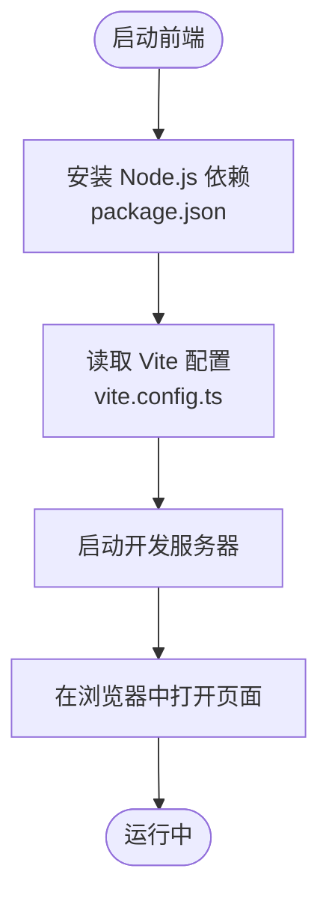
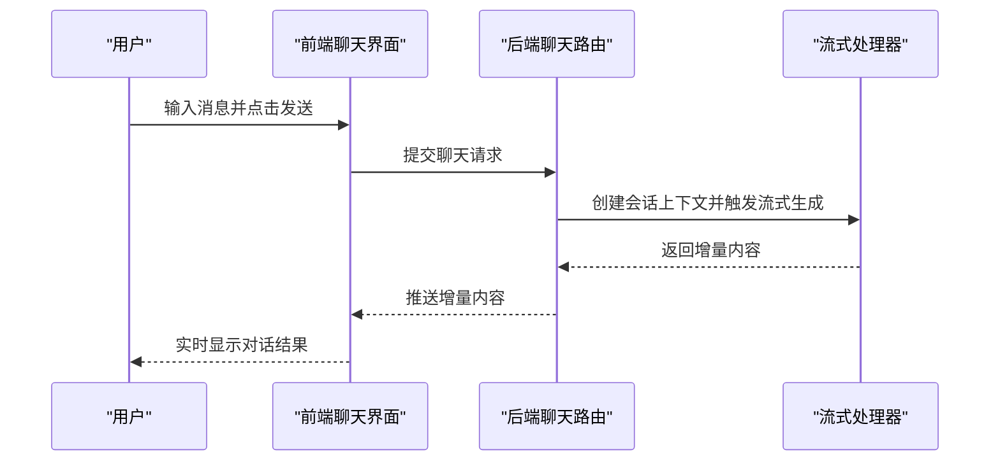
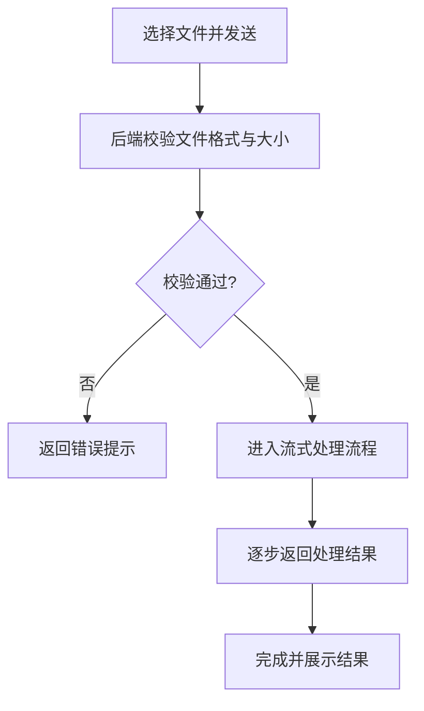
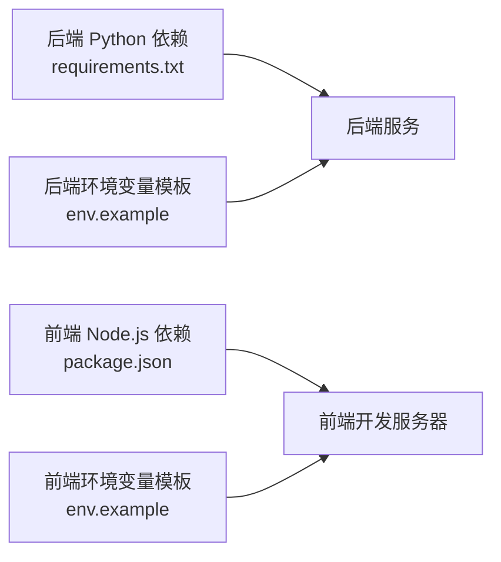

# 快速开始

<cite>
**本文引用的文件**   
- [backend/env.example](file://backend/env.example)
- [backend/requirements.txt](file://backend/requirements.txt)
- [backend/start.sh](file://backend/start.sh)
- [backend/app/main.py](file://backend/app/main.py)
- [backend/app/routers/chat.py](file://backend/app/routers/chat.py)
- [backend/app/services/stream_processor.py](file://backend/app/services/stream_processor.py)
- [frontend/env.example](file://frontend/env.example)
- [frontend/package.json](file://frontend/package.json)
- [frontend/vite.config.ts](file://frontend/vite.config.ts)
</cite>

## 目录
1. [简介](#简介)
2. [项目结构](#项目结构)
3. [核心组件](#核心组件)
4. [架构总览](#架构总览)
5. [详细组件分析](#详细组件分析)
6. [依赖分析](#依赖分析)
7. [性能考虑](#性能考虑)
8. [故障排除指南](#故障排除指南)
9. [结论](#结论)
10. [附录](#附录)

## 简介
本指南面向首次接触 PolyStudio 的用户，目标是在 30 分钟内完成环境准备、配置与启动，并体验第一个 AI 对话与文件上传。你将依次完成：
- 安装 Python 与 Node.js 环境
- 安装系统依赖与后端/前端依赖
- 配置环境变量（API 密钥、数据库连接等）
- 启动后端服务与前端开发服务器
- 发起一次 AI 对话并尝试上传文件
- 常见问题的排查方法

## 项目结构
PolyStudio 采用前后端分离的架构：
- 后端：基于 Python 的 FastAPI 应用，提供聊天、设置、流式处理、工具调用等能力
- 前端：基于 React + Vite 的开发服务器，提供聊天界面、设置页、3D 模型查看器等

图表来源
- [backend/app/main.py](file://backend/app/main.py)
- [backend/app/routers/chat.py](file://backend/app/routers/chat.py)
- [backend/app/services/stream_processor.py](file://backend/app/services/stream_processor.py)
- [backend/requirements.txt](file://backend/requirements.txt)
- [backend/env.example](file://backend/env.example)
- [frontend/vite.config.ts](file://frontend/vite.config.ts)
- [frontend/package.json](file://frontend/package.json)
- [frontend/env.example](file://frontend/env.example)

章节来源
- [backend/app/main.py](file://backend/app/main.py)
- [backend/app/routers/chat.py](file://backend/app/routers/chat.py)
- [backend/app/services/stream_processor.py](file://backend/app/services/stream_processor.py)
- [backend/requirements.txt](file://backend/requirements.txt)
- [backend/env.example](file://backend/env.example)
- [frontend/vite.config.ts](file://frontend/vite.config.ts)
- [frontend/package.json](file://frontend/package.json)
- [frontend/env.example](file://frontend/env.example)

## 核心组件
- 后端入口与路由：负责注册路由、挂载中间件、启动服务
- 聊天路由：处理聊天请求、解析参数、转发到业务逻辑
- 流式处理器：实现 SSE/流式响应，提升交互体验
- 依赖与环境：通过 requirements.txt 管理 Python 依赖；通过 env.example 提供环境变量模板
- 前端开发与配置：通过 vite.config.ts 配置代理与端口；通过 package.json 管理脚本与依赖；通过 env.example 提供前端环境变量模板

章节来源
- [backend/app/main.py](file://backend/app/main.py)
- [backend/app/routers/chat.py](file://backend/app/routers/chat.py)
- [backend/app/services/stream_processor.py](file://backend/app/services/stream_processor.py)
- [backend/requirements.txt](file://backend/requirements.txt)
- [backend/env.example](file://backend/env.example)
- [frontend/vite.config.ts](file://frontend/vite.config.ts)
- [frontend/package.json](file://frontend/package.json)
- [frontend/env.example](file://frontend/env.example)

## 架构总览
下图展示了从浏览器到后端的完整请求链路，包括流式响应的关键路径。

图表来源
- [backend/app/routers/chat.py](file://backend/app/routers/chat.py)
- [backend/app/services/stream_processor.py](file://backend/app/services/stream_processor.py)
- [backend/app/main.py](file://backend/app/main.py)

## 详细组件分析

### 后端服务启动流程
- 使用 start.sh 或等效命令启动后端服务
- 后端加载环境变量与依赖，初始化路由与中间件
- 监听本地端口并提供 REST/SSE 接口

图表来源
- [backend/start.sh](file://backend/start.sh)
- [backend/requirements.txt](file://backend/requirements.txt)
- [backend/env.example](file://backend/env.example)
- [backend/app/main.py](file://backend/app/main.py)

章节来源
- [backend/start.sh](file://backend/start.sh)
- [backend/requirements.txt](file://backend/requirements.txt)
- [backend/env.example](file://backend/env.example)
- [backend/app/main.py](file://backend/app/main.py)

### 前端开发服务器启动流程
- 安装 Node.js 依赖
- 根据 vite.config.ts 配置代理与端口
- 启动开发服务器并在浏览器中访问

图表来源
- [frontend/package.json](file://frontend/package.json)
- [frontend/vite.config.ts](file://frontend/vite.config.ts)

章节来源
- [frontend/package.json](file://frontend/package.json)
- [frontend/vite.config.ts](file://frontend/vite.config.ts)

### 第一个 AI 对话实操步骤
- 确保后端已启动且可访问
- 在前端聊天界面输入消息并发送
- 观察流式响应效果
- 如需上传文件，选择文件并发送，后端将按路由与流式处理器进行处理

图表来源
- [backend/app/routers/chat.py](file://backend/app/routers/chat.py)
- [backend/app/services/stream_processor.py](file://backend/app/services/stream_processor.py)

章节来源
- [backend/app/routers/chat.py](file://backend/app/routers/chat.py)
- [backend/app/services/stream_processor.py](file://backend/app/services/stream_processor.py)

### 文件上传与处理要点
- 前端支持选择文件并随聊天请求一并发送
- 后端路由接收文件并进行必要校验
- 流式处理器结合业务逻辑对文件内容进行理解或生成

图表来源
- [backend/app/routers/chat.py](file://backend/app/routers/chat.py)
- [backend/app/services/stream_processor.py](file://backend/app/services/stream_processor.py)

章节来源
- [backend/app/routers/chat.py](file://backend/app/routers/chat.py)
- [backend/app/services/stream_processor.py](file://backend/app/services/stream_processor.py)

## 依赖分析
- Python 依赖：通过 requirements.txt 统一管理
- Node.js 依赖：通过 package.json 管理
- 环境变量：后端与前端分别提供 env.example 作为模板

图表来源
- [backend/requirements.txt](file://backend/requirements.txt)
- [frontend/package.json](file://frontend/package.json)
- [backend/env.example](file://backend/env.example)
- [frontend/env.example](file://frontend/env.example)

章节来源
- [backend/requirements.txt](file://backend/requirements.txt)
- [frontend/package.json](file://frontend/package.json)
- [backend/env.example](file://backend/env.example)
- [frontend/env.example](file://frontend/env.example)

## 性能考虑
- 流式响应：优先使用流式输出以降低首字节延迟，提升用户体验
- 资源限制：合理设置文件大小上限与并发数，避免内存溢出
- 缓存策略：对频繁使用的模型或结果进行缓存，减少重复计算
- 日志与监控：启用结构化日志与关键指标采集，便于定位瓶颈

[本节为通用指导，不直接分析具体文件]

## 故障排除指南
- 端口占用
  - 现象：后端或前端启动失败，提示端口被占用
  - 解决：修改 vite.config.ts 中的前端端口或后端监听端口，确保未被其他进程占用
- 环境变量缺失
  - 现象：后端启动时报错或功能不可用
  - 解决：参考 env.example 模板，补齐 API 密钥、数据库连接等必要变量
- 依赖安装失败
  - 现象：pip 或 npm 安装报错
  - 解决：检查网络与镜像源；确认 Python 与 Node.js 版本满足要求；清理缓存后重试
- 跨域问题
  - 现象：前端无法访问后端接口
  - 解决：在 vite.config.ts 中配置代理，或将后端 CORS 设置为允许前端域名
- 文件上传失败
  - 现象：上传大文件或特定格式失败
  - 解决：检查后端对文件大小与类型的限制；确认前端正确编码 multipart/form-data

章节来源
- [backend/env.example](file://backend/env.example)
- [frontend/env.example](file://frontend/env.example)
- [frontend/vite.config.ts](file://frontend/vite.config.ts)

## 结论
按照本指南完成环境准备、配置与启动后，你可以在 30 分钟内成功运行 PolyStudio，并通过聊天界面体验 AI 对话与文件上传的核心能力。若遇到问题，请参考故障排除指南逐项排查。

## 附录

### 环境准备清单
- Python 环境
  - 建议版本：参见 requirements.txt 中的依赖说明
  - 安装依赖：使用 pip 安装 requirements.txt 所列依赖
- Node.js 环境
  - 建议版本：参见 package.json 中的引擎要求
  - 安装依赖：使用 npm 或 yarn 安装 package.json 所列依赖
- 系统依赖
  - 如遇到编译类依赖失败，请根据错误提示安装对应系统库

章节来源
- [backend/requirements.txt](file://backend/requirements.txt)
- [frontend/package.json](file://frontend/package.json)

### 环境变量配置指引
- 后端环境变量
  - 参考 env.example 模板，填写 API 密钥、数据库连接字符串等
  - 启动前确保所有必需变量均已配置
- 前端环境变量
  - 参考 env.example 模板，配置后端 API 地址、调试开关等
  - 开发模式下可通过 vite.config.ts 配置代理以避免跨域

章节来源
- [backend/env.example](file://backend/env.example)
- [frontend/env.example](file://frontend/env.example)
- [frontend/vite.config.ts](file://frontend/vite.config.ts)

### 启动命令序列
- 后端
  - 安装依赖：pip install -r requirements.txt
  - 启动服务：执行 start.sh 或使用等效命令
- 前端
  - 安装依赖：npm install 或 yarn
  - 启动开发服务器：执行 package.json 中定义的脚本命令
  - 在浏览器中访问开发服务器地址

章节来源
- [backend/start.sh](file://backend/start.sh)
- [backend/requirements.txt](file://backend/requirements.txt)
- [frontend/package.json](file://frontend/package.json)