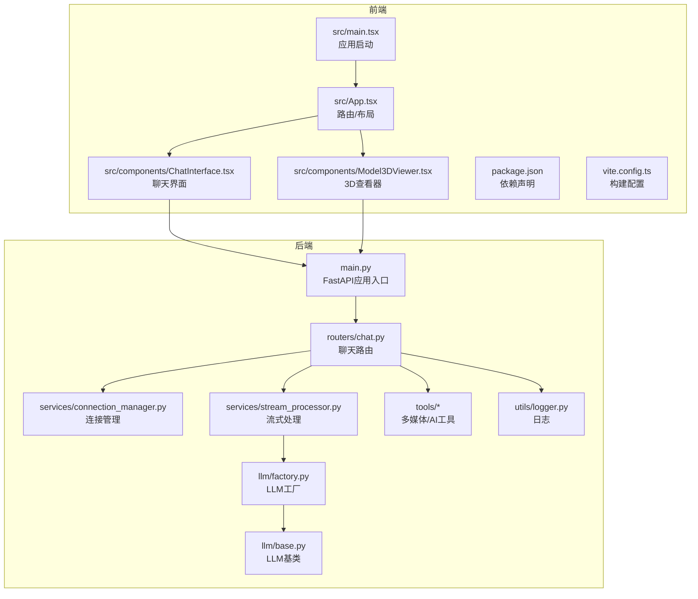
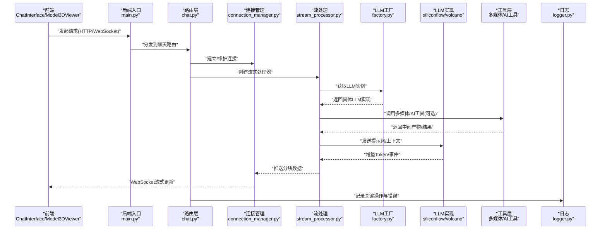
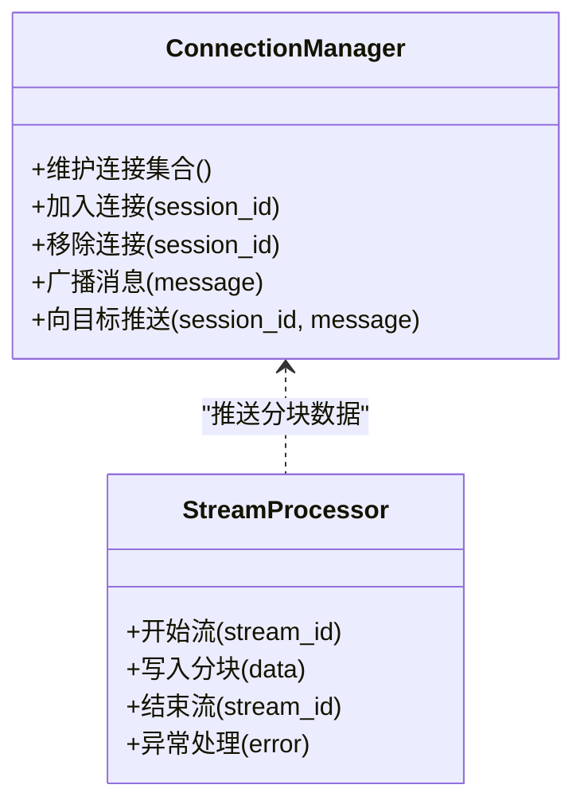
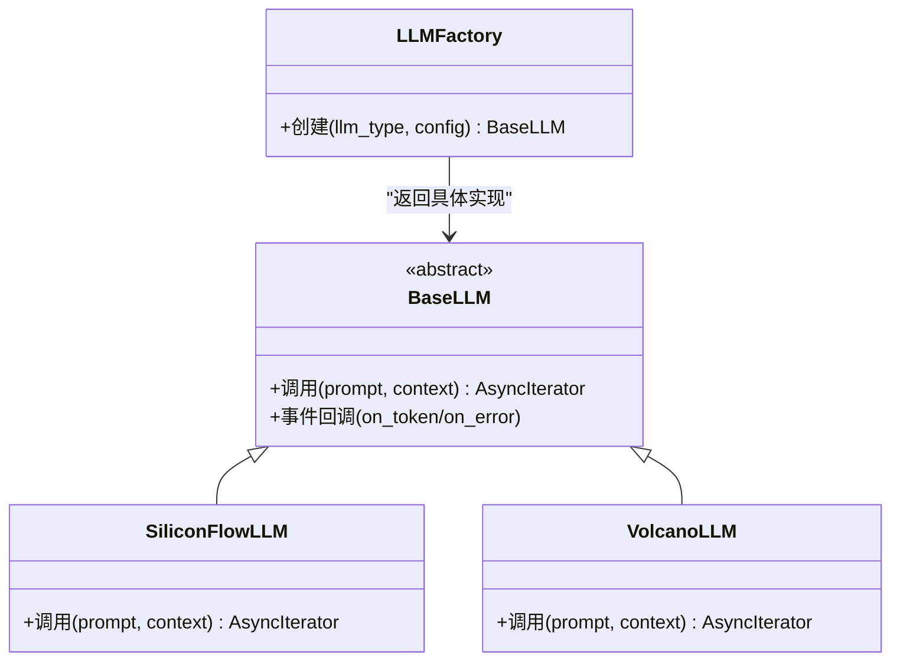
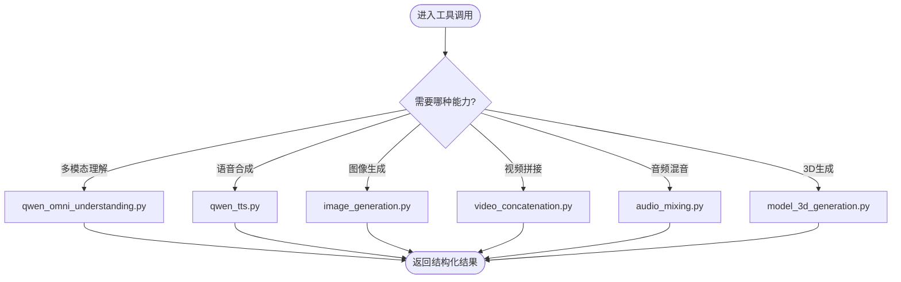
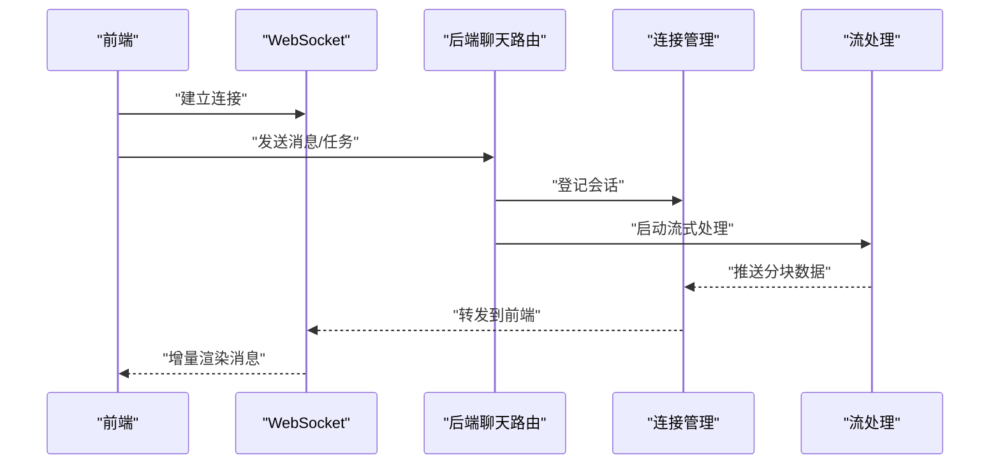

# 技术栈概览

<cite>
**本文引用的文件**   
- [backend/app/main.py](file://backend/app/main.py)
- [backend/requirements.txt](file://backend/requirements.txt)
- [backend/app/routers/chat.py](file://backend/app/routers/chat.py)
- [backend/app/services/connection_manager.py](file://backend/app/services/connection_manager.py)
- [backend/app/services/stream_processor.py](file://backend/app/services/stream_processor.py)
- [backend/app/llm/base.py](file://backend/app/llm/base.py)
- [backend/app/llm/factory.py](file://backend/app/llm/factory.py)
- [backend/app/llm/siliconflow.py](file://backend/app/llm/siliconflow.py)
- [backend/app/llm/volcano.py](file://backend/app/llm/volcano.py)
- [backend/app/tools/qwen_omni_understanding.py](file://backend/app/tools/qwen_omni_understanding.py)
- [backend/app/tools/qwen_tts.py](file://backend/app/tools/qwen_tts.py)
- [backend/app/tools/model_3d_generation.py](file://backend/app/tools/model_3d_generation.py)
- [backend/app/tools/image_generation.py](file://backend/app/tools/image_generation.py)
- [backend/app/tools/video_concatenation.py](file://backend/app/tools/video_concatenation.py)
- [backend/app/tools/audio_mixing.py](file://backend/app/tools/audio_mixing.py)
- [backend/app/utils/logger.py](file://backend/app/utils/logger.py)
- [frontend/package.json](file://frontend/package.json)
- [frontend/vite.config.ts](file://frontend/vite.config.ts)
- [frontend/src/main.tsx](file://frontend/src/main.tsx)
- [frontend/src/App.tsx](file://frontend/src/App.tsx)
- [frontend/src/components/ChatInterface.tsx](file://frontend/src/components/ChatInterface.tsx)
- [frontend/src/components/Model3DViewer.tsx](file://frontend/src/components/Model3DViewer.tsx)
</cite>

## 目录
1. [简介](#简介)
2. [项目结构](#项目结构)
3. [核心组件](#核心组件)
4. [架构总览](#架构总览)
5. [详细组件分析](#详细组件分析)
6. [依赖分析](#依赖分析)
7. [性能考量](#性能考量)
8. [故障排查指南](#故障排查指南)
9. [结论](#结论)
10. [附录](#附录)

## 简介
本技术栈概览面向PolyStudio项目的技术决策者与工程师，系统梳理后端与前端技术选型、关键依赖库、LLM集成框架、多媒体处理与3D渲染能力，并给出前后端交互模式与数据流向的架构图。文档旨在帮助读者快速理解项目的技术基础、扩展点与兼容性要求，为后续演进与二次开发提供依据。

## 项目结构
项目采用前后端分离的模块化组织方式：
- 后端（Python FastAPI）：以应用入口为中心，通过路由层暴露REST/WebSocket接口；服务层编排业务逻辑；工具层封装第三方AI与多媒体处理能力；LLM抽象层统一多模型接入；日志等通用能力下沉至utils。
- 前端（React + TypeScript + Vite）：以Vite构建，TypeScript类型安全，组件化UI；包含聊天界面与3D模型查看器等功能模块。

图表来源
- [backend/app/main.py](file://backend/app/main.py)
- [backend/app/routers/chat.py](file://backend/app/routers/chat.py)
- [backend/app/services/connection_manager.py](file://backend/app/services/connection_manager.py)
- [backend/app/services/stream_processor.py](file://backend/app/services/stream_processor.py)
- [backend/app/llm/factory.py](file://backend/app/llm/factory.py)
- [backend/app/llm/base.py](file://backend/app/llm/base.py)
- [backend/app/tools/qwen_omni_understanding.py](file://backend/app/tools/qwen_omni_understanding.py)
- [backend/app/tools/qwen_tts.py](file://backend/app/tools/qwen_tts.py)
- [backend/app/tools/model_3d_generation.py](file://backend/app/tools/model_3d_generation.py)
- [backend/app/tools/image_generation.py](file://backend/app/tools/image_generation.py)
- [backend/app/tools/video_concatenation.py](file://backend/app/tools/video_concatenation.py)
- [backend/app/tools/audio_mixing.py](file://backend/app/tools/audio_mixing.py)
- [backend/app/utils/logger.py](file://backend/app/utils/logger.py)
- [frontend/src/main.tsx](file://frontend/src/main.tsx)
- [frontend/src/App.tsx](file://frontend/src/App.tsx)
- [frontend/src/components/ChatInterface.tsx](file://frontend/src/components/ChatInterface.tsx)
- [frontend/src/components/Model3DViewer.tsx](file://frontend/src/components/Model3DViewer.tsx)
- [frontend/package.json](file://frontend/package.json)
- [frontend/vite.config.ts](file://frontend/vite.config.ts)

章节来源
- [backend/app/main.py](file://backend/app/main.py)
- [backend/requirements.txt](file://backend/requirements.txt)
- [frontend/package.json](file://frontend/package.json)
- [frontend/vite.config.ts](file://frontend/vite.config.ts)
- [frontend/src/main.tsx](file://frontend/src/main.tsx)
- [frontend/src/App.tsx](file://frontend/src/App.tsx)

## 核心组件
- 后端应用入口与路由
  - FastAPI应用初始化与中间件挂载位于应用入口文件，负责注册路由、生命周期钩子与全局配置。
  - 聊天路由集中处理对话请求，协调连接管理与流式响应，支撑实时交互体验。
- 连接管理与流式处理
  - 连接管理器维护WebSocket会话集合，支持广播与定向推送。
  - 流处理器对LLM输出进行分块转发，降低首字节延迟，提升用户体验。
- LLM抽象与工厂
  - 基类定义统一的调用接口与事件回调契约，屏蔽不同模型的差异。
  - 工厂根据配置动态选择具体实现（如硅基流动、火山引擎），便于扩展新模型。
- 工具层（多媒体与AI）
  - 语音合成、图像生成、视频拼接、音频混音、3D模型生成、多模态理解等工具，按职责拆分，便于复用与测试。
- 前端组件
  - 聊天界面负责消息收发、流式渲染与用户交互。
  - 3D查看器用于加载与展示生成的3D资源，配合后端生成流程形成闭环。

章节来源
- [backend/app/routers/chat.py](file://backend/app/routers/chat.py)
- [backend/app/services/connection_manager.py](file://backend/app/services/connection_manager.py)
- [backend/app/services/stream_processor.py](file://backend/app/services/stream_processor.py)
- [backend/app/llm/base.py](file://backend/app/llm/base.py)
- [backend/app/llm/factory.py](file://backend/app/llm/factory.py)
- [backend/app/llm/siliconflow.py](file://backend/app/llm/siliconflow.py)
- [backend/app/llm/volcano.py](file://backend/app/llm/volcano.py)
- [backend/app/tools/qwen_omni_understanding.py](file://backend/app/tools/qwen_omni_understanding.py)
- [backend/app/tools/qwen_tts.py](file://backend/app/tools/qwen_tts.py)
- [backend/app/tools/model_3d_generation.py](file://backend/app/tools/model_3d_generation.py)
- [backend/app/tools/image_generation.py](file://backend/app/tools/image_generation.py)
- [backend/app/tools/video_concatenation.py](file://backend/app/tools/video_concatenation.py)
- [backend/app/tools/audio_mixing.py](file://backend/app/tools/audio_mixing.py)
- [frontend/src/components/ChatInterface.tsx](file://frontend/src/components/ChatInterface.tsx)
- [frontend/src/components/Model3DViewer.tsx](file://frontend/src/components/Model3DViewer.tsx)

## 架构总览
下图展示了前后端交互模式与数据流向：前端通过HTTP/WebSocket与后端通信，路由层调度服务层，服务层组合LLM与工具链完成内容生成与媒体处理，结果经流式通道返回前端渲染。

图表来源
- [backend/app/main.py](file://backend/app/main.py)
- [backend/app/routers/chat.py](file://backend/app/routers/chat.py)
- [backend/app/services/connection_manager.py](file://backend/app/services/connection_manager.py)
- [backend/app/services/stream_processor.py](file://backend/app/services/stream_processor.py)
- [backend/app/llm/factory.py](file://backend/app/llm/factory.py)
- [backend/app/llm/siliconflow.py](file://backend/app/llm/siliconflow.py)
- [backend/app/llm/volcano.py](file://backend/app/llm/volcano.py)
- [backend/app/tools/qwen_omni_understanding.py](file://backend/app/tools/qwen_omni_understanding.py)
- [backend/app/tools/qwen_tts.py](file://backend/app/tools/qwen_tts.py)
- [backend/app/tools/model_3d_generation.py](file://backend/app/tools/model_3d_generation.py)
- [backend/app/tools/image_generation.py](file://backend/app/tools/image_generation.py)
- [backend/app/tools/video_concatenation.py](file://backend/app/tools/video_concatenation.py)
- [backend/app/tools/audio_mixing.py](file://backend/app/tools/audio_mixing.py)
- [backend/app/utils/logger.py](file://backend/app/utils/logger.py)
- [frontend/src/components/ChatInterface.tsx](file://frontend/src/components/ChatInterface.tsx)
- [frontend/src/components/Model3DViewer.tsx](file://frontend/src/components/Model3DViewer.tsx)

## 详细组件分析

### 后端：FastAPI应用与路由
- 应用入口负责初始化FastAPI实例、注册路由与中间件，并提供健康检查与静态资源访问能力。
- 聊天路由聚合对话相关接口，包括文本对话、流式输出、以及可能的媒体任务提交与状态查询。

章节来源
- [backend/app/main.py](file://backend/app/main.py)
- [backend/app/routers/chat.py](file://backend/app/routers/chat.py)

### 连接管理与流式处理
- 连接管理器维护活跃连接集合，支持按会话ID或房间维度进行消息广播与订阅。
- 流处理器对接LLM的增量输出，将Token或事件转换为可消费的流片段，并通过连接管理器推送给前端。

图表来源
- [backend/app/services/connection_manager.py](file://backend/app/services/connection_manager.py)
- [backend/app/services/stream_processor.py](file://backend/app/services/stream_processor.py)

章节来源
- [backend/app/services/connection_manager.py](file://backend/app/services/connection_manager.py)
- [backend/app/services/stream_processor.py](file://backend/app/services/stream_processor.py)

### LLM抽象与工厂
- 基类定义统一的调用签名、事件回调与错误语义，确保上层服务无需关心底层模型差异。
- 工厂根据运行时配置选择具体实现（如硅基流动、火山引擎），新增模型只需实现基类接口并注册到工厂。

图表来源
- [backend/app/llm/base.py](file://backend/app/llm/base.py)
- [backend/app/llm/factory.py](file://backend/app/llm/factory.py)
- [backend/app/llm/siliconflow.py](file://backend/app/llm/siliconflow.py)
- [backend/app/llm/volcano.py](file://backend/app/llm/volcano.py)

章节来源
- [backend/app/llm/base.py](file://backend/app/llm/base.py)
- [backend/app/llm/factory.py](file://backend/app/llm/factory.py)
- [backend/app/llm/siliconflow.py](file://backend/app/llm/siliconflow.py)
- [backend/app/llm/volcano.py](file://backend/app/llm/volcano.py)

### 工具层：多媒体与AI能力
- 多模态理解：接收图文输入，返回结构化解析结果供下游使用。
- 语音合成：将文本转为音频流或文件，供播报或混合。
- 图像/视频生成：调用外部服务或本地管线生成素材。
- 视频拼接与音频混音：将多段素材合并，输出最终媒体文件。
- 3D模型生成：根据描述或参数生成3D资产，供前端查看器渲染。

图表来源
- [backend/app/tools/qwen_omni_understanding.py](file://backend/app/tools/qwen_omni_understanding.py)
- [backend/app/tools/qwen_tts.py](file://backend/app/tools/qwen_tts.py)
- [backend/app/tools/image_generation.py](file://backend/app/tools/image_generation.py)
- [backend/app/tools/video_concatenation.py](file://backend/app/tools/video_concatenation.py)
- [backend/app/tools/audio_mixing.py](file://backend/app/tools/audio_mixing.py)
- [backend/app/tools/model_3d_generation.py](file://backend/app/tools/model_3d_generation.py)

章节来源
- [backend/app/tools/qwen_omni_understanding.py](file://backend/app/tools/qwen_omni_understanding.py)
- [backend/app/tools/qwen_tts.py](file://backend/app/tools/qwen_tts.py)
- [backend/app/tools/image_generation.py](file://backend/app/tools/image_generation.py)
- [backend/app/tools/video_concatenation.py](file://backend/app/tools/video_concatenation.py)
- [backend/app/tools/audio_mixing.py](file://backend/app/tools/audio_mixing.py)
- [backend/app/tools/model_3d_generation.py](file://backend/app/tools/model_3d_generation.py)

### 前端：React + TypeScript + Vite
- 应用启动与路由：入口文件初始化React应用，主组件承载页面路由与布局。
- 聊天界面：负责与后端建立WebSocket连接，接收流式消息并渲染，同时支持用户输入与历史消息展示。
- 3D查看器：加载后端生成的3D资源，提供交互与可视化能力。

图表来源
- [frontend/src/main.tsx](file://frontend/src/main.tsx)
- [frontend/src/App.tsx](file://frontend/src/App.tsx)
- [frontend/src/components/ChatInterface.tsx](file://frontend/src/components/ChatInterface.tsx)
- [backend/app/routers/chat.py](file://backend/app/routers/chat.py)
- [backend/app/services/connection_manager.py](file://backend/app/services/connection_manager.py)
- [backend/app/services/stream_processor.py](file://backend/app/services/stream_processor.py)

章节来源
- [frontend/src/main.tsx](file://frontend/src/main.tsx)
- [frontend/src/App.tsx](file://frontend/src/App.tsx)
- [frontend/src/components/ChatInterface.tsx](file://frontend/src/components/ChatInterface.tsx)
- [frontend/src/components/Model3DViewer.tsx](file://frontend/src/components/Model3DViewer.tsx)

## 依赖分析
- 后端依赖
  - Python包清单定义了运行所需的核心库与版本约束，涵盖Web框架、异步IO、日志、第三方AI SDK与多媒体处理库等。
- 前端依赖
  - package.json声明了React生态、TypeScript、Vite构建工具及相关插件的版本范围，确保构建一致性与可复现性。
- 版本兼容性与环境
  - 建议锁定关键依赖版本，避免上游不兼容变更影响稳定性；生产环境需明确Python与Node.js版本基线。

章节来源
- [backend/requirements.txt](file://backend/requirements.txt)
- [frontend/package.json](file://frontend/package.json)

## 性能考量
- 异步与并发
  - 后端基于FastAPI的异步特性，结合WebSocket与流式处理，显著降低首字节延迟，提高吞吐。
- 流式传输
  - 将大响应拆分为小块增量推送，减少内存峰值与网络拥塞风险，提升交互流畅度。
- 资源与缓存
  - 对频繁使用的模型或素材进行缓存策略设计，减少重复计算与外部调用开销。
- 前端渲染优化
  - 对长列表与流式消息采用虚拟滚动与增量更新，避免重排重绘带来的卡顿。

[本节为通用指导，不涉及具体文件分析]

## 故障排查指南
- 日志定位
  - 使用统一日志模块记录关键路径、错误堆栈与耗时指标，便于问题回溯与性能分析。
- 常见问题
  - WebSocket断连：检查连接管理器心跳与重连机制，确认服务端会话清理是否及时。
  - 流式中断：核对流处理器异常分支与回退逻辑，确保前端能优雅降级。
  - 第三方服务不可用：在工具层增加熔断与重试策略，并在日志中输出错误码与上下文。
- 调试建议
  - 开启详细日志级别，捕获请求头、负载大小与时间戳；对关键节点埋点，绘制端到端时序图辅助定位。

章节来源
- [backend/app/utils/logger.py](file://backend/app/utils/logger.py)

## 结论
PolyStudio采用“FastAPI + 异步流式 + WebSocket”的后端架构与“React + TypeScript + Vite”的前端体系，结合LLM抽象工厂与丰富的多媒体/AI工具链，形成了高扩展、低耦合的技术基础。该架构既能满足实时对话与多媒体生成的复杂需求，又具备良好的横向扩展能力，适合持续引入新模型与新工具，支撑产品快速迭代。

[本节为总结性内容，不涉及具体文件分析]

## 附录
- 技术选型优势
  - 后端：FastAPI提供高性能异步HTTP与WebSocket原生支持；LLM抽象工厂简化多模型接入；工具层按职责拆分，利于测试与维护。
  - 前端：React生态成熟，TypeScript保障类型安全，Vite提供极速开发与构建体验。
- 扩展建议
  - 新增LLM：实现基类接口并注册到工厂，即可无缝接入。
  - 新增工具：遵循统一输入输出契约，在路由或服务层按需编排。
  - 前端能力：通过组件化与状态管理扩展更多交互场景。

[本节为补充信息，不涉及具体文件分析]