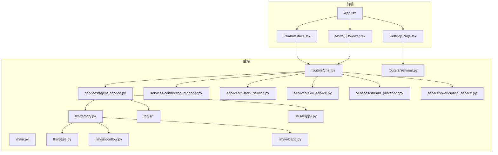
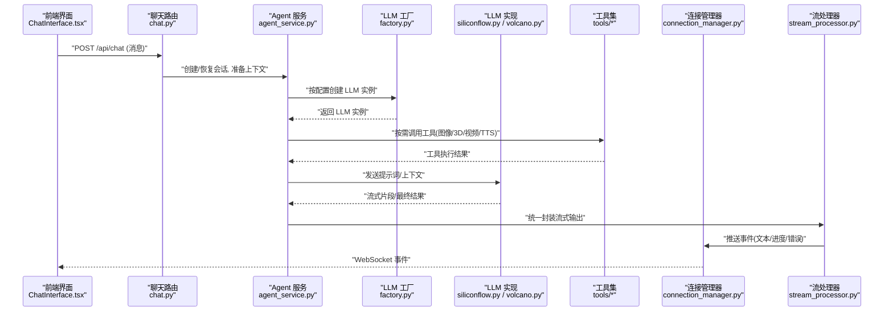
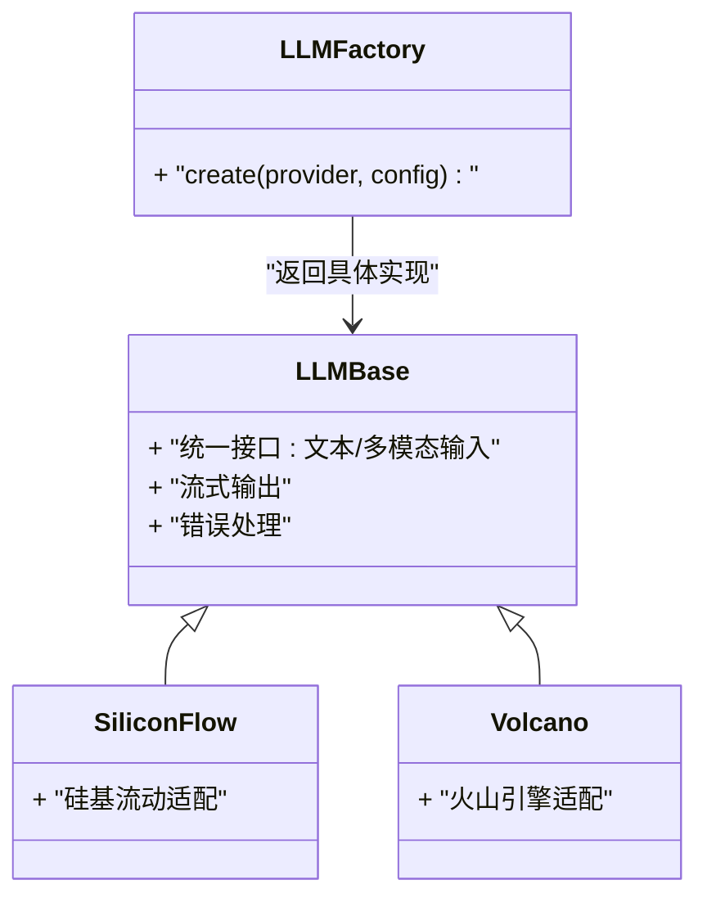
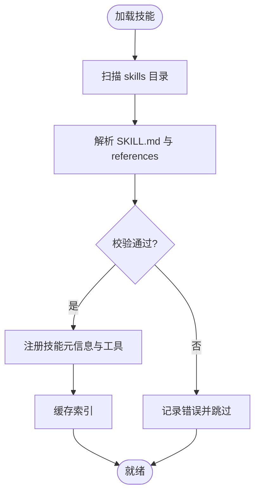
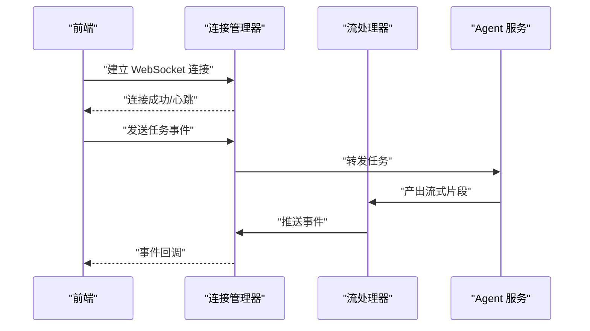
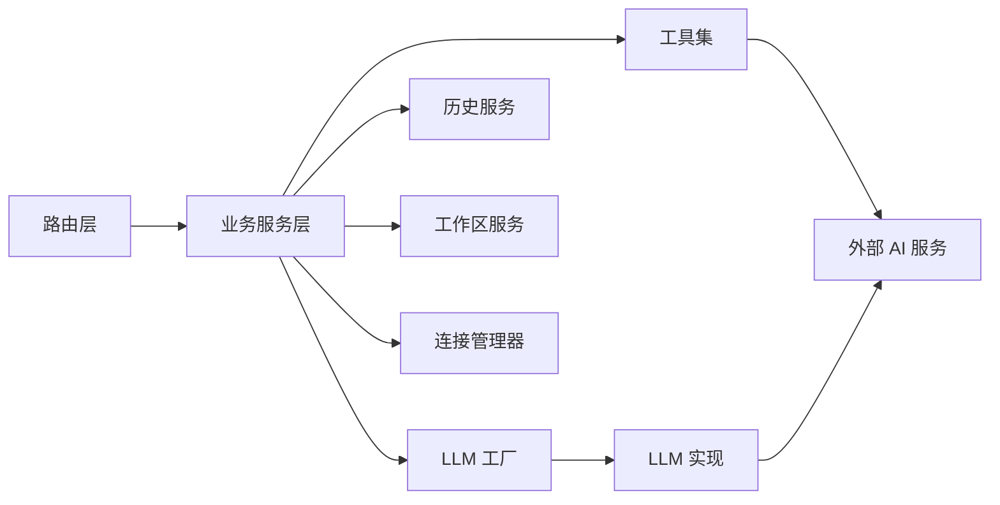
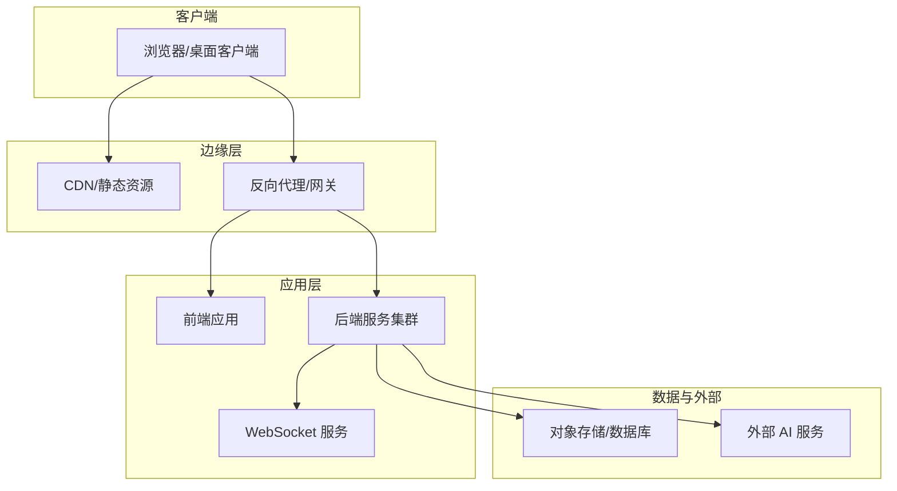

# 系统架构总览

<cite>
**本文引用的文件**   
- [backend/app/main.py](file://backend/app/main.py)
- [backend/app/routers/chat.py](file://backend/app/routers/chat.py)
- [backend/app/routers/settings.py](file://backend/app/routers/settings.py)
- [backend/app/services/agent_service.py](file://backend/app/services/agent_service.py)
- [backend/app/services/connection_manager.py](file://backend/app/services/connection_manager.py)
- [backend/app/services/history_service.py](file://backend/app/services/history_service.py)
- [backend/app/services/skill_service.py](file://backend/app/services/skill_service.py)
- [backend/app/services/stream_processor.py](file://backend/app/services/stream_processor.py)
- [backend/app/services/workspace_service.py](file://backend/app/services/workspace_service.py)
- [backend/app/llm/base.py](file://backend/app/llm/base.py)
- [backend/app/llm/factory.py](file://backend/app/llm/factory.py)
- [backend/app/llm/siliconflow.py](file://backend/app/llm/siliconflow.py)
- [backend/app/llm/volcano.py](file://backend/app/llm/volcano.py)
- [backend/app/tools/skill_tools.py](file://backend/app/tools/skill_tools.py)
- [backend/app/tools/image_generation.py](file://backend/app/tools/image_generation.py)
- [backend/app/tools/model_3d_generation.py](file://backend/app/tools/model_3d_generation.py)
- [backend/app/tools/video_concatenation.py](file://backend/app/tools/video_concatenation.py)
- [backend/app/tools/qwen_tts.py](file://backend/app/tools/qwen_tts.py)
- [backend/app/utils/logger.py](file://backend/app/utils/logger.py)
- [frontend/src/App.tsx](file://frontend/src/App.tsx)
- [frontend/src/components/ChatInterface.tsx](file://frontend/src/components/ChatInterface.tsx)
- [frontend/src/components/SettingsPage.tsx](file://frontend/src/components/SettingsPage.tsx)
- [frontend/src/components/Model3DViewer.tsx](file://frontend/src/components/Model3DViewer.tsx)
</cite>

## 目录
1. [简介](#简介)
2. [项目结构](#项目结构)
3. [核心组件](#核心组件)
4. [架构总览](#架构总览)
5. [详细组件分析](#详细组件分析)
6. [依赖关系分析](#依赖关系分析)
7. [性能与可扩展性](#性能与可扩展性)
8. [部署拓扑与通信协议](#部署拓扑与通信协议)
9. [故障排查指南](#故障排查指南)
10. [结论](#结论)

## 简介
本文件为 PolyStudio 的系统架构总览，面向开发者与运维人员，提供前后端分离的架构视图、关键数据流、设计模式应用（工厂模式、插件架构、事件驱动）、模块化组织原则以及部署拓扑与通信协议说明。目标是帮助读者快速建立对系统的整体理解，并指导后续扩展与维护。

## 项目结构
PolyStudio 采用前后端分离的组织方式：
- 前端（React + TypeScript）：负责用户界面、交互与实时通信（WebSocket），调用后端 REST/WebSocket API。
- 后端（Python FastAPI）：提供路由层、业务服务层、LLM 抽象与工厂、工具集、工作区与历史管理、流式处理与连接管理等。
- 技能系统（skills）：以“技能包”形式提供可插拔的工作流与参考模板，支持动态加载与组合。
- 工具集（tools）：封装图像生成、3D 模型生成、视频拼接、TTS 等能力，供业务服务编排调用。

图表来源
- [backend/app/main.py](file://backend/app/main.py)
- [backend/app/routers/chat.py](file://backend/app/routers/chat.py)
- [backend/app/routers/settings.py](file://backend/app/routers/settings.py)
- [backend/app/services/agent_service.py](file://backend/app/services/agent_service.py)
- [backend/app/services/connection_manager.py](file://backend/app/services/connection_manager.py)
- [backend/app/services/history_service.py](file://backend/app/services/history_service.py)
- [backend/app/services/skill_service.py](file://backend/app/services/skill_service.py)
- [backend/app/services/stream_processor.py](file://backend/app/services/stream_processor.py)
- [backend/app/services/workspace_service.py](file://backend/app/services/workspace_service.py)
- [backend/app/llm/base.py](file://backend/app/llm/base.py)
- [backend/app/llm/factory.py](file://backend/app/llm/factory.py)
- [backend/app/llm/siliconflow.py](file://backend/app/llm/siliconflow.py)
- [backend/app/llm/volcano.py](file://backend/app/llm/volcano.py)
- [backend/app/tools/skill_tools.py](file://backend/app/tools/skill_tools.py)
- [backend/app/tools/image_generation.py](file://backend/app/tools/image_generation.py)
- [backend/app/tools/model_3d_generation.py](file://backend/app/tools/model_3d_generation.py)
- [backend/app/tools/video_concatenation.py](file://backend/app/tools/video_concatenation.py)
- [backend/app/tools/qwen_tts.py](file://backend/app/tools/qwen_tts.py)
- [backend/app/utils/logger.py](file://backend/app/utils/logger.py)
- [frontend/src/App.tsx](file://frontend/src/App.tsx)
- [frontend/src/components/ChatInterface.tsx](file://frontend/src/components/ChatInterface.tsx)
- [frontend/src/components/SettingsPage.tsx](file://frontend/src/components/SettingsPage.tsx)
- [frontend/src/components/Model3DViewer.tsx](file://frontend/src/components/Model3DViewer.tsx)

章节来源
- [backend/app/main.py](file://backend/app/main.py)
- [frontend/src/App.tsx](file://frontend/src/App.tsx)

## 核心组件
- 路由层（REST/WebSocket）
  - 聊天路由：接收消息、启动会话、返回流式响应或 WebSocket 事件。
  - 设置路由：读写配置项（如 LLM 提供商选择、密钥等）。
- 业务服务层
  - Agent 服务：编排对话流程、调用 LLM 工厂、调度工具与工作区。
  - 连接管理器：维护 WebSocket 连接与会话状态。
  - 历史服务：持久化对话记录与上下文。
  - 技能服务：加载与管理技能包，解析工作流与参考文档。
  - 流处理器：统一处理 SSE/WS 流式输出与错误回传。
  - 工作区服务：管理用户工作区、资源与权限边界。
- LLM 抽象与工厂
  - 基类：定义统一的 LLM 接口（文本/多模态输入、流式输出、错误处理）。
  - 工厂：根据配置创建具体 LLM 实例（SiliconFlow、火山引擎等）。
  - 实现：各厂商适配层，屏蔽差异。
- 工具集
  - 技能工具：将技能工作流暴露为可调用的工具。
  - 媒体与生成工具：图像生成、3D 模型生成、视频拼接、语音合成等。
- 前端组件
  - 聊天界面：发送消息、展示流式结果、通过 WebSocket 接收事件。
  - 设置页：修改后端配置（如切换 LLM 提供商）。
  - 3D 查看器：渲染后端生成的 3D 资源。

章节来源
- [backend/app/routers/chat.py](file://backend/app/routers/chat.py)
- [backend/app/routers/settings.py](file://backend/app/routers/settings.py)
- [backend/app/services/agent_service.py](file://backend/app/services/agent_service.py)
- [backend/app/services/connection_manager.py](file://backend/app/services/connection_manager.py)
- [backend/app/services/history_service.py](file://backend/app/services/history_service.py)
- [backend/app/services/skill_service.py](file://backend/app/services/skill_service.py)
- [backend/app/services/stream_processor.py](file://backend/app/services/stream_processor.py)
- [backend/app/services/workspace_service.py](file://backend/app/services/workspace_service.py)
- [backend/app/llm/base.py](file://backend/app/llm/base.py)
- [backend/app/llm/factory.py](file://backend/app/llm/factory.py)
- [backend/app/llm/siliconflow.py](file://backend/app/llm/siliconflow.py)
- [backend/app/llm/volcano.py](file://backend/app/llm/volcano.py)
- [backend/app/tools/skill_tools.py](file://backend/app/tools/skill_tools.py)
- [backend/app/tools/image_generation.py](file://backend/app/tools/image_generation.py)
- [backend/app/tools/model_3d_generation.py](file://backend/app/tools/model_3d_generation.py)
- [backend/app/tools/video_concatenation.py](file://backend/app/tools/video_concatenation.py)
- [backend/app/tools/qwen_tts.py](file://backend/app/tools/qwen_tts.py)
- [frontend/src/components/ChatInterface.tsx](file://frontend/src/components/ChatInterface.tsx)
- [frontend/src/components/SettingsPage.tsx](file://frontend/src/components/SettingsPage.tsx)
- [frontend/src/components/Model3DViewer.tsx](file://frontend/src/components/Model3DViewer.tsx)

## 架构总览
下图展示了从前端到后端的完整调用链，包括 REST 请求、WebSocket 事件、LLM 工厂与外部 AI 服务的交互。

图表来源
- [backend/app/routers/chat.py](file://backend/app/routers/chat.py)
- [backend/app/services/agent_service.py](file://backend/app/services/agent_service.py)
- [backend/app/llm/factory.py](file://backend/app/llm/factory.py)
- [backend/app/llm/siliconflow.py](file://backend/app/llm/siliconflow.py)
- [backend/app/llm/volcano.py](file://backend/app/llm/volcano.py)
- [backend/app/tools/skill_tools.py](file://backend/app/tools/skill_tools.py)
- [backend/app/tools/image_generation.py](file://backend/app/tools/image_generation.py)
- [backend/app/tools/model_3d_generation.py](file://backend/app/tools/model_3d_generation.py)
- [backend/app/tools/video_concatenation.py](file://backend/app/tools/video_concatenation.py)
- [backend/app/tools/qwen_tts.py](file://backend/app/tools/qwen_tts.py)
- [backend/app/services/connection_manager.py](file://backend/app/services/connection_manager.py)
- [backend/app/services/stream_processor.py](file://backend/app/services/stream_processor.py)
- [frontend/src/components/ChatInterface.tsx](file://frontend/src/components/ChatInterface.tsx)

## 详细组件分析

### LLM 抽象与工厂（工厂模式）
- 设计要点
  - 基类定义统一接口，屏蔽不同厂商的差异。
  - 工厂依据运行时配置创建具体实现，便于新增提供商。
  - 各实现类仅关注自身协议与鉴权细节。
- 适用场景
  - 多 LLM 提供商切换、灰度发布、A/B 测试。
  - 统一错误码与重试策略。

图表来源
- [backend/app/llm/base.py](file://backend/app/llm/base.py)
- [backend/app/llm/factory.py](file://backend/app/llm/factory.py)
- [backend/app/llm/siliconflow.py](file://backend/app/llm/siliconflow.py)
- [backend/app/llm/volcano.py](file://backend/app/llm/volcano.py)

章节来源
- [backend/app/llm/base.py](file://backend/app/llm/base.py)
- [backend/app/llm/factory.py](file://backend/app/llm/factory.py)
- [backend/app/llm/siliconflow.py](file://backend/app/llm/siliconflow.py)
- [backend/app/llm/volcano.py](file://backend/app/llm/volcano.py)

### 插件架构（技能系统）
- 设计要点
  - 技能包以目录结构组织，包含 SKILL.md、references、scripts 等。
  - 技能服务负责扫描、加载、校验与缓存技能元信息。
  - 工具层将技能工作流暴露为可被 Agent 调用的工具。
- 扩展方式
  - 新增技能目录与描述文件，无需改动核心代码。
  - 通过脚本进行初始化、打包与验证。

图表来源
- [backend/app/services/skill_service.py](file://backend/app/services/skill_service.py)
- [backend/app/tools/skill_tools.py](file://backend/app/tools/skill_tools.py)

章节来源
- [backend/app/services/skill_service.py](file://backend/app/services/skill_service.py)
- [backend/app/tools/skill_tools.py](file://backend/app/tools/skill_tools.py)

### 事件驱动（WebSocket 通信）
- 设计要点
  - 连接管理器维护客户端连接与会话映射。
  - 流处理器将 LLM 与工具的中间结果转换为统一事件格式。
  - 前端订阅事件，实时更新 UI。
- 典型事件类型
  - 文本增量、进度、完成、错误、资源链接等。

图表来源
- [backend/app/services/connection_manager.py](file://backend/app/services/connection_manager.py)
- [backend/app/services/stream_processor.py](file://backend/app/services/stream_processor.py)
- [backend/app/services/agent_service.py](file://backend/app/services/agent_service.py)
- [frontend/src/components/ChatInterface.tsx](file://frontend/src/components/ChatInterface.tsx)

章节来源
- [backend/app/services/connection_manager.py](file://backend/app/services/connection_manager.py)
- [backend/app/services/stream_processor.py](file://backend/app/services/stream_processor.py)
- [backend/app/services/agent_service.py](file://backend/app/services/agent_service.py)
- [frontend/src/components/ChatInterface.tsx](file://frontend/src/components/ChatInterface.tsx)

### 工具集与外部 AI 服务
- 职责划分
  - 图像生成：对接外部图像生成服务。
  - 3D 模型生成：生成与导出 3D 资源。
  - 视频拼接：合并素材与转码。
  - TTS：文本转语音。
  - 技能工具：将技能工作流作为工具暴露。
- 集成点
  - 由 Agent 服务在需要时按需调用，结果回写至工作区或返回给前端。

章节来源
- [backend/app/tools/image_generation.py](file://backend/app/tools/image_generation.py)
- [backend/app/tools/model_3d_generation.py](file://backend/app/tools/model_3d_generation.py)
- [backend/app/tools/video_concatenation.py](file://backend/app/tools/video_concatenation.py)
- [backend/app/tools/qwen_tts.py](file://backend/app/tools/qwen_tts.py)
- [backend/app/tools/skill_tools.py](file://backend/app/tools/skill_tools.py)

### 路由与服务编排
- 聊天路由
  - 接收前端消息，校验参数，创建/恢复会话，触发 Agent 编排。
  - 返回流式响应或通过 WebSocket 推送事件。
- 设置路由
  - 读取/更新系统配置（如 LLM 提供商、密钥、超时等）。
- 历史与工作区
  - 历史服务：持久化对话与上下文。
  - 工作区服务：隔离用户资源与权限。

章节来源
- [backend/app/routers/chat.py](file://backend/app/routers/chat.py)
- [backend/app/routers/settings.py](file://backend/app/routers/settings.py)
- [backend/app/services/history_service.py](file://backend/app/services/history_service.py)
- [backend/app/services/workspace_service.py](file://backend/app/services/workspace_service.py)

## 依赖关系分析
- 模块耦合
  - 路由层低耦合于服务层，通过函数/类注入减少硬依赖。
  - Agent 服务集中编排，依赖 LLM 工厂、工具集、工作区与历史服务。
  - LLM 工厂与实现解耦，新增提供商不影响上层。
- 外部依赖
  - 外部 AI 服务（图像/视频/3D/TTS/LLM）通过工具层与 LLM 实现接入。
- 潜在风险
  - 避免循环依赖：确保工具与服务之间单向依赖。
  - 配置中心：集中管理密钥与超时，降低分散配置带来的不一致。

图表来源
- [backend/app/routers/chat.py](file://backend/app/routers/chat.py)
- [backend/app/services/agent_service.py](file://backend/app/services/agent_service.py)
- [backend/app/llm/factory.py](file://backend/app/llm/factory.py)
- [backend/app/llm/siliconflow.py](file://backend/app/llm/siliconflow.py)
- [backend/app/llm/volcano.py](file://backend/app/llm/volcano.py)
- [backend/app/tools/skill_tools.py](file://backend/app/tools/skill_tools.py)
- [backend/app/services/history_service.py](file://backend/app/services/history_service.py)
- [backend/app/services/workspace_service.py](file://backend/app/services/workspace_service.py)
- [backend/app/services/connection_manager.py](file://backend/app/services/connection_manager.py)

章节来源
- [backend/app/routers/chat.py](file://backend/app/routers/chat.py)
- [backend/app/services/agent_service.py](file://backend/app/services/agent_service.py)
- [backend/app/llm/factory.py](file://backend/app/llm/factory.py)
- [backend/app/llm/siliconflow.py](file://backend/app/llm/siliconflow.py)
- [backend/app/llm/volcano.py](file://backend/app/llm/volcano.py)
- [backend/app/tools/skill_tools.py](file://backend/app/tools/skill_tools.py)
- [backend/app/services/history_service.py](file://backend/app/services/history_service.py)
- [backend/app/services/workspace_service.py](file://backend/app/services/workspace_service.py)
- [backend/app/services/connection_manager.py](file://backend/app/services/connection_manager.py)

## 性能与可扩展性
- 流式处理
  - 使用流处理器统一封装 LLM 与工具的中间结果，降低前端渲染压力。
- 并发与异步
  - 建议在高并发场景下对 I/O 密集操作（网络请求、文件读写）采用异步处理。
- 缓存与幂等
  - 对重复请求与静态资源引入缓存；对长任务提供幂等键以避免重复执行。
- 水平扩展
  - 无状态服务节点配合负载均衡；WebSocket 会话可通过共享存储（如 Redis）跨节点同步。
- 可观测性
  - 统一日志与指标上报，便于定位瓶颈与异常。

[本节为通用指导，不直接分析具体文件]

## 部署拓扑与通信协议
- 部署拓扑
  - 前端静态资源由 Web 服务器或 CDN 托管。
  - 后端服务部署为多个无状态实例，前置反向代理/网关进行路由与限流。
  - 外部 AI 服务通过公网或内网访问，建议使用专用网络与密钥管理。
- 通信协议
  - REST：用于设置、查询与一次性任务。
  - WebSocket：用于实时对话与流式事件推送。
  - 可选 SSE：若仅需服务端推送，可使用 Server-Sent Events。

图表来源
- [backend/app/main.py](file://backend/app/main.py)
- [backend/app/routers/chat.py](file://backend/app/routers/chat.py)
- [backend/app/routers/settings.py](file://backend/app/routers/settings.py)
- [backend/app/services/connection_manager.py](file://backend/app/services/connection_manager.py)
- [frontend/src/App.tsx](file://frontend/src/App.tsx)

## 故障排查指南
- 常见问题
  - LLM 调用失败：检查工厂配置、密钥与网络连通性。
  - WebSocket 断连：确认心跳机制、代理超时与跨域设置。
  - 工具执行异常：查看工具日志与外部服务返回码。
- 诊断手段
  - 启用结构化日志与链路追踪。
  - 增加重试与熔断策略，避免雪崩。
  - 对关键路径添加健康检查与告警。

章节来源
- [backend/app/utils/logger.py](file://backend/app/utils/logger.py)

## 结论
PolyStudio 采用清晰的前后端分离与分层架构，结合工厂模式、插件架构与事件驱动，实现了高内聚、低耦合与良好的可扩展性。通过统一的流式处理与连接管理，系统在实时性与用户体验方面具备优势。建议在后续迭代中持续完善可观测性、弹性伸缩与安全治理，以支撑更大规模的生产环境。