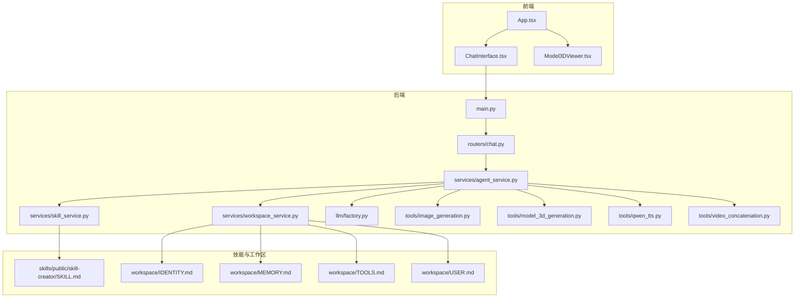
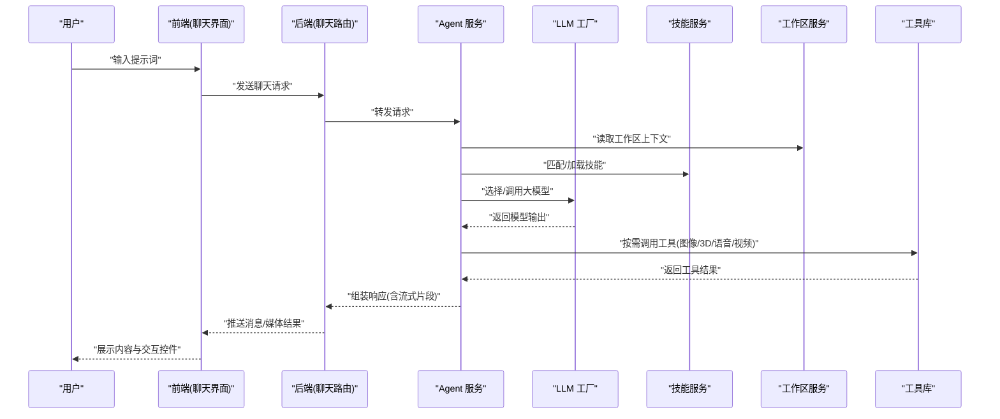
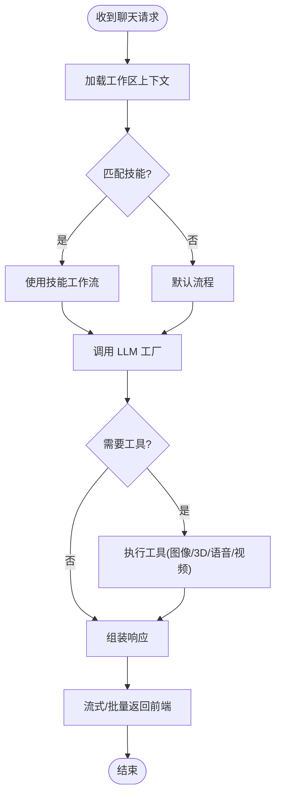
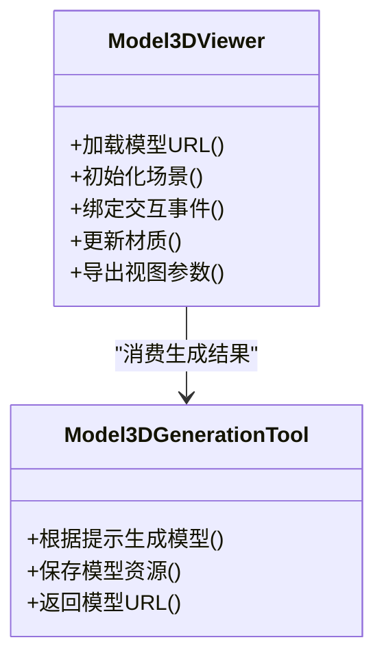
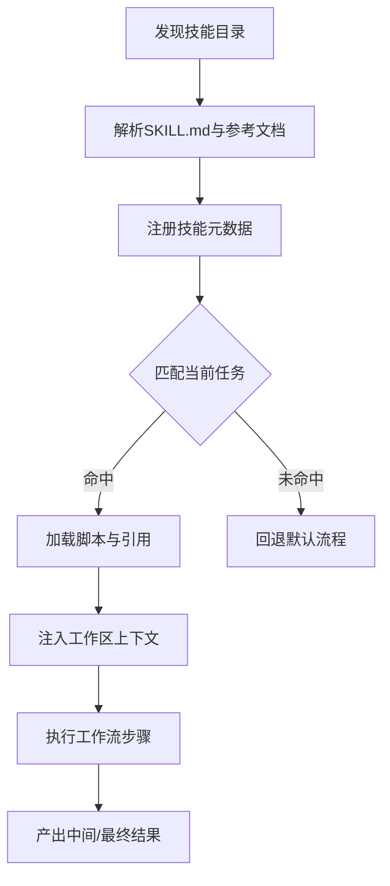
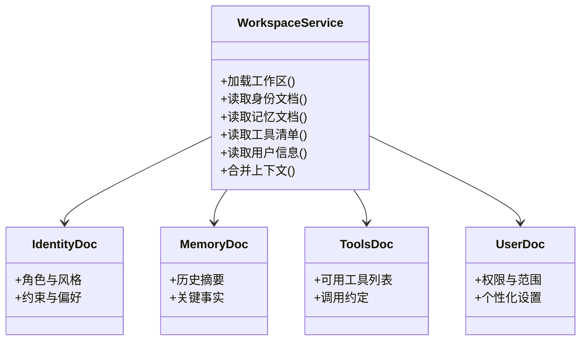
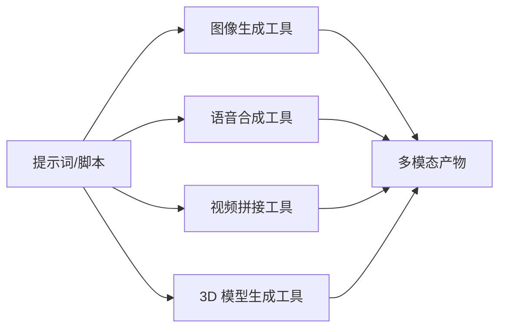
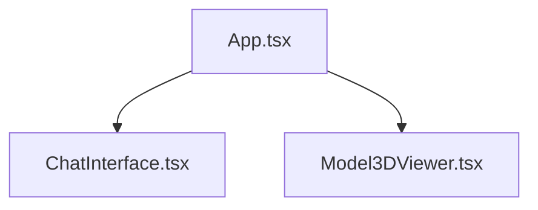
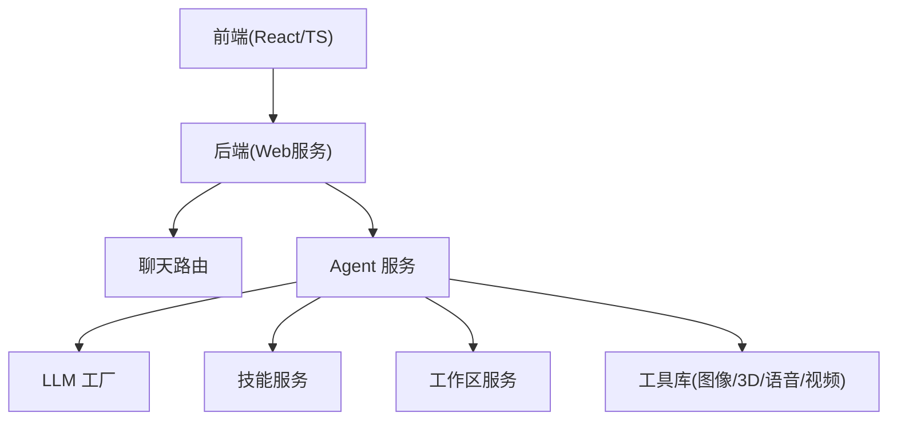

# 项目介绍

<cite>
**本文引用的文件**   
- [backend/app/main.py](file://backend/app/main.py)
- [backend/app/routers/chat.py](file://backend/app/routers/chat.py)
- [backend/app/services/agent_service.py](file://backend/app/services/agent_service.py)
- [backend/app/services/skill_service.py](file://backend/app/services/skill_service.py)
- [backend/app/services/workspace_service.py](file://backend/app/services/workspace_service.py)
- [backend/app/tools/image_generation.py](file://backend/app/tools/image_generation.py)
- [backend/app/tools/model_3d_generation.py](file://backend/app/tools/model_3d_generation.py)
- [backend/app/tools/qwen_tts.py](file://backend/app/tools/qwen_tts.py)
- [backend/app/tools/video_concatenation.py](file://backend/app/tools/video_concatenation.py)
- [backend/app/llm/factory.py](file://backend/app/llm/factory.py)
- [frontend/src/components/ChatInterface.tsx](file://frontend/src/components/ChatInterface.tsx)
- [frontend/src/components/Model3DViewer.tsx](file://frontend/src/components/Model3DViewer.tsx)
- [frontend/src/App.tsx](file://frontend/src/App.tsx)
- [backend/skills/public/skill-creator/SKILL.md](file://backend/skills/public/skill-creator/SKILL.md)
- [backend/workspace/IDENTITY.md](file://backend/workspace/IDENTITY.md)
- [backend/workspace/MEMORY.md](file://backend/workspace/MEMORY.md)
- [backend/workspace/TOOLS.md](file://backend/workspace/TOOLS.md)
- [backend/workspace/USER.md](file://backend/workspace/USER.md)
</cite>

## 目录
1. [简介](#简介)
2. [项目结构](#项目结构)
3. [核心组件](#核心组件)
4. [架构总览](#架构总览)
5. [详细组件分析](#详细组件分析)
6. [依赖分析](#依赖分析)
7. [性能考虑](#性能考虑)
8. [故障排查指南](#故障排查指南)
9. [结论](#结论)
10. [附录](#附录)

## 简介
PolyStudio 是一个面向多模态 AI 创作的一体化平台，旨在通过“对话即创作”的方式，帮助用户快速生成图像、视频、语音与 3D 模型等内容。平台以实时聊天界面为入口，结合可插拔的“技能系统”和“工作区管理”，让创作者在统一环境中完成从构思到产出的全流程。其核心价值主张包括：
- 多模态一体化：文本、图像、音频、视频与 3D 模型在同一工作流中无缝协作
- 对话驱动创作：用自然语言描述需求，AI 自动编排工具与技能完成任务
- 可插拔扩展：通过“技能”机制灵活接入新能力与新工作流
- 工作区隔离：每个项目拥有独立上下文、记忆与工具集，便于团队协作与版本化

目标用户群体涵盖内容创作者、营销团队、教育者、开发者以及希望借助 AI 提升效率的个人用户。

## 项目结构
仓库采用前后端分离的组织方式：
- 后端（Python）：提供 LLM 适配层、路由服务、业务服务、工具库与技能系统
- 前端（React + TypeScript）：提供聊天界面、3D 模型查看器与设置页等
- 技能与知识库：以 Markdown 与脚本形式定义技能模板与工作流参考
- 工作区配置：以文档形式维护身份、记忆、工具与用户信息

图表来源
- [backend/app/main.py](file://backend/app/main.py)
- [backend/app/routers/chat.py](file://backend/app/routers/chat.py)
- [backend/app/services/agent_service.py](file://backend/app/services/agent_service.py)
- [backend/app/services/skill_service.py](file://backend/app/services/skill_service.py)
- [backend/app/services/workspace_service.py](file://backend/app/services/workspace_service.py)
- [backend/app/llm/factory.py](file://backend/app/llm/factory.py)
- [backend/app/tools/image_generation.py](file://backend/app/tools/image_generation.py)
- [backend/app/tools/model_3d_generation.py](file://backend/app/tools/model_3d_generation.py)
- [backend/app/tools/qwen_tts.py](file://backend/app/tools/qwen_tts.py)
- [backend/app/tools/video_concatenation.py](file://backend/app/tools/video_concatenation.py)
- [backend/skills/public/skill-creator/SKILL.md](file://backend/skills/public/skill-creator/SKILL.md)
- [backend/workspace/IDENTITY.md](file://backend/workspace/IDENTITY.md)
- [backend/workspace/MEMORY.md](file://backend/workspace/MEMORY.md)
- [backend/workspace/TOOLS.md](file://backend/workspace/TOOLS.md)
- [backend/workspace/USER.md](file://backend/workspace/USER.md)
- [frontend/src/App.tsx](file://frontend/src/App.tsx)
- [frontend/src/components/ChatInterface.tsx](file://frontend/src/components/ChatInterface.tsx)
- [frontend/src/components/Model3DViewer.tsx](file://frontend/src/components/Model3DViewer.tsx)

章节来源
- [backend/app/main.py](file://backend/app/main.py)
- [backend/app/routers/chat.py](file://backend/app/routers/chat.py)
- [backend/app/services/agent_service.py](file://backend/app/services/agent_service.py)
- [backend/app/services/skill_service.py](file://backend/app/services/skill_service.py)
- [backend/app/services/workspace_service.py](file://backend/app/services/workspace_service.py)
- [backend/app/llm/factory.py](file://backend/app/llm/factory.py)
- [backend/app/tools/image_generation.py](file://backend/app/tools/image_generation.py)
- [backend/app/tools/model_3d_generation.py](file://backend/app/tools/model_3d_generation.py)
- [backend/app/tools/qwen_tts.py](file://backend/app/tools/qwen_tts.py)
- [backend/app/tools/video_concatenation.py](file://backend/app/tools/video_concatenation.py)
- [backend/skills/public/skill-creator/SKILL.md](file://backend/skills/public/skill-creator/SKILL.md)
- [backend/workspace/IDENTITY.md](file://backend/workspace/IDENTITY.md)
- [backend/workspace/MEMORY.md](file://backend/workspace/MEMORY.md)
- [backend/workspace/TOOLS.md](file://backend/workspace/TOOLS.md)
- [backend/workspace/USER.md](file://backend/workspace/USER.md)
- [frontend/src/App.tsx](file://frontend/src/App.tsx)
- [frontend/src/components/ChatInterface.tsx](file://frontend/src/components/ChatInterface.tsx)
- [frontend/src/components/Model3DViewer.tsx](file://frontend/src/components/Model3DViewer.tsx)

## 核心组件
- 聊天接口（前端）：提供实时对话体验，支持消息流式渲染与多媒体结果展示
- 3D 模型查看器（前端）：用于预览与交互 3D 模型资源
- 应用入口（前端）：组合页面与路由，承载聊天与 3D 查看器等模块
- 后端主服务：启动 Web 服务并挂载路由
- 聊天路由：处理聊天请求、鉴权与会话状态
- Agent 服务：编排 LLM 调用、工具执行与技能调度
- 技能服务：加载与管理技能，解析工作流与参考文档
- 工作区服务：维护项目级身份、记忆、工具与用户信息
- LLM 工厂：抽象不同大模型提供商的统一调用接口
- 工具库：封装图像生成、3D 模型生成、语音合成、视频拼接等能力
- 技能模板与工作区文档：以 Markdown 与脚本定义技能规范与项目上下文

章节来源
- [frontend/src/components/ChatInterface.tsx](file://frontend/src/components/ChatInterface.tsx)
- [frontend/src/components/Model3DViewer.tsx](file://frontend/src/components/Model3DViewer.tsx)
- [frontend/src/App.tsx](file://frontend/src/App.tsx)
- [backend/app/main.py](file://backend/app/main.py)
- [backend/app/routers/chat.py](file://backend/app/routers/chat.py)
- [backend/app/services/agent_service.py](file://backend/app/services/agent_service.py)
- [backend/app/services/skill_service.py](file://backend/app/services/skill_service.py)
- [backend/app/services/workspace_service.py](file://backend/app/services/workspace_service.py)
- [backend/app/llm/factory.py](file://backend/app/llm/factory.py)
- [backend/app/tools/image_generation.py](file://backend/app/tools/image_generation.py)
- [backend/app/tools/model_3d_generation.py](file://backend/app/tools/model_3d_generation.py)
- [backend/app/tools/qwen_tts.py](file://backend/app/tools/qwen_tts.py)
- [backend/app/tools/video_concatenation.py](file://backend/app/tools/video_concatenation.py)
- [backend/skills/public/skill-creator/SKILL.md](file://backend/skills/public/skill-creator/SKILL.md)
- [backend/workspace/IDENTITY.md](file://backend/workspace/IDENTITY.md)
- [backend/workspace/MEMORY.md](file://backend/workspace/MEMORY.md)
- [backend/workspace/TOOLS.md](file://backend/workspace/TOOLS.md)
- [backend/workspace/USER.md](file://backend/workspace/USER.md)

## 架构总览
平台采用“前端轻量 UI + 后端编排引擎”的架构。前端聚焦于交互与可视化；后端通过 Agent 服务将自然语言意图转化为结构化任务，再根据技能与工作区上下文选择合适的大模型与工具进行执行，最终将结果回传给前端进行展示。

图表来源
- [backend/app/routers/chat.py](file://backend/app/routers/chat.py)
- [backend/app/services/agent_service.py](file://backend/app/services/agent_service.py)
- [backend/app/services/skill_service.py](file://backend/app/services/skill_service.py)
- [backend/app/services/workspace_service.py](file://backend/app/services/workspace_service.py)
- [backend/app/llm/factory.py](file://backend/app/llm/factory.py)
- [backend/app/tools/image_generation.py](file://backend/app/tools/image_generation.py)
- [backend/app/tools/model_3d_generation.py](file://backend/app/tools/model_3d_generation.py)
- [backend/app/tools/qwen_tts.py](file://backend/app/tools/qwen_tts.py)
- [backend/app/tools/video_concatenation.py](file://backend/app/tools/video_concatenation.py)
- [frontend/src/components/ChatInterface.tsx](file://frontend/src/components/ChatInterface.tsx)

## 详细组件分析

### 聊天与实时流式交互
- 前端聊天界面负责消息渲染、流式更新与多媒体嵌入
- 后端聊天路由接收请求，交由 Agent 服务编排
- Agent 服务基于工作区上下文与技能匹配，调用 LLM 工厂与工具库，并将结果以流式或批量方式返回
- 前端根据返回类型动态渲染文本、图片、音频、视频与 3D 模型

图表来源
- [backend/app/routers/chat.py](file://backend/app/routers/chat.py)
- [backend/app/services/agent_service.py](file://backend/app/services/agent_service.py)
- [backend/app/services/skill_service.py](file://backend/app/services/skill_service.py)
- [backend/app/services/workspace_service.py](file://backend/app/services/workspace_service.py)
- [backend/app/llm/factory.py](file://backend/app/llm/factory.py)
- [backend/app/tools/image_generation.py](file://backend/app/tools/image_generation.py)
- [backend/app/tools/model_3d_generation.py](file://backend/app/tools/model_3d_generation.py)
- [backend/app/tools/qwen_tts.py](file://backend/app/tools/qwen_tts.py)
- [backend/app/tools/video_concatenation.py](file://backend/app/tools/video_concatenation.py)
- [frontend/src/components/ChatInterface.tsx](file://frontend/src/components/ChatInterface.tsx)

章节来源
- [backend/app/routers/chat.py](file://backend/app/routers/chat.py)
- [backend/app/services/agent_service.py](file://backend/app/services/agent_service.py)
- [backend/app/services/skill_service.py](file://backend/app/services/skill_service.py)
- [backend/app/services/workspace_service.py](file://backend/app/services/workspace_service.py)
- [backend/app/llm/factory.py](file://backend/app/llm/factory.py)
- [backend/app/tools/image_generation.py](file://backend/app/tools/image_generation.py)
- [backend/app/tools/model_3d_generation.py](file://backend/app/tools/model_3d_generation.py)
- [backend/app/tools/qwen_tts.py](file://backend/app/tools/qwen_tts.py)
- [backend/app/tools/video_concatenation.py](file://backend/app/tools/video_concatenation.py)
- [frontend/src/components/ChatInterface.tsx](file://frontend/src/components/ChatInterface.tsx)

### 3D 模型查看器
- 前端 3D 查看器组件负责加载与渲染 3D 模型资源，支持旋转、缩放与基础交互
- 后端 3D 模型生成工具可根据提示词或工作区上下文生成模型数据，供前端直接消费
- 该组件可与聊天界面联动，实现“对话生成—即时预览”的创作闭环

图表来源
- [frontend/src/components/Model3DViewer.tsx](file://frontend/src/components/Model3DViewer.tsx)
- [backend/app/tools/model_3d_generation.py](file://backend/app/tools/model_3d_generation.py)

章节来源
- [frontend/src/components/Model3DViewer.tsx](file://frontend/src/components/Model3DViewer.tsx)
- [backend/app/tools/model_3d_generation.py](file://backend/app/tools/model_3d_generation.py)

### 可插拔技能系统
- 技能以 Markdown 与脚本形式定义，包含工作流、输出模式与参考文档
- 技能服务负责扫描、加载与解析技能元数据，并在 Agent 编排时按规则匹配
- 公共技能模板提供“技能创建器”，降低自定义技能门槛

图表来源
- [backend/skills/public/skill-creator/SKILL.md](file://backend/skills/public/skill-creator/SKILL.md)
- [backend/app/services/skill_service.py](file://backend/app/services/skill_service.py)
- [backend/app/services/agent_service.py](file://backend/app/services/agent_service.py)

章节来源
- [backend/skills/public/skill-creator/SKILL.md](file://backend/skills/public/skill-creator/SKILL.md)
- [backend/app/services/skill_service.py](file://backend/app/services/skill_service.py)
- [backend/app/services/agent_service.py](file://backend/app/services/agent_service.py)

### 工作区管理系统
- 工作区以一组 Markdown 文档定义项目身份、记忆、工具与用户信息
- 工作区服务负责加载、合并与缓存这些上下文，确保每次任务具备一致的项目视角
- 该设计使同一平台能同时支撑多个独立项目，避免上下文污染

图表来源
- [backend/workspace/IDENTITY.md](file://backend/workspace/IDENTITY.md)
- [backend/workspace/MEMORY.md](file://backend/workspace/MEMORY.md)
- [backend/workspace/TOOLS.md](file://backend/workspace/TOOLS.md)
- [backend/workspace/USER.md](file://backend/workspace/USER.md)
- [backend/app/services/workspace_service.py](file://backend/app/services/workspace_service.py)

章节来源
- [backend/workspace/IDENTITY.md](file://backend/workspace/IDENTITY.md)
- [backend/workspace/MEMORY.md](file://backend/workspace/MEMORY.md)
- [backend/workspace/TOOLS.md](file://backend/workspace/TOOLS.md)
- [backend/workspace/USER.md](file://backend/workspace/USER.md)
- [backend/app/services/workspace_service.py](file://backend/app/services/workspace_service.py)

### 多模态工具链
- 图像生成：根据提示词或工作区风格生成高质量图像
- 3D 模型生成：从文本或草图生成可交互 3D 资产
- 语音合成：将文本转换为自然语音，支持音色与语速控制
- 视频拼接：将多段素材按时间线或脚本顺序合成为成品视频

图表来源
- [backend/app/tools/image_generation.py](file://backend/app/tools/image_generation.py)
- [backend/app/tools/qwen_tts.py](file://backend/app/tools/qwen_tts.py)
- [backend/app/tools/video_concatenation.py](file://backend/app/tools/video_concatenation.py)
- [backend/app/tools/model_3d_generation.py](file://backend/app/tools/model_3d_generation.py)

章节来源
- [backend/app/tools/image_generation.py](file://backend/app/tools/image_generation.py)
- [backend/app/tools/qwen_tts.py](file://backend/app/tools/qwen_tts.py)
- [backend/app/tools/video_concatenation.py](file://backend/app/tools/video_concatenation.py)
- [backend/app/tools/model_3d_generation.py](file://backend/app/tools/model_3d_generation.py)

### 前端应用与页面组织
- App 作为根组件，组合聊天界面与 3D 查看器等子模块
- 聊天界面负责消息渲染、流式更新与多媒体展示
- 3D 查看器负责模型加载与交互

图表来源
- [frontend/src/App.tsx](file://frontend/src/App.tsx)
- [frontend/src/components/ChatInterface.tsx](file://frontend/src/components/ChatInterface.tsx)
- [frontend/src/components/Model3DViewer.tsx](file://frontend/src/components/Model3DViewer.tsx)

章节来源
- [frontend/src/App.tsx](file://frontend/src/App.tsx)
- [frontend/src/components/ChatInterface.tsx](file://frontend/src/components/ChatInterface.tsx)
- [frontend/src/components/Model3DViewer.tsx](file://frontend/src/components/Model3DViewer.tsx)

## 依赖分析
- 前端依赖 React 生态，主要关注 UI 与交互逻辑
- 后端依赖 Python Web 框架与大模型 SDK，通过工厂模式解耦不同 LLM 提供商
- 工具与服务之间通过清晰的服务边界与接口契约协作，降低耦合度
- 技能与工作区文档作为“配置即代码”的一部分，便于版本管理与共享

图表来源
- [backend/app/main.py](file://backend/app/main.py)
- [backend/app/routers/chat.py](file://backend/app/routers/chat.py)
- [backend/app/services/agent_service.py](file://backend/app/services/agent_service.py)
- [backend/app/llm/factory.py](file://backend/app/llm/factory.py)
- [backend/app/services/skill_service.py](file://backend/app/services/skill_service.py)
- [backend/app/services/workspace_service.py](file://backend/app/services/workspace_service.py)
- [backend/app/tools/image_generation.py](file://backend/app/tools/image_generation.py)
- [backend/app/tools/model_3d_generation.py](file://backend/app/tools/model_3d_generation.py)
- [backend/app/tools/qwen_tts.py](file://backend/app/tools/qwen_tts.py)
- [backend/app/tools/video_concatenation.py](file://backend/app/tools/video_concatenation.py)

章节来源
- [backend/app/main.py](file://backend/app/main.py)
- [backend/app/routers/chat.py](file://backend/app/routers/chat.py)
- [backend/app/services/agent_service.py](file://backend/app/services/agent_service.py)
- [backend/app/llm/factory.py](file://backend/app/llm/factory.py)
- [backend/app/services/skill_service.py](file://backend/app/services/skill_service.py)
- [backend/app/services/workspace_service.py](file://backend/app/services/workspace_service.py)
- [backend/app/tools/image_generation.py](file://backend/app/tools/image_generation.py)
- [backend/app/tools/model_3d_generation.py](file://backend/app/tools/model_3d_generation.py)
- [backend/app/tools/qwen_tts.py](file://backend/app/tools/qwen_tts.py)
- [backend/app/tools/video_concatenation.py](file://backend/app/tools/video_concatenation.py)

## 性能考虑
- 流式传输：对长耗时任务采用流式返回，提升首帧与首字体验
- 并行编排：在安全范围内并发调用多个工具，缩短端到端延迟
- 缓存策略：对重复提示与静态资源进行缓存，减少重复计算与网络开销
- 资源限制：对大模型与外部工具调用设置超时与重试上限，保障稳定性
- 前端优化：懒加载 3D 模型与媒体资源，按需渲染，降低内存占用

[本节为通用指导，不直接分析具体文件]

## 故障排查指南
- 聊天无响应：检查路由是否正常挂载、Agent 是否成功加载工作区与技能、LLM 工厂是否配置正确
- 工具调用失败：确认工具参数与工作区工具清单一致，检查外部服务可用性
- 3D 模型无法显示：验证模型 URL 可达性与格式兼容性，检查前端查看器初始化流程
- 技能未生效：核对技能目录结构与 SKILL.md 语法，确认技能服务已正确解析与注册

章节来源
- [backend/app/routers/chat.py](file://backend/app/routers/chat.py)
- [backend/app/services/agent_service.py](file://backend/app/services/agent_service.py)
- [backend/app/services/skill_service.py](file://backend/app/services/skill_service.py)
- [backend/app/services/workspace_service.py](file://backend/app/services/workspace_service.py)
- [backend/app/llm/factory.py](file://backend/app/llm/factory.py)
- [backend/app/tools/model_3d_generation.py](file://backend/app/tools/model_3d_generation.py)
- [frontend/src/components/Model3DViewer.tsx](file://frontend/src/components/Model3DViewer.tsx)

## 结论
PolyStudio 以“对话即创作”为核心，将多模态能力、可插拔技能与工作区上下文整合在一个统一平台中。它既适合初学者快速上手，也能为专业团队提供强大的扩展与协作能力。通过清晰的架构设计与模块化组件，平台具备良好的可维护性与演进空间。

[本节为总结性内容，不直接分析具体文件]

## 附录
- 技术愿景：持续扩展多模态工具与技能生态，构建开放的内容创作操作系统
- 发展路线图：
  - 短期：完善流式体验与错误恢复，增强 3D 查看器交互能力
  - 中期：引入更多 LLM 提供商与工具集成，优化技能匹配与编排策略
  - 长期：构建社区技能市场与协作工作区，支持多人协同与版本化管理

[本节为概念性内容，不直接分析具体文件]