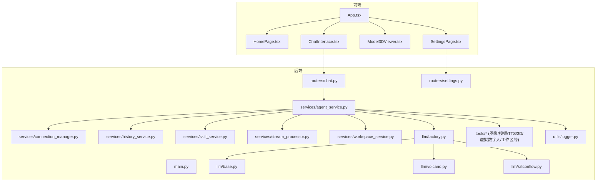
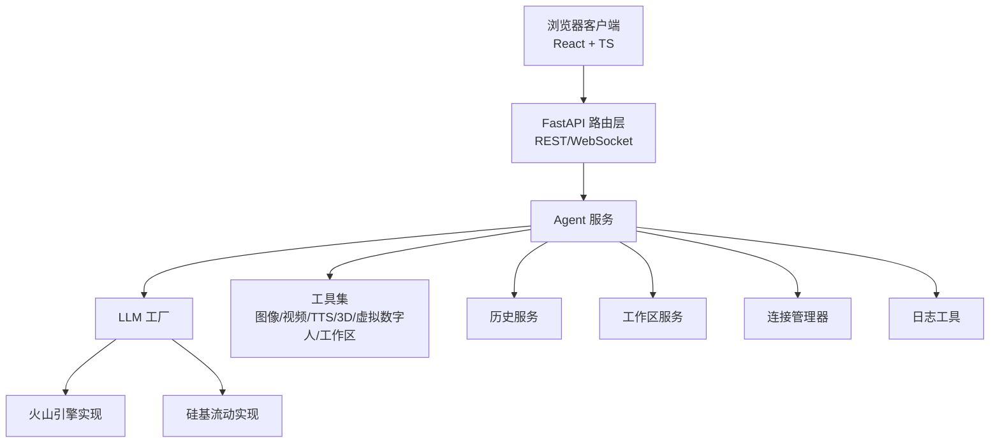
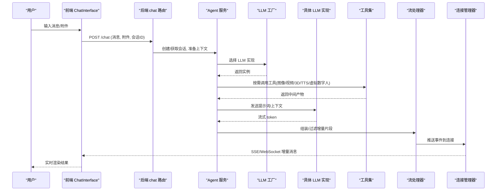
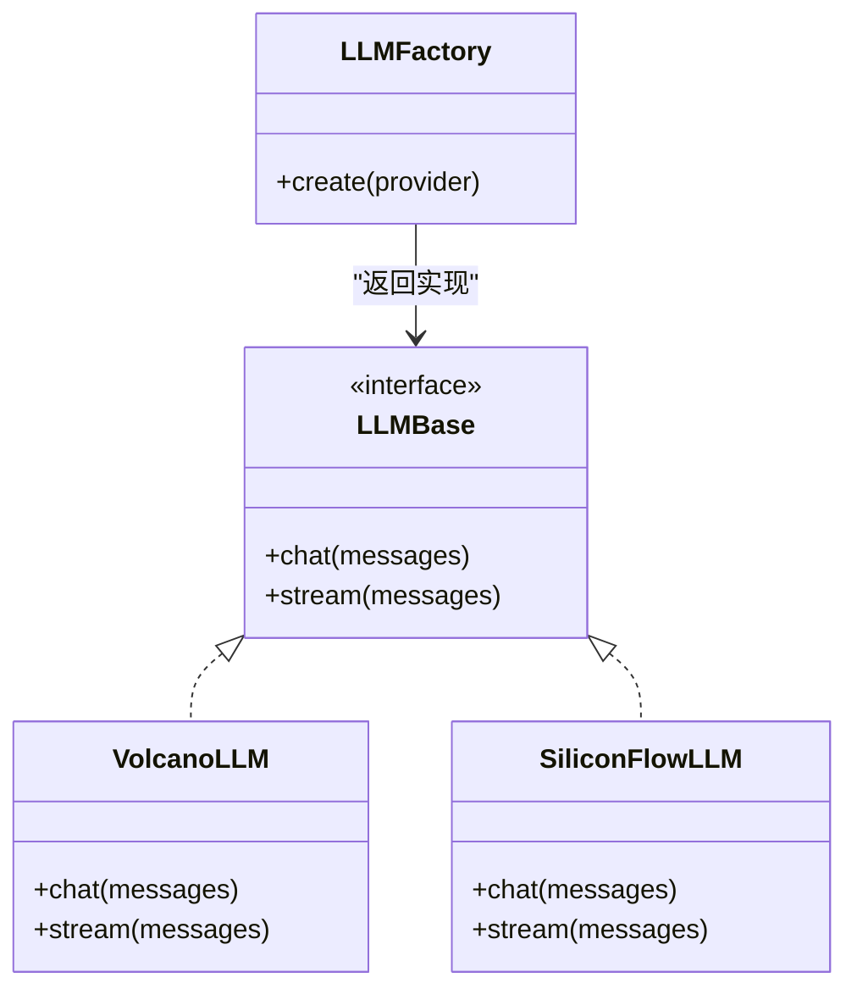
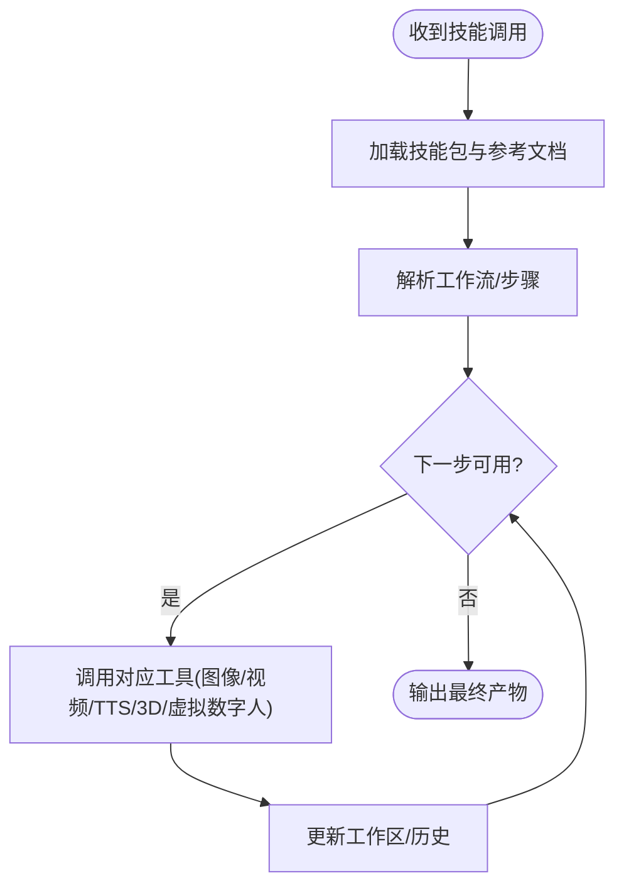
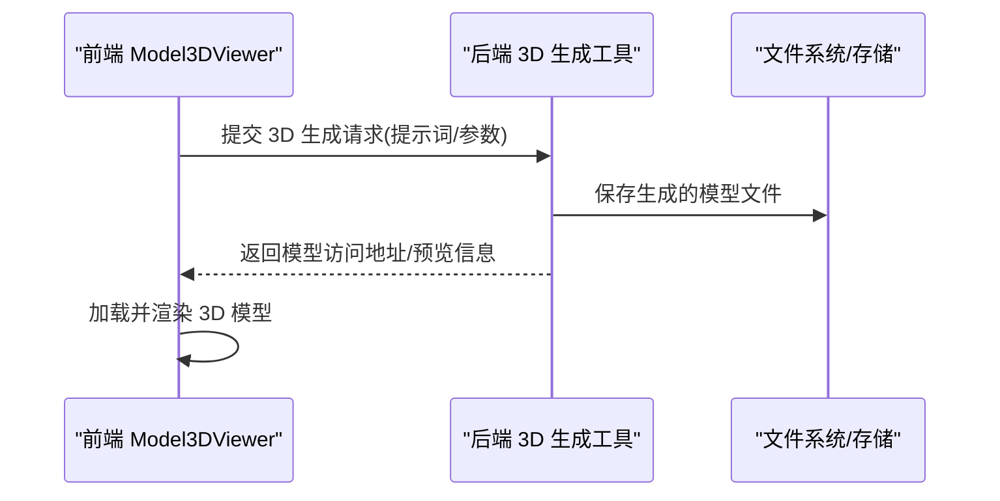
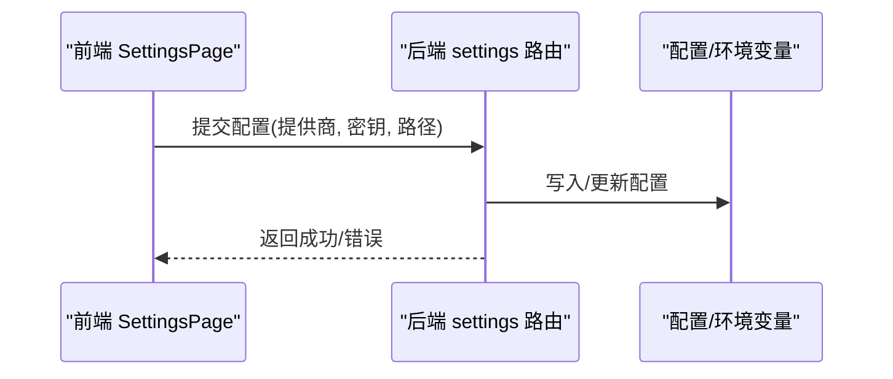
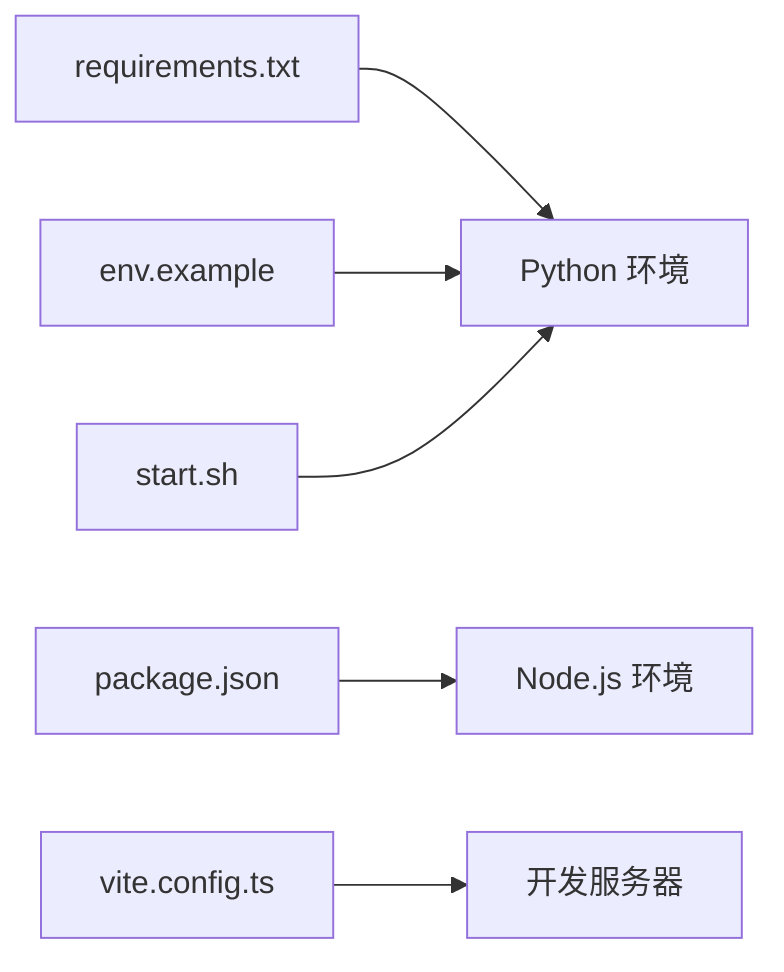

# 项目概述

<cite>
**本文引用的文件**   
- [backend/app/main.py](file://backend/app/main.py)
- [backend/requirements.txt](file://backend/requirements.txt)
- [backend/env.example](file://backend/env.example)
- [backend/start.sh](file://backend/start.sh)
- [backend/app/routers/chat.py](file://backend/app/routers/chat.py)
- [backend/app/routers/settings.py](file://backend/app/routers/settings.py)
- [backend/app/services/agent_service.py](file://backend/app/services/agent_service.py)
- [backend/app/services/connection_manager.py](file://backend/app/services/connection_manager.py)
- [backend/app/services/history_service.py](file://backend/app/services/history_service.py)
- [backend/app/services/skill_service.py](file://backend/app/services/skill_service.py)
- [backend/app/services/stream_processor.py](file://backend/app/services/stream_processor.py)
- [backend/app/services/workspace_service.py](file://backend/app/services/workspace_service.py)
- [backend/app/llm/base.py](file://backend/app/llm/base.py)
- [backend/app/llm/factory.py](file://backend/app/llm/factory.py)
- [backend/app/llm/siliconflow.py](file://backend/app/llm/siliconflow.py)
- [backend/app/llm/volcano.py](file://backend/app/llm/volcano.py)
- [backend/app/tools/image_generation.py](file://backend/app/tools/image_generation.py)
- [backend/app/tools/model_3d_generation.py](file://backend/app/tools/model_3d_generation.py)
- [backend/app/tools/qwen_tts.py](file://backend/app/tools/qwen_tts.py)
- [backend/app/tools/video_concatenation.py](file://backend/app/tools/video_concatenation.py)
- [backend/app/tools/virtual_anchor_generation.py](file://backend/app/tools/virtual_anchor_generation.py)
- [backend/app/tools/volcano_image_generation.py](file://backend/app/tools/volcano_image_generation.py)
- [backend/app/tools/volcano_video_generation.py](file://backend/app/tools/volcano_video_generation.py)
- [backend/app/tools/audio_mixing.py](file://backend/app/tools/audio_mixing.py)
- [backend/app/tools/skill_tools.py](file://backend/app/tools/skill_tools.py)
- [backend/app/tools/workspace_tools.py](file://backend/app/tools/workspace_tools.py)
- [backend/app/utils/logger.py](file://backend/app/utils/logger.py)
- [frontend/src/App.tsx](file://frontend/src/App.tsx)
- [frontend/src/components/ChatInterface.tsx](file://frontend/src/components/ChatInterface.tsx)
- [frontend/src/components/Model3DViewer.tsx](file://frontend/src/components/Model3DViewer.tsx)
- [frontend/src/components/HomePage.tsx](file://frontend/src/components/HomePage.tsx)
- [frontend/src/components/SettingsPage.tsx](file://frontend/src/components/SettingsPage.tsx)
- [frontend/package.json](file://frontend/package.json)
- [frontend/vite.config.ts](file://frontend/vite.config.ts)
</cite>

## 目录
1. [简介](#简介)
2. [项目结构](#项目结构)
3. [核心组件](#核心组件)
4. [架构总览](#架构总览)
5. [详细组件分析](#详细组件分析)
6. [依赖分析](#依赖分析)
7. [性能考虑](#性能考虑)
8. [故障排查指南](#故障排查指南)
9. [结论](#结论)
10. [附录：快速开始](#附录快速开始)

## 简介
PolyStudio 是一个多模态 AI 创作平台，围绕“AI 聊天 + 3D 模型查看 + 多模态内容生成 + 技能系统”构建，面向创作者、设计师、教育者与开发者，提供从对话到产出的端到端工作流。其设计理念是“以对话驱动创作”，通过统一的聊天界面与可插拔的 LLM 与工具生态，让用户用自然语言完成图像、视频、语音、3D 资产与虚拟数字人等内容的生成与编排。

核心价值
- 统一入口：基于聊天的交互方式降低使用门槛，支持文本、图片、音频、视频与 3D 模型的协同创作。
- 多模型集成：抽象化 LLM 接口，灵活接入多家厂商能力，便于扩展与替换。
- 工具与技能：将常用能力封装为工具与技能，支持组合编排与复用。
- 工作区记忆：持久化的工作区上下文，保障长会话与跨任务的一致性。

目标用户与应用场景
- 创作者与营销团队：快速产出图文、短视频、口播脚本与虚拟主播素材。
- 设计与工程人员：借助 3D 模型查看与生成能力进行可视化验证与原型制作。
- 教育与科研：利用论文写作、知识检索与多模态理解辅助研究与教学。
- 开发者与集成商：基于开放 API 与技能体系搭建自有业务流。

技术栈概览
- 后端：Python + FastAPI（异步路由、WebSocket 流式响应）
- 前端：React + TypeScript + Vite
- LLM 与多模态服务：抽象层统一接入多家供应商（如火山引擎、硅基流动等）
- 工具链：图像生成、视频拼接、TTS、3D 模型生成、虚拟数字人生成、音频混音等
- 技能系统：可插拔的技能包与参考文档，支持自定义扩展

## 项目结构
仓库采用前后端分离的组织方式，后端按“路由-服务-工具-LLM-工具集”分层，前端按页面与组件划分。

图表来源
- [backend/app/main.py](file://backend/app/main.py)
- [backend/app/routers/chat.py](file://backend/app/routers/chat.py)
- [backend/app/routers/settings.py](file://backend/app/routers/settings.py)
- [backend/app/services/agent_service.py](file://backend/app/services/agent_service.py)
- [backend/app/services/connection_manager.py](file://backend/app/services/connection_manager.py)
- [backend/app/services/history_service.py](file://backend/app/services/history_service.py)
- [backend/app/services/skill_service.py](file://backend/app/services/skill_service.py)
- [backend/app/services/stream_processor.py](file://backend/app/services/stream_processor.py)
- [backend/app/services/workspace_service.py](file://backend/app/services/workspace_service.py)
- [backend/app/llm/base.py](file://backend/app/llm/base.py)
- [backend/app/llm/factory.py](file://backend/app/llm/factory.py)
- [backend/app/llm/volcano.py](file://backend/app/llm/volcano.py)
- [backend/app/llm/siliconflow.py](file://backend/app/llm/siliconflow.py)
- [backend/app/tools/image_generation.py](file://backend/app/tools/image_generation.py)
- [backend/app/tools/model_3d_generation.py](file://backend/app/tools/model_3d_generation.py)
- [backend/app/tools/qwen_tts.py](file://backend/app/tools/qwen_tts.py)
- [backend/app/tools/video_concatenation.py](file://backend/app/tools/video_concatenation.py)
- [backend/app/tools/virtual_anchor_generation.py](file://backend/app/tools/virtual_anchor_generation.py)
- [backend/app/tools/volcano_image_generation.py](file://backend/app/tools/volcano_image_generation.py)
- [backend/app/tools/volcano_video_generation.py](file://backend/app/tools/volcano_video_generation.py)
- [backend/app/tools/audio_mixing.py](file://backend/app/tools/audio_mixing.py)
- [backend/app/tools/skill_tools.py](file://backend/app/tools/skill_tools.py)
- [backend/app/tools/workspace_tools.py](file://backend/app/tools/workspace_tools.py)
- [backend/app/utils/logger.py](file://backend/app/utils/logger.py)
- [frontend/src/App.tsx](file://frontend/src/App.tsx)
- [frontend/src/components/ChatInterface.tsx](file://frontend/src/components/ChatInterface.tsx)
- [frontend/src/components/Model3DViewer.tsx](file://frontend/src/components/Model3DViewer.tsx)
- [frontend/src/components/HomePage.tsx](file://frontend/src/components/HomePage.tsx)
- [frontend/src/components/SettingsPage.tsx](file://frontend/src/components/SettingsPage.tsx)

章节来源
- [backend/app/main.py](file://backend/app/main.py)
- [frontend/src/App.tsx](file://frontend/src/App.tsx)

## 核心组件
- 路由层
  - 聊天路由：处理消息收发、流式输出与会话管理。
  - 设置路由：读取与更新应用配置（如 LLM 提供商、密钥等）。
- 服务层
  - Agent 服务：编排对话流程、调用 LLM 与工具、维护工作区上下文。
  - 连接管理器：管理 WebSocket 连接与广播。
  - 历史服务：持久化聊天记录与工作区状态。
  - 技能服务：加载、解析与执行技能包。
  - 流处理器：对 LLM 或工具的增量输出进行分块与转发。
  - 工作区服务：读写工作区文件与元数据。
- LLM 抽象层
  - 基础接口：定义统一的对话/补全/流式接口。
  - 工厂：根据配置选择具体实现。
  - 具体实现：火山引擎、硅基流动等。
- 工具集
  - 图像生成、视频拼接、TTS、3D 模型生成、虚拟数字人、音频混音、工作区操作等。
- 前端组件
  - 首页、聊天界面、3D 模型查看器、设置页。

章节来源
- [backend/app/routers/chat.py](file://backend/app/routers/chat.py)
- [backend/app/routers/settings.py](file://backend/app/routers/settings.py)
- [backend/app/services/agent_service.py](file://backend/app/services/agent_service.py)
- [backend/app/services/connection_manager.py](file://backend/app/services/connection_manager.py)
- [backend/app/services/history_service.py](file://backend/app/services/history_service.py)
- [backend/app/services/skill_service.py](file://backend/app/services/skill_service.py)
- [backend/app/services/stream_processor.py](file://backend/app/services/stream_processor.py)
- [backend/app/services/workspace_service.py](file://backend/app/services/workspace_service.py)
- [backend/app/llm/base.py](file://backend/app/llm/base.py)
- [backend/app/llm/factory.py](file://backend/app/llm/factory.py)
- [backend/app/llm/volcano.py](file://backend/app/llm/volcano.py)
- [backend/app/llm/siliconflow.py](file://backend/app/llm/siliconflow.py)
- [backend/app/tools/image_generation.py](file://backend/app/tools/image_generation.py)
- [backend/app/tools/model_3d_generation.py](file://backend/app/tools/model_3d_generation.py)
- [backend/app/tools/qwen_tts.py](file://backend/app/tools/qwen_tts.py)
- [backend/app/tools/video_concatenation.py](file://backend/app/tools/video_concatenation.py)
- [backend/app/tools/virtual_anchor_generation.py](file://backend/app/tools/virtual_anchor_generation.py)
- [backend/app/tools/volcano_image_generation.py](file://backend/app/tools/volcano_image_generation.py)
- [backend/app/tools/volcano_video_generation.py](file://backend/app/tools/volcano_video_generation.py)
- [backend/app/tools/audio_mixing.py](file://backend/app/tools/audio_mixing.py)
- [backend/app/tools/skill_tools.py](file://backend/app/tools/skill_tools.py)
- [backend/app/tools/workspace_tools.py](file://backend/app/tools/workspace_tools.py)
- [frontend/src/components/ChatInterface.tsx](file://frontend/src/components/ChatInterface.tsx)
- [frontend/src/components/Model3DViewer.tsx](file://frontend/src/components/Model3DViewer.tsx)
- [frontend/src/components/HomePage.tsx](file://frontend/src/components/HomePage.tsx)
- [frontend/src/components/SettingsPage.tsx](file://frontend/src/components/SettingsPage.tsx)

## 架构总览
整体采用“前端 SPA + 后端 FastAPI”的分层架构。前端通过 REST 与 WebSocket 与后端通信；后端由路由层调度至服务层，服务层协调 LLM 抽象层与工具集，并通过工作区与历史服务维持状态。

图表来源
- [backend/app/main.py](file://backend/app/main.py)
- [backend/app/routers/chat.py](file://backend/app/routers/chat.py)
- [backend/app/services/agent_service.py](file://backend/app/services/agent_service.py)
- [backend/app/llm/factory.py](file://backend/app/llm/factory.py)
- [backend/app/llm/volcano.py](file://backend/app/llm/volcano.py)
- [backend/app/llm/siliconflow.py](file://backend/app/llm/siliconflow.py)
- [backend/app/tools/image_generation.py](file://backend/app/tools/image_generation.py)
- [backend/app/tools/model_3d_generation.py](file://backend/app/tools/model_3d_generation.py)
- [backend/app/tools/qwen_tts.py](file://backend/app/tools/qwen_tts.py)
- [backend/app/tools/video_concatenation.py](file://backend/app/tools/video_concatenation.py)
- [backend/app/tools/virtual_anchor_generation.py](file://backend/app/tools/virtual_anchor_generation.py)
- [backend/app/tools/volcano_image_generation.py](file://backend/app/tools/volcano_image_generation.py)
- [backend/app/tools/volcano_video_generation.py](file://backend/app/tools/volcano_video_generation.py)
- [backend/app/tools/audio_mixing.py](file://backend/app/tools/audio_mixing.py)
- [backend/app/tools/skill_tools.py](file://backend/app/tools/skill_tools.py)
- [backend/app/tools/workspace_tools.py](file://backend/app/tools/workspace_tools.py)
- [backend/app/services/history_service.py](file://backend/app/services/history_service.py)
- [backend/app/services/workspace_service.py](file://backend/app/services/workspace_service.py)
- [backend/app/services/connection_manager.py](file://backend/app/services/connection_manager.py)
- [backend/app/utils/logger.py](file://backend/app/utils/logger.py)

## 详细组件分析

### 聊天与流式输出流程
聊天功能通过 REST 发起请求并建立 WebSocket 通道，服务端在 Agent 服务中编排 LLM 与工具调用，并以流式事件向前端推送增量结果。

图表来源
- [backend/app/routers/chat.py](file://backend/app/routers/chat.py)
- [backend/app/services/agent_service.py](file://backend/app/services/agent_service.py)
- [backend/app/llm/factory.py](file://backend/app/llm/factory.py)
- [backend/app/llm/volcano.py](file://backend/app/llm/volcano.py)
- [backend/app/llm/siliconflow.py](file://backend/app/llm/siliconflow.py)
- [backend/app/services/stream_processor.py](file://backend/app/services/stream_processor.py)
- [backend/app/services/connection_manager.py](file://backend/app/services/connection_manager.py)
- [backend/app/tools/image_generation.py](file://backend/app/tools/image_generation.py)
- [backend/app/tools/model_3d_generation.py](file://backend/app/tools/model_3d_generation.py)
- [backend/app/tools/qwen_tts.py](file://backend/app/tools/qwen_tts.py)
- [backend/app/tools/video_concatenation.py](file://backend/app/tools/video_concatenation.py)
- [backend/app/tools/virtual_anchor_generation.py](file://backend/app/tools/virtual_anchor_generation.py)
- [backend/app/tools/volcano_image_generation.py](file://backend/app/tools/volcano_image_generation.py)
- [backend/app/tools/volcano_video_generation.py](file://backend/app/tools/volcano_video_generation.py)
- [backend/app/tools/audio_mixing.py](file://backend/app/tools/audio_mixing.py)
- [backend/app/tools/skill_tools.py](file://backend/app/tools/skill_tools.py)
- [backend/app/tools/workspace_tools.py](file://backend/app/tools/workspace_tools.py)
- [frontend/src/components/ChatInterface.tsx](file://frontend/src/components/ChatInterface.tsx)

章节来源
- [backend/app/routers/chat.py](file://backend/app/routers/chat.py)
- [backend/app/services/agent_service.py](file://backend/app/services/agent_service.py)
- [backend/app/services/stream_processor.py](file://backend/app/services/stream_processor.py)
- [backend/app/services/connection_manager.py](file://backend/app/services/connection_manager.py)
- [frontend/src/components/ChatInterface.tsx](file://frontend/src/components/ChatInterface.tsx)

### LLM 抽象与工厂
LLM 抽象层定义了统一的对话与流式接口，工厂根据配置动态选择具体实现，便于接入更多供应商。

图表来源
- [backend/app/llm/base.py](file://backend/app/llm/base.py)
- [backend/app/llm/factory.py](file://backend/app/llm/factory.py)
- [backend/app/llm/volcano.py](file://backend/app/llm/volcano.py)
- [backend/app/llm/siliconflow.py](file://backend/app/llm/siliconflow.py)

章节来源
- [backend/app/llm/base.py](file://backend/app/llm/base.py)
- [backend/app/llm/factory.py](file://backend/app/llm/factory.py)
- [backend/app/llm/volcano.py](file://backend/app/llm/volcano.py)
- [backend/app/llm/siliconflow.py](file://backend/app/llm/siliconflow.py)

### 技能系统与工具编排
技能系统通过技能服务加载技能包，结合工具集完成复杂任务编排。例如“视频创作”、“播客创作”、“小红书文案”等技能可组合图像、视频、TTS 与虚拟数字人工具。

图表来源
- [backend/app/services/skill_service.py](file://backend/app/services/skill_service.py)
- [backend/app/tools/skill_tools.py](file://backend/app/tools/skill_tools.py)
- [backend/app/tools/image_generation.py](file://backend/app/tools/image_generation.py)
- [backend/app/tools/video_concatenation.py](file://backend/app/tools/video_concatenation.py)
- [backend/app/tools/qwen_tts.py](file://backend/app/tools/qwen_tts.py)
- [backend/app/tools/model_3d_generation.py](file://backend/app/tools/model_3d_generation.py)
- [backend/app/tools/virtual_anchor_generation.py](file://backend/app/tools/virtual_anchor_generation.py)
- [backend/app/tools/volcano_image_generation.py](file://backend/app/tools/volcano_image_generation.py)
- [backend/app/tools/volcano_video_generation.py](file://backend/app/tools/volcano_video_generation.py)
- [backend/app/tools/audio_mixing.py](file://backend/app/tools/audio_mixing.py)
- [backend/app/tools/workspace_tools.py](file://backend/app/tools/workspace_tools.py)

章节来源
- [backend/app/services/skill_service.py](file://backend/app/services/skill_service.py)
- [backend/app/tools/skill_tools.py](file://backend/app/tools/skill_tools.py)

### 3D 模型查看与生成
前端提供 3D 模型查看器，后端提供 3D 模型生成工具，二者配合可实现“描述即模型”的创作体验。

图表来源
- [frontend/src/components/Model3DViewer.tsx](file://frontend/src/components/Model3DViewer.tsx)
- [backend/app/tools/model_3d_generation.py](file://backend/app/tools/model_3d_generation.py)

章节来源
- [frontend/src/components/Model3DViewer.tsx](file://frontend/src/components/Model3DViewer.tsx)
- [backend/app/tools/model_3d_generation.py](file://backend/app/tools/model_3d_generation.py)

### 设置与配置管理
设置页允许用户配置 LLM 提供商、密钥与工作区路径等，后端设置路由负责校验与持久化。

图表来源
- [frontend/src/components/SettingsPage.tsx](file://frontend/src/components/SettingsPage.tsx)
- [backend/app/routers/settings.py](file://backend/app/routers/settings.py)

章节来源
- [frontend/src/components/SettingsPage.tsx](file://frontend/src/components/SettingsPage.tsx)
- [backend/app/routers/settings.py](file://backend/app/routers/settings.py)

## 依赖分析
- 后端依赖
  - Python 运行时与第三方库由 requirements.txt 管理。
  - 启动脚本 start.sh 用于初始化环境与运行服务。
  - env.example 提供环境变量模板（如 LLM 密钥、端口等）。
- 前端依赖
  - package.json 管理 React、TypeScript、Vite 等依赖。
  - vite.config.ts 配置开发服务器与代理（指向后端 API）。

图表来源
- [backend/requirements.txt](file://backend/requirements.txt)
- [backend/env.example](file://backend/env.example)
- [backend/start.sh](file://backend/start.sh)
- [frontend/package.json](file://frontend/package.json)
- [frontend/vite.config.ts](file://frontend/vite.config.ts)

章节来源
- [backend/requirements.txt](file://backend/requirements.txt)
- [backend/env.example](file://backend/env.example)
- [backend/start.sh](file://backend/start.sh)
- [frontend/package.json](file://frontend/package.json)
- [frontend/vite.config.ts](file://frontend/vite.config.ts)

## 性能考虑
- 流式输出：优先使用流式接口减少首字节延迟，提升用户体验。
- 并发与限流：对 LLM 与外部工具调用增加超时与重试策略，避免雪崩。
- 资源缓存：对频繁使用的模型与中间产物进行缓存，降低重复计算。
- 前端渲染优化：大文件（视频/3D）采用懒加载与分片传输。
- 日志与监控：集中记录关键指标与错误堆栈，便于定位瓶颈。

[本节为通用指导，不直接分析具体文件]

## 故障排查指南
- 常见问题
  - 无法连接 LLM：检查 env.example 中的密钥与网络连通性。
  - 流式中断：确认 WebSocket/SSE 连接是否被代理或防火墙阻断。
  - 工具失败：查看日志输出，核对输入参数与权限。
- 定位方法
  - 启用调试日志，关注 Agent 服务与工具调用的异常堆栈。
  - 复现最小用例，逐步隔离问题模块（路由/服务/LLM/工具）。
  - 检查工作区与历史服务的读写权限与磁盘空间。

章节来源
- [backend/app/utils/logger.py](file://backend/app/utils/logger.py)
- [backend/app/services/agent_service.py](file://backend/app/services/agent_service.py)
- [backend/app/services/history_service.py](file://backend/app/services/history_service.py)
- [backend/app/services/workspace_service.py](file://backend/app/services/workspace_service.py)

## 结论
PolyStudio 以“对话驱动创作”为核心，通过统一的聊天界面与可扩展的 LLM 与工具生态，覆盖图像、视频、语音、3D 与虚拟数字人等多模态场景。其分层清晰、职责明确，既适合初学者快速上手，也为高级用户提供深度定制与二次开发的空间。

[本节为总结性内容，不直接分析具体文件]

## 附录：快速开始
- 环境要求
  - Python 3.x（版本见 requirements.txt）
  - Node.js 与 npm/yarn（前端开发）
- 安装步骤
  - 后端
    - 复制 env.example 为实际环境变量文件，填写 LLM 密钥与必要配置。
    - 安装依赖并启动服务（参考 start.sh）。
  - 前端
    - 安装依赖并启动开发服务器（参考 package.json 与 vite.config.ts）。
- 基本使用示例
  - 打开前端首页，进入聊天界面，输入自然语言指令，选择需要的工具或技能，观察流式输出与产物。
  - 在设置页配置 LLM 提供商与密钥，切换不同模型能力。
  - 使用 3D 模型查看器加载或生成模型，进行预览与编辑。

章节来源
- [backend/requirements.txt](file://backend/requirements.txt)
- [backend/env.example](file://backend/env.example)
- [backend/start.sh](file://backend/start.sh)
- [frontend/package.json](file://frontend/package.json)
- [frontend/vite.config.ts](file://frontend/vite.config.ts)
- [frontend/src/components/HomePage.tsx](file://frontend/src/components/HomePage.tsx)
- [frontend/src/components/ChatInterface.tsx](file://frontend/src/components/ChatInterface.tsx)
- [frontend/src/components/SettingsPage.tsx](file://frontend/src/components/SettingsPage.tsx)
- [frontend/src/components/Model3DViewer.tsx](file://frontend/src/components/Model3DViewer.tsx)